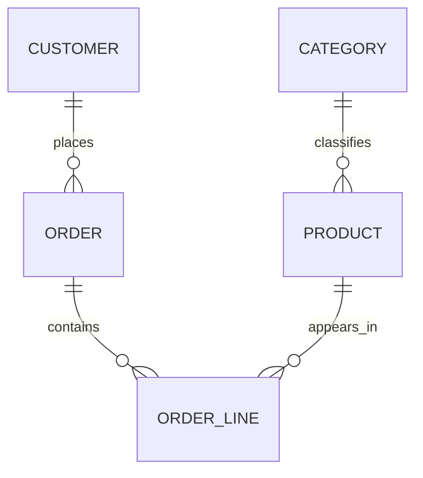
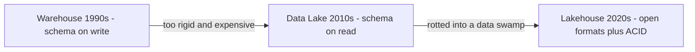

# Lecture 1 — The Data Platform and Who Owns What: OLTP vs OLAP and the Warehouse / Lake / Lakehouse Lineage

> **Time:** 2 hours. Take the role-and-on-call material in one sitting and the OLTP/OLAP-and-lineage material in a second sitting. **Prerequisites:** C1 Python fluency and comfort with a `SELECT … JOIN … GROUP BY`. Docker installed (`docker --version`). **Citations:** the PostgreSQL 16 documentation (<https://www.postgresql.org/docs/16/index.html>), Kleppmann's *Designing Data-Intensive Applications* (<https://dataintensive.net/>), the Kimball Group "Dimensional Modeling Techniques" reference (<https://www.kimballgroup.com/data-warehouse-business-intelligence-resources/kimball-techniques/dimensional-modeling-techniques/>), and the official Docker Postgres image (<https://hub.docker.com/_/postgres>).

## 1. Four engineers, four pagers

Before we write a line of SQL, we need to know whose job we are training for. Data engineering is defined less by the tools it uses than by the part of the system it is responsible for when something breaks. The fastest way to understand the role is to draw the seam between four people who all touch data and ask one question of each: *what wakes them up at 3 a.m.?*

```text
            +-------------------+        +----------------------+
   writes   |  Backend engineer |        |  Data engineer       |  reads
   the row  |  owns the OLTP    | -----> |  owns the pipeline   | -----> serves the
            |  system of record |  CDC/  |  + the warehouse     |        derived table
            +-------------------+  batch +----------+-----------+
                    ^                                |
                    | "INSERT failed / row locked"   | "load double-counted /
                    | "checkout is down"             |  table is stale / schema drifted"
                    |                                 v
            +-------------------+        +----------------------+
            |  the application  |        |  Analyst  |  Data scientist |
            |  user             |        |  owns the | owns the model  |
            +-------------------+        |  dashboard| + the features  |
                                         +-----------+-----------------+
                                          "the number  "features arrived late /
                                           is WRONG"    malformed / silently null"
```

- **The backend engineer** owns the **system of record** — the OLTP database behind the checkout, the orders table, the inventory table. They are paged when a write fails, when a row is locked under contention, when the transactional database is down and customers cannot place orders. Their world is correctness *of a single transaction, right now*. Kleppmann calls these the source-of-truth "systems of record" (<https://dataintensive.net/>).
- **The data engineer** — you — owns the **pipeline and the derived analytical store**. You extract from the systems of record (via change-data-capture or batch extracts), load into a warehouse, model it, and serve it. You are paged when a nightly load *double-counted*, when a table that should refresh by 6 a.m. is *stale at 9*, when an upstream team renamed a column and your load silently produced nulls. Your world is correctness *of a derived dataset, over time, reproducibly*. Kleppmann calls warehouses and search indexes "derived data systems": rederivable from the source, and therefore your responsibility to keep faithfully derived.
- **The analyst (or analytics engineer)** owns the **dashboard and the business-facing SQL** on top of the warehouse you serve. They are paged — or rather, they get the angry Slack message — when *the number is wrong*. Often the number is wrong because of something in your pipeline, which is why the analyst's bug reports are your early-warning system.
- **The data scientist** owns the **model and the feature pipeline that feeds it**. They are paged when features arrive late, malformed, or silently null, quietly degrading a model nobody notices until the predictions get bad. C27 exists in large part to make this person's inputs trustworthy.

The boundary is not about seniority or smarts; it is about *which derived artifact is yours to keep correct*. The single most useful sentence you can say in a data-engineering interview is: "I own the contract of the table — its grain, its freshness, its schema, and its lineage — so that everyone downstream can trust it without re-deriving it themselves." Hold that sentence; the rest of the week is mechanics for keeping it.

## 2. The failure modes only the data engineer sees

The backend engineer's failures are loud: a 500, a timeout, a dead checkout. Yours are usually *quiet*, which is why they are dangerous. There are five canonical quiet failures, and naming them now means you will recognize them all course long:

1. **The double-count.** A load runs twice — a retry, a manual re-run, an orchestrator catch-up — and a fact row gets inserted twice. Revenue is now overstated by exactly the rows that re-ran, and no error was logged. (Phase I, Week 3 makes loads idempotent so this cannot happen.)
2. **The silent staleness.** A source file did not arrive; the load "succeeded" because there was nothing to load; the dashboard shows yesterday's numbers as if they were today's. The pipeline lied by succeeding. (Week 4's orchestration and Week 10's freshness checks catch this.)
3. **The schema drift.** Upstream renamed `customer_id` to `cust_id`, your extract mapped the missing column to `NULL`, and a million rows landed with no customer. No exception — just a column quietly full of nulls. (Week 10's data contracts and quality gates are the defense.)
4. **The grain mismatch.** Two fact tables that *look* joinable are at different grains; a join multiplies rows; the sum is now wrong by a factor nobody can explain. This is a *modeling* failure, and it is exactly what this week exists to prevent.
5. **The late record.** An event for last Tuesday arrives this Thursday; depending on how the load was written, it is either dropped or attributed to the wrong day. (Week 3 handles late and out-of-order data deliberately.)

Every one of these is a *correctness of derived data over time* problem — the data engineer's exact domain. Notice that none of them is a programming-language problem; they are all *data-modeling and data-flow* problems. That is why this course starts with modeling and not with code.

## 3. OLTP vs OLAP — two completely different shapes of work

The backend engineer's database and your warehouse are both "SQL databases", and that shared word hides a chasm. They serve **opposite access patterns**, and almost every design decision flows from that.

| Dimension | OLTP (Online Transaction Processing) | OLAP (Online Analytical Processing) |
|---|---|---|
| Who owns it | Backend engineer | Data engineer / analyst |
| Typical operation | `INSERT`/`UPDATE`/point `SELECT` | Big aggregating `SELECT` |
| Rows touched per query | A handful | Millions |
| Query count | Thousands per second, tiny | A few per minute, huge |
| Normalization | High (3NF) — avoid update anomalies | Low — denormalized for read speed |
| Optimized for | Write throughput, point-lookup latency | Scan throughput, aggregation |
| Storage layout (at scale) | Row-store | Column-store |
| Example question | "Place this order for this customer" | "Weekly revenue by category by region, last quarter" |
| Freshness need | Immediate (the row must be there now) | Periodic (refreshed hourly/daily is usually fine) |

The reason these cannot be the *same* optimal store at scale is **storage layout**. An OLTP system reads and writes whole rows, so it stores rows contiguously (row-store): fetching one order means reading one place on disk. An OLAP system reads one or two columns across millions of rows (`SUM(amount)` over a year), so a column-store that keeps each column contiguous reads only the columns the query needs and compresses them brilliantly — a scan of `amount` never touches `customer_name`. Kleppmann's storage-and-retrieval chapter walks this row-vs-column trade in depth (<https://dataintensive.net/>); it is the reason the warehouses and lakehouses you meet later (DuckDB, Parquet, Iceberg) are all columnar. At laptop scale, Postgres — a row-store — is perfectly fine for *both* roles, which is exactly why we teach modeling on it before introducing columnar engines in Phase II.

## 4. The same data, modeled twice

Concepts land when you see the same retail data shaped for each world. Spin up Postgres first:

```bash
docker run --name cc-pg-w1 \
  -e POSTGRES_PASSWORD=crunch \
  -e POSTGRES_DB=retail \
  -p 5432:5432 \
  -d postgres:16
docker exec -it cc-pg-w1 psql -U postgres -d retail
```

(The image and its environment variables are documented at <https://hub.docker.com/_/postgres>.)

**The OLTP shape — normalized, write-optimized.** This is what the backend engineer's checkout writes into. Third normal form: every fact stored exactly once, foreign keys enforcing integrity, designed so that *updating a customer's city touches exactly one row*.

```sql
-- OLTP: normalized. Each concept lives in exactly one place.
CREATE TABLE customer (
    customer_id   bigint GENERATED ALWAYS AS IDENTITY PRIMARY KEY,
    email         text NOT NULL UNIQUE,
    full_name     text NOT NULL,
    city          text NOT NULL          -- update touches ONE row
);

CREATE TABLE category (
    category_id   bigint GENERATED ALWAYS AS IDENTITY PRIMARY KEY,
    name          text NOT NULL UNIQUE
);

CREATE TABLE product (
    product_id    bigint GENERATED ALWAYS AS IDENTITY PRIMARY KEY,
    sku           text NOT NULL UNIQUE,
    name          text NOT NULL,
    category_id   bigint NOT NULL REFERENCES category(category_id)
);

CREATE TABLE "order" (
    order_id      bigint GENERATED ALWAYS AS IDENTITY PRIMARY KEY,
    customer_id   bigint NOT NULL REFERENCES customer(customer_id),
    ordered_at    timestamptz NOT NULL DEFAULT now()
);

CREATE TABLE order_line (
    order_id      bigint NOT NULL REFERENCES "order"(order_id),
    line_no       int    NOT NULL,
    product_id    bigint NOT NULL REFERENCES product(product_id),
    quantity      int    NOT NULL CHECK (quantity > 0),
    unit_price    numeric(12,2) NOT NULL,
    PRIMARY KEY (order_id, line_no)
);
```

To answer "weekly revenue by category last quarter" against *this* schema you must join `order_line → product → category → order`, four tables, every time, and the more analysts who write that join the more ways it goes subtly wrong. The normalization that makes writes safe makes analytical reads *expensive and error-prone*. That is not a flaw in the OLTP design — it is the OLTP design working as intended. Analytics is simply not its job.


*The OLTP schema is fully normalized — every fact lives in exactly one table, reached by following foreign keys.*

**The OLAP shape — denormalized star, read-optimized.** This is what you, the data engineer, build *from* the OLTP data. The descriptive context is flattened into wide dimension tables; the measurements live in one central fact table; the analytical question becomes a single fact-to-dimension join.

```sql
-- OLAP: denormalized star. Built FOR the analytical question.
CREATE TABLE dim_product (
    product_key   bigint GENERATED ALWAYS AS IDENTITY PRIMARY KEY,  -- surrogate
    sku           text NOT NULL,            -- natural key, now just an attribute
    product_name  text NOT NULL,
    category_name text NOT NULL,            -- DENORMALIZED: category text lives here
    brand_name    text NOT NULL             -- DENORMALIZED: no join to reach it
);

CREATE TABLE dim_date (
    date_key      int  PRIMARY KEY,         -- e.g. 20260619 (smart integer key)
    full_date     date NOT NULL,
    year          int  NOT NULL,
    quarter       int  NOT NULL,
    week_of_year  int  NOT NULL
);

CREATE TABLE fact_sales (
    sale_key      bigint GENERATED ALWAYS AS IDENTITY PRIMARY KEY,
    date_key      int    NOT NULL REFERENCES dim_date(date_key),
    product_key   bigint NOT NULL REFERENCES dim_product(product_key),
    quantity      int    NOT NULL,
    extended_amount numeric(14,2) NOT NULL  -- the additive measure
);
```

Now "weekly revenue by category last quarter" is one join, one `GROUP BY`, and impossible to get subtly wrong:

```sql
SELECT d.year, d.week_of_year, p.category_name,
       SUM(f.extended_amount) AS revenue
FROM   fact_sales f
JOIN   dim_date    d ON d.date_key = f.date_key
JOIN   dim_product p ON p.product_key = f.product_key
WHERE  d.quarter = 1 AND d.year = 2026
GROUP  BY d.year, d.week_of_year, p.category_name
ORDER  BY d.week_of_year, revenue DESC;
```

The denormalization you see in `dim_product` (category and brand stored as repeated text, not as foreign keys to other tables) is *deliberate*. It trades storage and write-simplicity — which OLAP does not care about — for read-simplicity and join performance, which is all OLAP cares about. We will name this trade precisely in Lecture 2 as "star vs snowflake".

## 5. Why the OLTP schema is normalized — and why you must un-do it

It is worth pausing on *why* the OLTP schema avoids the repeated text that the OLAP star embraces, because the reason is the exact reason your warehouse can safely repeat it. Normalization exists to prevent **update anomalies**. In the OLTP `category` table, the string "Beverages" is stored exactly once; rename it to "Drinks" and you `UPDATE` one row and every product that points at it is instantly correct. If, instead, the OLTP schema had stored the category name as text on every product row, renaming a category would mean updating thousands of rows, and any row the update missed would leave the database in a contradictory state — the same category spelled two ways. For a system taking thousands of writes a second, that risk is unacceptable, so OLTP normalizes: every fact in exactly one place, integrity enforced by foreign keys.

The warehouse can safely do the opposite for two reasons. First, the warehouse is **loaded, not edited** — you do not run ad-hoc `UPDATE`s against `dim_product` in production; a controlled pipeline rebuilds or appends to it on a schedule, so the "someone forgot to update a row" anomaly cannot arise. Second — and this is the subtle part that the rest of the week unpacks — when a category name *does* change, the warehouse usually does not *want* to overwrite the old value everywhere, because a historical sale should keep showing the category that was true *when the sale happened*. The OLTP "rename in one place" behavior is exactly wrong for analytics. That tension — write systems want one current truth, analytical systems want the truth-at-the-time — is the seed of slowly-changing dimensions in Lecture 3. For now, hold the asymmetry: **normalize to write safely; denormalize to read fast; and accept that the denormalized copy is the data engineer's to keep faithfully derived.**

```sql
-- The OLTP rename: one row, instant global effect, history erased.
UPDATE category SET name = 'Drinks' WHERE name = 'Beverages';

-- The warehouse will NOT do this blindly. A historical fact_sales row that
-- sold a "Beverages" product must keep saying "Beverages". How? Lecture 3.
```

## 6. The lineage: warehouse → lake → lakehouse

You will be asked to place yourself on this timeline in every interview, so learn it as a story with three acts, each born from the failure of the last.

```text
   1990s                    2010s                      2020s (now)
+-----------+           +-------------+            +------------------+
| WAREHOUSE |  --->     |  DATA LAKE  |   --->      |    LAKEHOUSE     |
+-----------+           +-------------+            +------------------+
 schema-on-write        schema-on-read              open formats
 structured SQL         raw files, any shape        + ACID table semantics
 expensive storage      cheap object storage         cheap object storage
 rigid, trusted         flexible, untrusted          flexible AND trusted
 (Inmon, Kimball)       (Hadoop, HDFS, S3)           (Iceberg, Delta Lake)
        |                      |                            |
   "too rigid &          "it rotted into a            "keep the cheap lake,
    too expensive         data swamp: no              add the warehouse's
    to dump raw           transactions, no            transactions and
    data into"            schema, can't tell          schema back on top"
                          what's current"
```

**Act I — the data warehouse (schema-on-write).** Bill Inmon and Ralph Kimball formalized the warehouse in the 1990s: a structured analytical store you design *before* loading (schema-on-write), populated by ETL, queried with SQL. The star schema you build this week is the warehouse pattern in miniature; the Kimball Group's techniques page is its living reference (<https://www.kimballgroup.com/data-warehouse-business-intelligence-resources/kimball-techniques/dimensional-modeling-techniques/>). The warehouse's weakness was cost and rigidity: proprietary storage was expensive, and you had to model everything up front, so semi-structured and exploratory data had nowhere to land.

**Act II — the data lake (schema-on-read).** The Hadoop era answered with the lake: dump *everything* — logs, JSON, images, CSVs — as raw files into cheap distributed/object storage (HDFS, then S3), and defer structure to query time (schema-on-read). Storage got cheap and flexible. But lakes had no transactions, no schema enforcement, and no reliable notion of "the current version of this table". Half-written files, no atomic appends, and no way to know which files were stale turned many lakes into *data swamps*. Kleppmann's treatment of derived data and the cost of weak guarantees is the conceptual backdrop (<https://dataintensive.net/>).

**Act III — the lakehouse (open formats + ACID table semantics).** The present synthesis keeps the lake's cheap object storage and open columnar files (Parquet) but layers a *table format* — Apache Iceberg or Delta Lake — on top that adds ACID transactions, schema enforcement and evolution, time travel, and a reliable current-snapshot pointer. You get the lake's flexibility *and* the warehouse's trustworthiness. C27 builds exactly this in Phase II (Weeks 5–8); this week you are building the Act-I warehouse so that the Act-III lakehouse has something coherent to be a generalization *of*. Dimensional modeling did not die with the warehouse — Iceberg and Delta tables are routinely modeled as Kimball stars. The grain, the dimensions, the SCDs you learn this week travel with you the whole course.


*Each era of data platforms was born from the previous era's failure mode.*

## 7. Where Postgres sits, and why it is the right teaching engine

Postgres is a row-store OLTP database that is *also* a perfectly competent small OLAP engine. At laptop scale (millions, not billions, of rows) it will run every star-schema query, `MERGE`, and `EXPLAIN ANALYZE` we need, and it implements the standard SQL we will rely on all course: identity columns for surrogate keys (<https://www.postgresql.org/docs/16/ddl-identity-columns.html>), `MERGE` for upserts and SCD maintenance (<https://www.postgresql.org/docs/16/sql-merge.html>), generated columns, and a genuinely excellent query planner you can read with `EXPLAIN ANALYZE` (<https://www.postgresql.org/docs/16/sql-explain.html>). Using one familiar engine for both OLTP and OLAP this week lets us isolate the *modeling* lesson from the *distributed-systems* lesson; the columnar engines (DuckDB, Spark) arrive in Phase II once the modeling is in your hands. Run it in Docker (<https://hub.docker.com/_/postgres>) so your machine stays clean and your environment is reproducible — a discipline that pays off enormously when the stack grows to five containers in later weeks.

## Exercise pointer

Open [`../exercises/exercise-01-model-the-grain.sql`](../exercises/exercise-01-model-the-grain.sql) and start by *declaring a grain in one sentence* for the retail-sales fact before you write any DDL — the exercise's acceptance criteria check that your grain sentence has no "and". Then continue to [`exercise-02-build-the-star-schema.sql`](../exercises/exercise-02-build-the-star-schema.sql) to stand up the full star and run the Section-4 analytical query against your own data. Spin up the container exactly as shown in Section 4; everything in the exercises is `psql`-runnable as written.

## Summary

- A data engineer owns the **pipeline and the derived analytical store**: paged for double-counts, staleness, schema drift, grain mismatches, and late data — the *quiet* failures of derived data over time. The backend engineer owns the loud OLTP failures; the analyst owns the wrong number; the data scientist owns the degraded model.
- **OLTP** is many small writes against a normalized, row-stored, write-optimized system of record. **OLAP** is few enormous aggregating reads against a denormalized, (at scale) column-stored, read-optimized warehouse. The opposite access patterns drive opposite designs.
- The **same retail data** is modeled normalized for OLTP (four-table joins for analytics) and denormalized as a star for OLAP (one fact-to-dimension join). The denormalization is deliberate, not sloppy.
- The storage lineage runs **warehouse → lake → lakehouse**: schema-on-write structure, then schema-on-read flexibility, then open formats with ACID table semantics. Each act fixed the previous act's failure. The star schema is the warehouse pattern, and it survives into the lakehouse.
- **Postgres 16 in Docker** is the right engine for the modeling lesson: standard SQL, identity columns, `MERGE`, a readable planner, and no setup tax.

## Cited references

Kimball Group, "Dimensional Modeling Techniques" <https://www.kimballgroup.com/data-warehouse-business-intelligence-resources/kimball-techniques/dimensional-modeling-techniques/> · Martin Kleppmann, *Designing Data-Intensive Applications* <https://dataintensive.net/> · PostgreSQL 16 documentation index <https://www.postgresql.org/docs/16/index.html>, identity columns <https://www.postgresql.org/docs/16/ddl-identity-columns.html>, `MERGE` <https://www.postgresql.org/docs/16/sql-merge.html>, `EXPLAIN` <https://www.postgresql.org/docs/16/sql-explain.html> · Docker Postgres image <https://hub.docker.com/_/postgres>.
