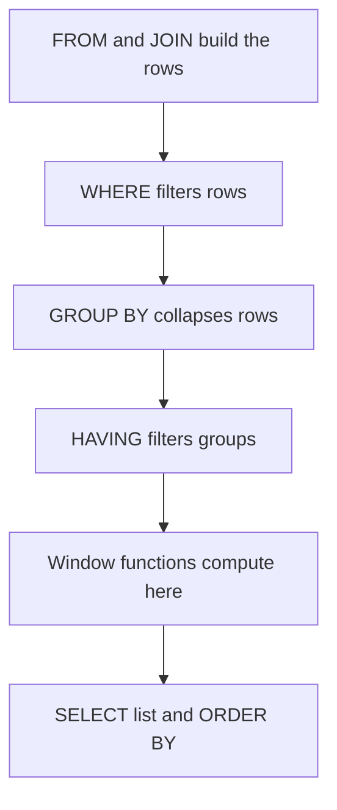
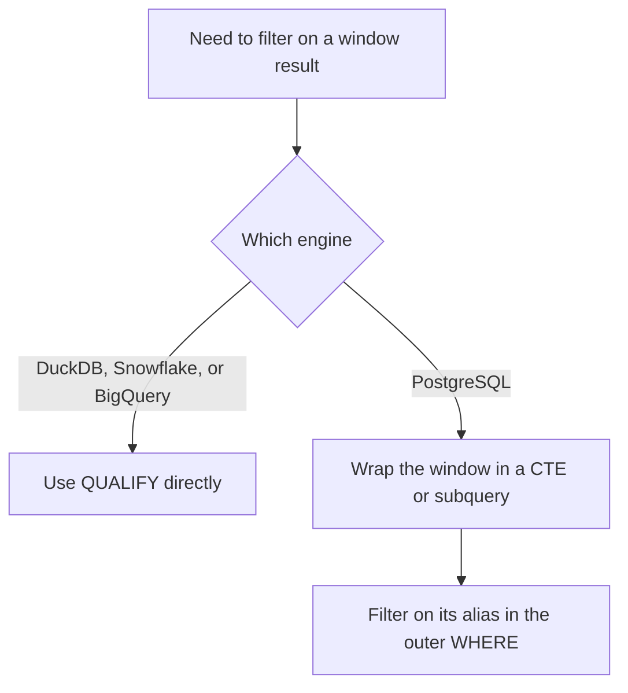

# Lecture 1 — Window Functions and Frames

> **Time:** 2 hours. Take the `OVER`/ranking material in one sitting and the frames/`QUALIFY` material in a second. **Prerequisites:** Week 1 (the retail star schema loaded in Postgres 16) and comfort with `GROUP BY` and joins. **Citations:** the PostgreSQL window tutorial at <https://www.postgresql.org/docs/16/tutorial-window.html>, the window-functions reference at <https://www.postgresql.org/docs/16/functions-window.html>, the `SELECT`/`WINDOW` syntax at <https://www.postgresql.org/docs/16/sql-select.html#SQL-WINDOW>, and DuckDB's window docs at <https://duckdb.org/docs/sql/window_functions> and `QUALIFY` at <https://duckdb.org/docs/sql/query_syntax/qualify>.

## 1. The one idea: keep the detail, get the aggregate next to it

Every analyst has written this query: "total revenue per category."

```sql
SELECT p.category,
       SUM(f.extended_price) AS category_revenue
FROM   fact_sales f
JOIN   dim_product p ON p.product_key = f.product_key
GROUP  BY p.category;
```

`GROUP BY` takes many rows and returns *one row per group*. You asked for revenue per category, you got one row per category, and the individual sale rows are gone. That is correct and useful — but it cannot answer "show me each sale, and next to it the total revenue of its category, and what fraction of the category that one sale represents." The moment the question is "each row, *and* an aggregate," `GROUP BY` is the wrong tool, because it destroys the rows you wanted to keep.

A **window function** is the tool. It computes an aggregate over a *window* of rows and attaches the result back to every individual row, without collapsing anything:

```sql
SELECT f.sales_key,
       p.category,
       f.extended_price,
       SUM(f.extended_price) OVER (PARTITION BY p.category) AS category_revenue,
       f.extended_price
         / SUM(f.extended_price) OVER (PARTITION BY p.category) AS share_of_category
FROM   fact_sales f
JOIN   dim_product p ON p.product_key = f.product_key;
```

The query returns one row per sale — the detail survives — and next to each sale sits the total revenue of its category and that sale's share of it. The `OVER (...)` clause is what turns an ordinary aggregate like `SUM` into a window function. That is the whole idea. Everything else this lecture is the machinery inside the `OVER`.

A useful way to hold the distinction: `GROUP BY` runs *before* the rows are emitted and reduces them; a window function runs *after* the rows are chosen (after `WHERE`, after `GROUP BY`, after `HAVING`) and decorates them. That ordering — window functions are computed late — is the reason you cannot filter on a window result in the same `WHERE` clause, which we return to in section 9.


*Window functions run after WHERE, GROUP BY, and HAVING, which is why a window result cannot be filtered in the same WHERE clause.*

## 2. The retail schema, restated

Every query in this lecture runs against the Week-1 star schema. The shape you need to remember:

```text
            dim_date                  dim_product
        +--------------+          +-----------------+
        | date_key  PK |          | product_key  PK |
        | full_date    |          | product_name    |
        | year         |          | category        |
        | month        |          | brand           |
        | day_of_week  |          | unit_cost       |
        +------+-------+          +--------+--------+
               |                           |
               |        fact_sales         |
               |   +-------------------+    |
               +-->| date_key      FK  |<---+
                   | product_key   FK  |
        dim_store  | store_key     FK  |  dim_customer
     +-----------+ | customer_key  FK  | +---------------+
     | store_key | | quantity          | | customer_key  |
     | store_name|<| unit_price        |>| customer_name |
     | region    | | extended_price    | | segment       |
     +-----------+ | discount_amount   | | signup_date   |
                   +-------------------+ +---------------+
```

`fact_sales` is at the grain of one row per product per sale line. `extended_price` is `quantity * unit_price - discount_amount` (computed at load time in Week 1). The dimensions are small; the fact is the big table. That asymmetry is what makes plan-reading in Lecture 3 interesting.

## 3. The three knobs of `OVER`: PARTITION BY, ORDER BY, frame

The `OVER` clause has three independent parts, and the single most common confusion in window functions is conflating them:

```text
  SUM(amount) OVER ( PARTITION BY store_key      -- knob 1: reset per group
                     ORDER BY full_date          -- knob 2: order within the group
                     ROWS BETWEEN ... AND ... )   -- knob 3: which neighbours to see
```

1. **`PARTITION BY`** divides rows into independent groups. The window function restarts at every partition boundary. It is exactly like `GROUP BY` *except it does not collapse rows*. Omit it and the whole result set is one partition.
2. **`ORDER BY`** (inside the `OVER`) defines the order rows are processed within the partition. It is what gives "running total" and "previous row" any meaning. Omit it and there is no order, so running aggregates are undefined and ranking functions cannot work.
3. **The frame clause** defines, for the current row, *which rows in the partition the function actually sees*. This is the knob most people never learn, and section 6 is devoted to it.

You can name a window once and reuse it with the `WINDOW` clause, which keeps long queries readable:

```sql
SELECT s.store_name,
       d.full_date,
       SUM(f.extended_price) OVER w  AS daily_running_total,
       AVG(f.extended_price) OVER w  AS daily_running_avg
FROM   fact_sales f
JOIN   dim_store s ON s.store_key = f.store_key
JOIN   dim_date  d ON d.date_key  = f.date_key
WINDOW w AS (PARTITION BY s.store_key ORDER BY d.full_date);
```

Defining `w` once and using it twice is documented at <https://www.postgresql.org/docs/16/sql-select.html#SQL-WINDOW>.

## 4. Ranking: ROW_NUMBER vs RANK vs DENSE_RANK

These three functions answer "what number is this row," and they differ only in how they treat ties. This is interview gold and a daily source of bugs.

```sql
SELECT p.category,
       p.product_name,
       SUM(f.extended_price) AS revenue,
       ROW_NUMBER() OVER (PARTITION BY p.category ORDER BY SUM(f.extended_price) DESC) AS rn,
       RANK()       OVER (PARTITION BY p.category ORDER BY SUM(f.extended_price) DESC) AS rnk,
       DENSE_RANK() OVER (PARTITION BY p.category ORDER BY SUM(f.extended_price) DESC) AS dense
FROM   fact_sales f
JOIN   dim_product p ON p.product_key = f.product_key
GROUP  BY p.category, p.product_name;
```

Note that window functions are allowed to operate *on the result of `GROUP BY`* — here the `SUM` is the grouped aggregate, and the ranking windows rank those grouped rows. Suppose within "Electronics" two products tie at revenue 5000 and a third sits at 4000:

```text
 product   revenue  rn  rnk  dense
 ------------------------------------
 phone      5000     1    1     1
 tablet     5000     2    1     1
 charger    4000     3    3     2
```

- `ROW_NUMBER` never ties: it hands out 1, 2, 3 even when the values are equal. Use it when you want *exactly N rows* per group and you do not care which of two ties you keep (add a tiebreaker in the `ORDER BY` if you do).
- `RANK` ties and then *skips*: 1, 1, 3. There is no rank 2, because two rows consumed it.
- `DENSE_RANK` ties and does *not* skip: 1, 1, 2. Use it when you want "the top 3 *revenue levels*."

"Top 3 products per category" therefore has two correct answers depending on intent: `ROW_NUMBER() <= 3` gives at most three rows; `DENSE_RANK() <= 3` gives every product in the top three revenue tiers, which can be more than three rows. Choosing wrong is a silent bug — the query runs and returns plausible nonsense. The functions are catalogued at <https://www.postgresql.org/docs/16/functions-window.html>.

Two cousins worth knowing: `NTILE(4)` splits the partition into four roughly equal buckets (quartiles), and `PERCENT_RANK()` / `CUME_DIST()` give relative position as a fraction — useful for "this customer is in the 95th percentile of spend."

## 5. Offset functions: LAG and LEAD for period-over-period

`LAG(expr, offset)` reads `expr` from the row `offset` positions *earlier* in the window order; `LEAD` reads *later*. This is how every period-over-period metric is written.

```sql
WITH monthly AS (
    SELECT d.year,
           d.month,
           SUM(f.extended_price) AS revenue
    FROM   fact_sales f
    JOIN   dim_date d ON d.date_key = f.date_key
    GROUP  BY d.year, d.month
)
SELECT year,
       month,
       revenue,
       LAG(revenue) OVER (ORDER BY year, month)            AS prev_month_revenue,
       revenue - LAG(revenue) OVER (ORDER BY year, month)  AS mom_change,
       ROUND( 100.0 * (revenue - LAG(revenue) OVER (ORDER BY year, month))
              / NULLIF(LAG(revenue) OVER (ORDER BY year, month), 0), 1) AS mom_pct
FROM   monthly
ORDER  BY year, month;
```

Three things to internalize:

- `LAG(revenue)` with no offset means `LAG(revenue, 1)`. The first row has no predecessor, so `LAG` returns `NULL` there — handle it (here the `mom_change` is simply `NULL` for the first month, which is correct).
- The `NULLIF(..., 0)` guards against dividing by a zero previous month. Without it a zero-revenue month makes the percentage blow up to a division error.
- Before window functions, this required a self-join of `monthly` to a copy of itself shifted by one month, with all the off-by-one and boundary pain that implies. `LAG`/`LEAD` make it one expression. You can supply a third argument as the default for the missing edge: `LAG(revenue, 1, 0)` returns 0 instead of `NULL` at the first row.

`FIRST_VALUE`, `LAST_VALUE`, and `NTH_VALUE` read a specific position in the *frame* (not the partition) — and `LAST_VALUE` is a classic trap, because the default frame ends at the current row, so `LAST_VALUE` returns the current row, not the last row of the partition. Fixing it requires an explicit frame, which is the next section.

## 6. Frames: ROWS vs RANGE vs GROUPS

The frame clause answers, *for each current row, which rows does the aggregate see?* When you write `ORDER BY` in a window with an aggregate and **omit** the frame, PostgreSQL applies the default `RANGE BETWEEN UNBOUNDED PRECEDING AND CURRENT ROW`. That default is the source of more confusion than any other part of window functions, so make it explicit until it is second nature.

A frame slides down the partition. Picture a 7-day running total — frame `ROWS BETWEEN 6 PRECEDING AND CURRENT ROW`:

```text
 ordered rows (one per day):    the frame for the row marked  *  :

   day 1  [ . . . . . . ]       day 7:  [ d1 d2 d3 d4 d5 d6 d7* ]  <- 7 rows
   day 2  [ . . . . . . ]       day 8:     [ d2 d3 d4 d5 d6 d7 d8* ]
   day 3  [ . . . . . . ]       day 9:        [ d3 d4 d5 d6 d7 d8 d9* ]
   ...                                          ^---- frame slides down, width 7 ----^
```

```sql
SELECT s.store_name,
       d.full_date,
       f_daily.daily_revenue,
       SUM(f_daily.daily_revenue) OVER (
           PARTITION BY s.store_key
           ORDER BY d.full_date
           ROWS BETWEEN 6 PRECEDING AND CURRENT ROW
       ) AS revenue_7day
FROM ( SELECT store_key, date_key, SUM(extended_price) AS daily_revenue
       FROM   fact_sales GROUP BY store_key, date_key ) f_daily
JOIN dim_store s ON s.store_key = f_daily.store_key
JOIN dim_date  d ON d.date_key  = f_daily.date_key
ORDER BY s.store_name, d.full_date;
```

The three frame *modes* differ in how they count, and the difference is real:

- **`ROWS`** counts physical rows. `6 PRECEDING` means "the six rows physically before this one." Ties in the `ORDER BY` value do **not** merge. This is what you almost always want for a "7-day" or "last 10" calculation, *if your data has one row per day*.
- **`RANGE`** counts by *value* of the `ORDER BY` column. `RANGE BETWEEN '6 days' PRECEDING AND CURRENT ROW` (with a date order column) means "all rows whose date is within six days," which correctly handles gaps and duplicates by value, not by position. With `RANGE`, all rows sharing the current row's `ORDER BY` value are in the frame together — that is the default-frame surprise.
- **`GROUPS`** counts *peer groups* of equal `ORDER BY` values. `GROUPS BETWEEN 1 PRECEDING AND CURRENT ROW` means "this peer group and the one before it," regardless of how many rows each group has.

The frame boundaries you will write most: `UNBOUNDED PRECEDING` (start of partition), `N PRECEDING`, `CURRENT ROW`, `N FOLLOWING`, `UNBOUNDED FOLLOWING` (end of partition). A *centered* 3-day moving average is `ROWS BETWEEN 1 PRECEDING AND 1 FOLLOWING`. A cumulative (running) total to date is the default `UNBOUNDED PRECEDING AND CURRENT ROW`. A "total of the whole partition on every row" is `ROWS BETWEEN UNBOUNDED PRECEDING AND UNBOUNDED FOLLOWING` — which is what you must write to make `LAST_VALUE` actually return the last value:

```sql
LAST_VALUE(revenue) OVER (
    PARTITION BY store_key ORDER BY full_date
    ROWS BETWEEN UNBOUNDED PRECEDING AND UNBOUNDED FOLLOWING
)
```

The frame syntax is documented in full at <https://www.postgresql.org/docs/16/sql-expressions.html#SYNTAX-WINDOW-FUNCTIONS>; the `RANGE`/`ROWS`/`GROUPS` distinction is one of the few places PostgreSQL and the SQL standard agree precisely.

## 7. Running aggregates and the difference from a self-join total

Cumulative-to-date is the default frame, so the cleanest running total is simply:

```sql
SELECT d.full_date,
       SUM(daily.daily_revenue) AS revenue_today,
       SUM(SUM(daily.daily_revenue)) OVER (ORDER BY d.full_date) AS revenue_running
FROM ( SELECT date_key, SUM(extended_price) AS daily_revenue
       FROM fact_sales GROUP BY date_key ) daily
JOIN dim_date d ON d.date_key = daily.date_key
GROUP BY d.full_date
ORDER BY d.full_date;
```

The nested `SUM(SUM(...))` is not a typo: the inner `SUM` is the `GROUP BY` aggregate (revenue per day), the outer `SUM(...) OVER (...)` is the window running total over those daily sums. PostgreSQL evaluates the grouped aggregate first, then the window over the grouped result. Reading that line correctly is a small rite of passage.

## 8. A window is not a GROUP BY — the comparison, side by side

| Property | `GROUP BY` | window function |
|---|---|---|
| Rows out | one per group | one per input row |
| Detail | destroyed | preserved |
| Where computed | before output, reduces | after `WHERE`/`GROUP BY`/`HAVING`, decorates |
| Filter on result | `HAVING` | not in the same level (subquery / CTE / `QUALIFY`) |
| Multiple groupings in one query | needs `GROUPING SETS` | each window can partition differently |

That last row is underrated: in one `SELECT` you can have `SUM(x) OVER (PARTITION BY category)` and `SUM(x) OVER (PARTITION BY region)` and `SUM(x) OVER ()` (grand total) side by side, each partitioning the same rows differently. `GROUP BY` can produce only one grouping per query (which is exactly the gap `GROUPING SETS` fills, in Lecture 2).

## 9. QUALIFY — taught honestly

You will eventually want to filter on a window result: "give me only the #1 product per category." The intuitive query does **not** work in any engine:

```sql
-- WRONG everywhere: WHERE runs before window functions are computed
SELECT category, product_name, revenue
FROM   product_revenue
WHERE  ROW_NUMBER() OVER (PARTITION BY category ORDER BY revenue DESC) = 1;
-- ERROR:  window functions are not allowed in WHERE
```

The reason is the evaluation order from section 1: `WHERE` is applied *before* window functions exist. So you have two real options.


*QUALIFY filters a window result directly on engines that support it; PostgreSQL needs the CTE-and-WHERE workaround instead.*

**DuckDB / Snowflake / BigQuery — `QUALIFY`.** `QUALIFY` is to window functions what `HAVING` is to `GROUP BY`: a clause that filters on the window result. It is clean and it is the right tool *on engines that have it*:

```sql
-- DuckDB / Snowflake / BigQuery ONLY -- does not exist in PostgreSQL
SELECT category, product_name, revenue
FROM   product_revenue
QUALIFY ROW_NUMBER() OVER (PARTITION BY category ORDER BY revenue DESC) = 1;
```

DuckDB's `QUALIFY` is documented at <https://duckdb.org/docs/sql/query_syntax/qualify>. **PostgreSQL has no `QUALIFY` and never will compile it.**

**PostgreSQL — wrap and filter.** Compute the window in a subquery or CTE, then filter on its alias in the outer query:

```sql
-- PostgreSQL equivalent
WITH ranked AS (
    SELECT category, product_name, revenue,
           ROW_NUMBER() OVER (PARTITION BY category ORDER BY revenue DESC) AS rn
    FROM   product_revenue
)
SELECT category, product_name, revenue
FROM   ranked
WHERE  rn = 1;
```

The two produce identical results. The discipline this week: **label every query with its engine.** If you paste a `QUALIFY` query into Postgres you get a syntax error; if you paste the CTE form into DuckDB it runs fine (DuckDB supports both). Know which one you are writing before it reaches a production warehouse.

## 10. A note on DuckDB window syntax

DuckDB implements the same `OVER`, `PARTITION BY`, `ORDER BY`, and frame syntax as PostgreSQL — a window query you write for Postgres runs unchanged on DuckDB — and it adds `QUALIFY` on top. DuckDB's window reference is at <https://duckdb.org/docs/sql/window_functions>. The reason to care: in Lecture 3 you will run the *same* analytical query on both engines and read both plans, and the only difference in the SQL you write will be `QUALIFY` versus the CTE wrap. Keeping the window logic identical is what makes that comparison honest.

## Exercise pointer

Go to [`exercises/exercise-01-window-functions.sql`](../exercises/exercise-01-window-functions.sql). You will rank products by revenue per category (and choose `ROW_NUMBER` vs `DENSE_RANK` deliberately), build a 7-day running sales total with an explicit `ROWS` frame, and compute month-over-month change with `LAG`. The answer slots are marked `-- YOUR ANSWER:`; full solutions with sample output are in [`exercises/SOLUTIONS.md`](../exercises/SOLUTIONS.md).

## Summary

- A window function keeps the detail rows and attaches an aggregate; `GROUP BY` collapses rows. That is the whole reason window functions exist.
- `OVER` has three knobs: `PARTITION BY` (reset per group), in-window `ORDER BY` (process order), and the frame (which neighbours the function sees).
- `ROW_NUMBER` never ties; `RANK` ties and skips; `DENSE_RANK` ties and does not skip. "Top N per group" depends on which one you pick.
- `LAG`/`LEAD` read neighbouring rows and are how every period-over-period metric is written; guard the boundary `NULL` and the divide-by-zero.
- The default frame is `RANGE UNBOUNDED PRECEDING AND CURRENT ROW`. Write `ROWS BETWEEN N PRECEDING AND CURRENT ROW` explicitly for a real "last N rows" window, and `ROWS BETWEEN UNBOUNDED PRECEDING AND UNBOUNDED FOLLOWING` to make `LAST_VALUE` work.
- `WHERE` cannot filter on a window function. `QUALIFY` solves this on DuckDB / Snowflake / BigQuery; PostgreSQL requires wrapping the window in a CTE/subquery and filtering on its alias.

Cited references: PostgreSQL window tutorial <https://www.postgresql.org/docs/16/tutorial-window.html>; window-functions reference <https://www.postgresql.org/docs/16/functions-window.html>; window-frame syntax <https://www.postgresql.org/docs/16/sql-expressions.html#SYNTAX-WINDOW-FUNCTIONS>; `WINDOW` clause <https://www.postgresql.org/docs/16/sql-select.html#SQL-WINDOW>; DuckDB window functions <https://duckdb.org/docs/sql/window_functions>; DuckDB `QUALIFY` <https://duckdb.org/docs/sql/query_syntax/qualify>.
