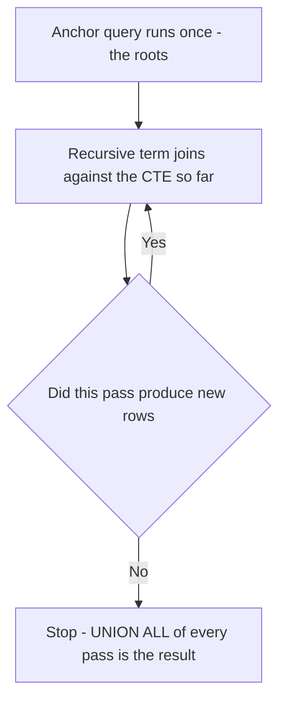
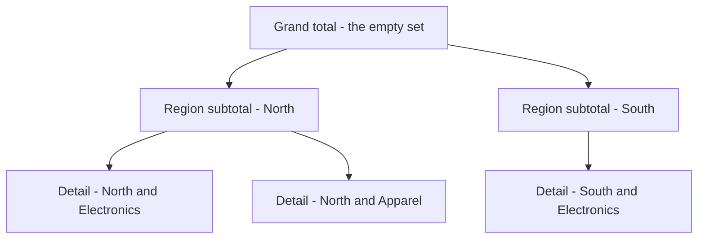

# Lecture 2 — CTEs, Recursive CTEs, Grouping Sets, and the Anti-Join

> **Time:** 2 hours. CTEs and recursion in one sitting; grouping sets and anti/semi-joins in a second. **Prerequisites:** Lecture 1 (window functions), the Week-1 retail star schema. **Citations:** PostgreSQL `WITH` queries at <https://www.postgresql.org/docs/16/queries-with.html>, grouping sets at <https://www.postgresql.org/docs/16/queries-table-expressions.html#QUERIES-GROUPING-SETS>, the `GROUPING()` function at <https://www.postgresql.org/docs/16/functions-aggregate.html#FUNCTIONS-GROUPING-TABLE>, and subquery expressions (`EXISTS`/`IN`) at <https://www.postgresql.org/docs/16/functions-subquery.html>.

## 1. The CTE: name every step

A Common Table Expression is a named subquery declared with `WITH` and referenced by name below. It does nothing a subquery cannot do; what it buys you is *readability* — a query becomes a top-to-bottom sequence of named steps instead of a pyramid of nested parentheses.

```sql
WITH monthly_revenue AS (
    SELECT d.year, d.month, SUM(f.extended_price) AS revenue
    FROM   fact_sales f
    JOIN   dim_date d ON d.date_key = f.date_key
    GROUP  BY d.year, d.month
),
ranked AS (
    SELECT *,
           RANK() OVER (PARTITION BY year ORDER BY revenue DESC) AS month_rank
    FROM   monthly_revenue
)
SELECT year, month, revenue, month_rank
FROM   ranked
WHERE  month_rank <= 3
ORDER  BY year, month_rank;
```

Read top to bottom: first compute monthly revenue, then rank months within each year, then keep the top three. The same logic as a nested subquery would be harder to review, and a colleague approving your PR can follow named steps in a way they cannot follow a triple-nested derived table. Multiple CTEs are comma-separated and each can reference the ones declared before it. The reference is <https://www.postgresql.org/docs/16/queries-with.html>.

## 2. Materialization: the optimization fence and how to control it

Here is a subtlety that bites people moving between PostgreSQL versions. Historically (Postgres 11 and earlier) a CTE was *always* an **optimization fence**: PostgreSQL computed it once into a temporary result and the planner could not push predicates into it or inline it. Since **PostgreSQL 12**, a CTE that is referenced once, is not recursive, and has no side effects is *inlined* by default — folded into the main query so the planner can optimize across the boundary. That change made some old queries faster and a few slower.

You can force either behaviour explicitly, which is a real tuning knob:

```sql
-- Force a single computation (a true fence). Useful when the CTE is expensive
-- and referenced many times, so you want it computed exactly once.
WITH heavy AS MATERIALIZED (
    SELECT product_key, SUM(extended_price) AS rev
    FROM fact_sales GROUP BY product_key
)
SELECT * FROM heavy h1 JOIN heavy h2 ON h2.rev = h1.rev;  -- referenced twice

-- Force inlining, so the planner can push a WHERE down into the CTE.
WITH recent AS NOT MATERIALIZED (
    SELECT * FROM fact_sales
)
SELECT * FROM recent WHERE date_key > 20260101;  -- predicate pushed into the scan
```

The rule of thumb: `MATERIALIZED` when an expensive CTE is referenced multiple times (compute it once); `NOT MATERIALIZED` when you want the planner to push filters through it. When in doubt, read the plan (Lecture 3) — `EXPLAIN` will show whether the CTE became a `CTE Scan` (materialized) or was folded into the surrounding nodes. The keywords are documented on the same `WITH` page.

## 3. Recursive CTEs: the only way SQL walks a hierarchy

A recursive CTE has three parts: an **anchor** (the seed rows), `UNION ALL`, and a **recursive term** that references the CTE's own name. PostgreSQL evaluates the anchor once, then runs the recursive term repeatedly — each iteration sees the rows produced by the previous one — until an iteration produces zero new rows.

### 3a. Walking a category tree

Suppose `dim_product` carries a self-referencing category hierarchy: a `category_id` and a `parent_category_id` (the Week-1 schema can be extended with a small `dim_category` table; for the lecture assume it exists with `category_id`, `category_name`, `parent_category_id`). "Show every category with its full depth and path from the root":

```sql
WITH RECURSIVE category_tree AS (
    -- anchor: the roots (no parent)
    SELECT category_id,
           category_name,
           parent_category_id,
           1                              AS depth,
           category_name::text            AS path
    FROM   dim_category
    WHERE  parent_category_id IS NULL

    UNION ALL

    -- recursive term: children of rows already in category_tree
    SELECT c.category_id,
           c.category_name,
           c.parent_category_id,
           ct.depth + 1,
           ct.path || ' > ' || c.category_name
    FROM   dim_category c
    JOIN   category_tree ct ON ct.category_id = c.parent_category_id
)
SELECT depth, path, category_id
FROM   category_tree
ORDER  BY path;
```

The result is the whole tree flattened, with a `depth` and a human-readable `path` like `Electronics > Phones > Smartphones`. The recursion terminates because the tree is finite: eventually a level has no children, the recursive term returns no rows, and PostgreSQL stops.


*A recursive CTE evaluates the anchor once, then reruns the recursive term against the growing result until a pass adds no new rows.*

If the data might contain a *cycle* (A is a child of B which is a child of A — a data bug, but they happen), the recursion never terminates. PostgreSQL 14+ supports the standard `CYCLE` clause to detect and stop on cycles:

```sql
WITH RECURSIVE category_tree AS ( ... )
  CYCLE category_id SET is_cycle USING cycle_path
SELECT * FROM category_tree WHERE NOT is_cycle;
```

### 3b. Generating a date spine

The other canonical recursion is *generating* rows. A common analytical need is "every day in a range, even days with zero sales," so that a chart has no gaps. (PostgreSQL also has `generate_series` for this, which is simpler — but the recursive form is worth seeing because it works on engines without `generate_series` and it teaches the pattern.)

```sql
WITH RECURSIVE date_spine AS (
    SELECT DATE '2026-01-01' AS d           -- anchor
    UNION ALL
    SELECT d + INTERVAL '1 day'             -- recursive term
    FROM   date_spine
    WHERE  d < DATE '2026-12-31'            -- termination guard
)
SELECT ds.d::date AS calendar_date,
       COALESCE(SUM(f.extended_price), 0) AS revenue
FROM   date_spine ds
LEFT   JOIN dim_date dd ON dd.full_date = ds.d::date
LEFT   JOIN fact_sales f ON f.date_key = dd.date_key
GROUP  BY ds.d
ORDER  BY ds.d;
```

The `LEFT JOIN` is the point: the spine has every day, the facts have only days with sales, and the left join with `COALESCE(..., 0)` fills the gaps with zero. This is how you turn a sparse fact table into a dense, gap-free time series. The recursive-query rules are on the same `WITH` page above.

## 4. GROUPING SETS, ROLLUP, CUBE: many groupings in one pass

A plain `GROUP BY region, category` gives you one grouping. A real finance report wants the detail *and* the subtotal per region *and* the grand total, all at once. Running three queries and union-ing them works but scans the fact table three times. `GROUPING SETS` does it in one pass:

```sql
SELECT s.region,
       p.category,
       SUM(f.extended_price) AS revenue
FROM   fact_sales f
JOIN   dim_store s   ON s.store_key   = f.store_key
JOIN   dim_product p ON p.product_key = f.product_key
GROUP  BY GROUPING SETS (
    (s.region, p.category),   -- detail: revenue per region per category
    (s.region),               -- subtotal: revenue per region
    ()                         -- grand total: revenue overall
);
```

`ROLLUP(region, category)` is shorthand for the *hierarchical* subtotals `(region, category), (region), ()` — exactly the three sets above. `CUBE(region, category)` is shorthand for *every* combination: `(region, category), (region), (category), ()`. Use `ROLLUP` for a hierarchy (region then category within it); use `CUBE` when you want every cross-tabulated subtotal. The family is documented at <https://www.postgresql.org/docs/16/queries-table-expressions.html#QUERIES-GROUPING-SETS>.


*ROLLUP walks the hierarchy top to bottom, emitting the grand total, each region subtotal, and every detail row in one pass.*

```sql
-- identical result to the GROUPING SETS above
SELECT s.region, p.category, SUM(f.extended_price) AS revenue
FROM fact_sales f
JOIN dim_store s ON s.store_key = f.store_key
JOIN dim_product p ON p.product_key = f.product_key
GROUP BY ROLLUP (s.region, p.category);
```

## 5. The GROUPING() function: telling a subtotal NULL from a data NULL

The subtotal rows have `NULL` in the columns that were rolled up. A "revenue per region" subtotal row has `NULL` in `category`. But what if some products genuinely have a `NULL` category? Then a data `NULL` and a subtotal `NULL` look identical, and your report is ambiguous. The `GROUPING()` function disambiguates: it returns `1` when the column is a subtotal (was rolled up in this row) and `0` when it is a real value.

```sql
SELECT CASE WHEN GROUPING(s.region) = 1 THEN 'ALL REGIONS' ELSE s.region   END AS region,
       CASE WHEN GROUPING(p.category) = 1 THEN 'ALL CATEGORIES' ELSE p.category END AS category,
       GROUPING(s.region)   AS is_region_subtotal,
       GROUPING(p.category) AS is_category_subtotal,
       SUM(f.extended_price) AS revenue
FROM   fact_sales f
JOIN   dim_store s   ON s.store_key   = f.store_key
JOIN   dim_product p ON p.product_key = f.product_key
GROUP  BY ROLLUP (s.region, p.category)
ORDER  BY GROUPING(s.region), s.region, GROUPING(p.category), p.category;
```

Now a grand-total row reads `ALL REGIONS / ALL CATEGORIES`, a region subtotal reads `North / ALL CATEGORIES`, and a genuine missing category reads `North / (null)` — three visibly different things. `GROUPING()` is documented at <https://www.postgresql.org/docs/16/functions-aggregate.html#FUNCTIONS-GROUPING-TABLE>. The `ORDER BY GROUPING(...)` trick sorts subtotal rows to the bottom of their group, which is how the report reads naturally.

## 6. Semi-joins: rows in A that have a match in B

A semi-join keeps rows from the left table that have *at least one* match on the right, without duplicating them and without pulling right-side columns. Two equivalent forms:

```sql
-- customers who have placed at least one order  (EXISTS form)
SELECT c.customer_key, c.customer_name
FROM   dim_customer c
WHERE  EXISTS (SELECT 1 FROM fact_sales f WHERE f.customer_key = c.customer_key);

-- same, IN form
SELECT c.customer_key, c.customer_name
FROM   dim_customer c
WHERE  c.customer_key IN (SELECT customer_key FROM fact_sales);
```

`EXISTS` stops at the first match (it is a boolean test), so it does not multiply rows the way an inner `JOIN` to `fact_sales` would. Prefer it when you only want to test membership, not pull fact columns. `EXISTS`/`IN` are documented at <https://www.postgresql.org/docs/16/functions-subquery.html>.

## 7. Anti-joins: rows in A with NO match in B

The negation — "customers who have *never* ordered" — is an anti-join. Two correct forms:

```sql
-- NOT EXISTS form (preferred)
SELECT c.customer_key, c.customer_name
FROM   dim_customer c
WHERE  NOT EXISTS (SELECT 1 FROM fact_sales f WHERE f.customer_key = c.customer_key);

-- LEFT JOIN ... IS NULL form (equivalent, sometimes a clearer plan)
SELECT c.customer_key, c.customer_name
FROM   dim_customer c
LEFT   JOIN fact_sales f ON f.customer_key = c.customer_key
WHERE  f.customer_key IS NULL;
```

Both ask the optimizer for an anti-join. The `LEFT JOIN ... IS NULL` form works because non-matching customers get all-`NULL` right-side columns, and filtering `f.customer_key IS NULL` keeps exactly the non-matches.

## 8. The NOT IN trap — feel it on purpose

`NOT IN` *looks* like a drop-in for `NOT EXISTS`. It is a trap when the subquery can return `NULL`:

```sql
-- DANGER: if ANY row in the subquery has customer_key = NULL, this returns ZERO rows.
SELECT c.customer_key, c.customer_name
FROM   dim_customer c
WHERE  c.customer_key NOT IN (SELECT customer_key FROM fact_sales);
```

Here is why. `x NOT IN (a, b, c)` is defined as `x <> a AND x <> b AND x <> c`. If any of those values is `NULL`, then `x <> NULL` evaluates to `NULL` (unknown — SQL three-valued logic), and `TRUE AND TRUE AND NULL` is `NULL`, which is not `TRUE`, so the row is *excluded*. The net effect: a single `NULL` anywhere in the subquery makes `NOT IN` return **no rows at all**, silently. The query does not error; it just lies.

```text
   customer_key NOT IN (10, 20, NULL)
   = (key <> 10) AND (key <> 20) AND (key <> NULL)
   = TRUE        AND TRUE        AND NULL
   = NULL  ->  not TRUE  ->  row dropped, for EVERY customer
```

`NOT EXISTS` has no such problem: it tests row-by-row existence and treats the `NULL` correctly. **Rule: use `NOT EXISTS` for anti-joins; reach for `NOT IN` only when you are certain the subquery column is `NOT NULL`** (and even then, `NOT EXISTS` is the safer habit). This is one of the most expensive silent bugs in analytical SQL, and you will reproduce it deliberately in Exercise 2.

## 9. Relational division: "sold in every store"

A harder set-membership question: "which products have sold in *every* store?" This is *relational division* — for each product, the set of stores it sold in must contain the set of all stores. The classic formulation is "there is no store where this product did *not* sell," a double anti-join:

```sql
SELECT p.product_key, p.product_name
FROM   dim_product p
WHERE  NOT EXISTS (
    SELECT 1
    FROM   dim_store s
    WHERE  NOT EXISTS (
        SELECT 1
        FROM   fact_sales f
        WHERE  f.product_key = p.product_key
          AND  f.store_key   = s.store_key
    )
);
```

Read it inside-out: the inner `NOT EXISTS` says "this product did not sell in this store"; the outer `NOT EXISTS` over all stores says "there is no store in which this product failed to sell" — i.e. it sold everywhere. A count-based equivalent is often clearer and faster: a product sold in every store iff its distinct store count equals the total store count.

```sql
SELECT f.product_key
FROM   fact_sales f
GROUP  BY f.product_key
HAVING COUNT(DISTINCT f.store_key) = (SELECT COUNT(*) FROM dim_store);
```

Both are correct; the count form usually plans better and is easier to review. You will write both in Exercise 2 and compare their plans.

## Exercise pointer

Go to [`exercises/exercise-02-grouping-and-anti-joins.sql`](../exercises/exercise-02-grouping-and-anti-joins.sql). You will build a region/category subtotal report with `GROUPING SETS` and `GROUPING()`, find customers with no orders with both anti-join forms, and find products sold in every store with both relational-division forms. Recursive CTEs appear again in the homework. Solutions with sample output are in [`exercises/SOLUTIONS.md`](../exercises/SOLUTIONS.md).

## Summary

- A CTE (`WITH`) names every intermediate step and makes a query reviewable; it does nothing a subquery cannot, but readability is the point.
- Since Postgres 12 a single-use CTE is inlined by default; `MATERIALIZED` forces one computation (good when referenced many times), `NOT MATERIALIZED` forces inlining (good for predicate pushdown).
- A recursive CTE is anchor + `UNION ALL` + recursive term; it walks hierarchies (category tree, org chart) and generates series (date spine). Guard termination; use `CYCLE` if cycles are possible.
- `GROUPING SETS` produces multiple groupings in one pass; `ROLLUP` is the hierarchical subtotals, `CUBE` is every combination. `GROUPING()` tells a subtotal `NULL` from a data `NULL`.
- Semi-join = "has a match" (`EXISTS`/`IN`); anti-join = "has no match" (`NOT EXISTS` / `LEFT JOIN ... IS NULL`).
- `NOT IN` with a `NULL` in the subquery silently returns zero rows. Use `NOT EXISTS` for anti-joins.
- "Sold in every store" is relational division: a double `NOT EXISTS`, or a `COUNT(DISTINCT)` equal to the total.

Cited references: PostgreSQL `WITH` queries <https://www.postgresql.org/docs/16/queries-with.html>; grouping sets <https://www.postgresql.org/docs/16/queries-table-expressions.html#QUERIES-GROUPING-SETS>; `GROUPING()` <https://www.postgresql.org/docs/16/functions-aggregate.html#FUNCTIONS-GROUPING-TABLE>; subquery expressions <https://www.postgresql.org/docs/16/functions-subquery.html>.
