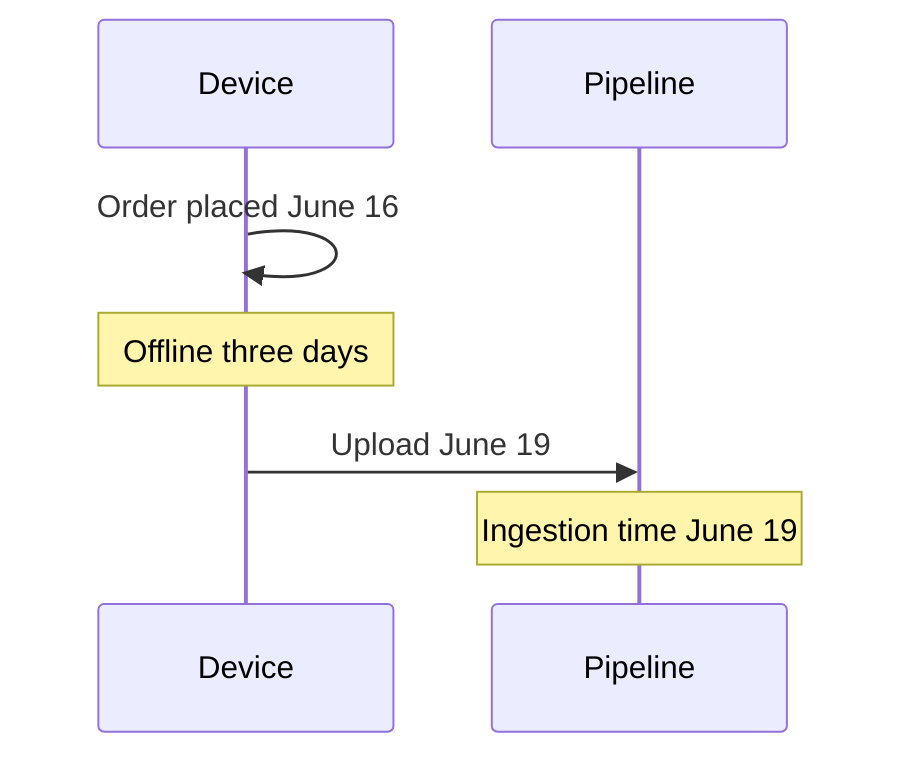
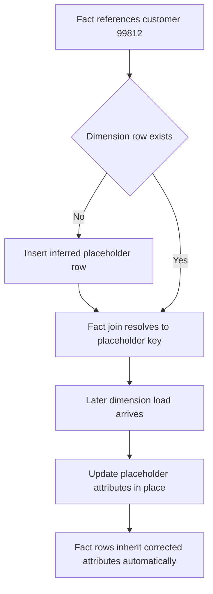

# Lecture 3 — Late-Arriving and Out-of-Order Records: Event Time vs Ingestion Time, the Lookback Window, and the Late-Arriving Dimension

> **Time:** ~2.5 hours. **Prerequisites:** Lectures 1 and 2 (the staging pattern, the watermark, the idempotent upsert). **Citations:** Kleppmann *DDIA* (event time vs processing time, the straggler problem, ch. 11) <https://dataintensive.net/>; Kimball Group on late-arriving dimensions <https://www.kimballgroup.com/data-warehouse-business-intelligence-resources/kimball-techniques/dimensional-modeling-techniques/late-arriving-dimensions/>; PostgreSQL 16 INSERT ... ON CONFLICT <https://www.postgresql.org/docs/16/sql-insert.html#SQL-ON-CONFLICT>; psycopg 3 docs <https://www.psycopg.org/psycopg3/docs/>.

## 1. The record that humbles the naive watermark

Lecture 2's watermark is correct under one assumption: that records arrive in roughly the order they happened. Reality violates that assumption constantly. A mobile app buffers events offline on a subway and uploads them when it surfaces three days later. A partner re-sends a corrected invoice for last Tuesday. A clock-skewed server backdates a row. Each of these is a **late-arriving record** — a record whose event time is in the past relative to data you have already processed — and if you watermark naively on event time, you will silently drop it. Silently is the operative word: nothing errors, no row count looks wrong, and the only symptom is a revenue number that is quietly too low. This lecture is about handling that record on purpose.

## 2. Event time vs ingestion time — two clocks, never the same

Every record carries (at least) two timestamps, and conflating them is the root cause of the whole problem:

- **Event time** — when the thing *happened* in the real world. The order was placed at `2026-06-16T14:02Z`. This clock belongs to the source/device and is what business questions are about ("revenue *on the 16th*").
- **Ingestion/processing time** — when *your pipeline saw the record*. The order landed in your extract at `2026-06-19T03:00Z`. This clock belongs to your infrastructure and is monotonic from your point of view — you can only ingest a record *now*, never in the past.

```text
   event time  ──────●─────────────────────────────────────────►
               (order placed, 06-16 14:02)
                       \
                        \  (device offline 3 days)
                         \
   ingestion    ──────────────────────────────────●─────────────►
                                          (pipeline sees it, 06-19 03:00)

   The gap between the two is "lateness". For most records it is seconds.
   For the late record it is days. A watermark on EVENT time cannot see it.
```

Kleppmann's *DDIA* chapter 11 develops this distinction precisely and names the consequence: a window keyed on event time can never be *certain* it has seen all its events, because a straggler can always arrive later <https://dataintensive.net/>. Batch inherits the same truth; streaming (Week 9) just makes it continuous.


*Event time and ingestion time diverge whenever a device stays offline before uploading.*

## 3. Why an event-time watermark silently drops a late record

Recall Lecture 2's incremental extract: `WHERE updated_at > last_watermark`. Suppose `updated_at` is set to the *event* time (a common, innocent-looking mistake). Walk it through:

```text
   run on 06-18:  loads orders through event-time 06-17, advances wm → 06-17T23:59
   run on 06-19:  reads WHERE event_time > 06-17T23:59
                  the late record's event_time is 06-16T14:02
                  06-16 is NOT > 06-17  ──► the late record is FILTERED OUT
                  ──► it is dropped, forever, silently
```

The record arrived in time (its ingestion time is 06-19), but the *filter* is on event time, and on event time it is behind the watermark. This is the canonical late-data bug. Three fixes, in increasing robustness:

### Fix A — watermark on ingestion time (or a monotonic `id`)

If `updated_at`/the watermark column is the *ingestion* time — a value your pipeline (or the source's insert) stamps at write time, which only ever increases — then the late record's watermark value is `06-19`, which *is* greater than the last watermark, so the extract picks it up. Same for a monotonic `max(id)`: a late insert still gets a higher `id`. The cost: an ingestion-time watermark requires the source to expose a reliable ingestion/`updated_at` column that bumps on every write, and an `id` watermark misses in-place updates (an edited old row keeps its `id`).

### Fix B — the lookback window (reprocessing window)

Whatever the watermark is, re-read a trailing window every run rather than reading strictly forward:

```python
LOOKBACK = timedelta(days=3)   # cover lateness up to 3 days

def extract_with_lookback(conn, watermark, lookback=LOOKBACK):
    cutoff = watermark - lookback         # step BACK before reading forward
    with conn.cursor() as cur:
        cur.execute(
            "SELECT order_id, customer_id, product_id, order_ts, quantity, "
            "       unit_price, updated_at "
            "FROM   src_orders "
            "WHERE  updated_at > %s "       # re-read the last `lookback` of data
            "ORDER  BY updated_at",
            (cutoff,),
        )
        return cur.fetchall()
```

You deliberately re-read the last three days every run. The rows you already loaded come back too — and that is *fine*, because the natural-key upsert from Lecture 2 makes re-loading them a no-op. The lookback turns "did I miss a late record?" from a silent bug into a routine, idempotent re-scan. The cost is reading more rows than strictly changed; the window length is a tuning knob (how late can a record plausibly be?) traded against scan cost.

### Fix C — the natural-key upsert as self-correction

Whichever extract you use, the upsert is what lets a re-seen record *correct* rather than *duplicate*. If a late record is a correction of an order you already loaded (same `order_id`, new `quantity`), the `ON CONFLICT (order_id) DO UPDATE` overwrites the old measures with the new ones, and any aggregate over `fact_sales` recomputes to the corrected total on the next read. No delete, no manual patch — the aggregate self-heals because the fact row was overwritten in place.

The production recipe combines all three: **ingestion/`id` watermark + a lookback window sized to your worst plausible lateness + a natural-key upsert.** That combination catches late inserts, catches late corrections, and never double-counts.

## 4. Out-of-order records and the older-overwriting-newer trap

A close cousin of lateness is **out-of-order arrival**: two updates to the same order arrive in the wrong order, so the *older* version arrives *after* the newer one. A naive full-replace upsert would let the older version clobber the newer — a silent regression.

The guard, introduced in Lecture 2, is the conditional update: only overwrite if the incoming row is genuinely newer.

```sql
INSERT INTO fact_sales (order_id, quantity, unit_price, amount, updated_at)
VALUES (%(order_id)s, %(quantity)s, %(unit_price)s, %(amount)s, %(updated_at)s)
ON CONFLICT (order_id) DO UPDATE SET
    quantity   = EXCLUDED.quantity,
    unit_price = EXCLUDED.unit_price,
    amount     = EXCLUDED.amount,
    updated_at = EXCLUDED.updated_at
WHERE  fact_sales.updated_at < EXCLUDED.updated_at;  -- only if strictly newer
```

The `WHERE fact_sales.updated_at < EXCLUDED.updated_at` makes the upsert a *last-writer-wins by event/version time*, not by arrival order. An out-of-order older copy hits the `WHERE`, finds the stored row is already newer, and the update is skipped — the row is left correct. This requires a trustworthy `updated_at` (or a version counter) on every row; if the source cannot give you one, you fall back to "newest ingestion wins," which is usually acceptable but not always correct.

## 5. Late-arriving dimensions — the Kimball problem

Lateness is not only a fact problem. Sometimes a fact arrives referencing a *dimension member that has not been loaded yet*: an order references `customer_id = 99812`, but the customer feed has not delivered customer 99812 yet (the customer registered seconds before ordering, and the dimension load runs hourly). This is the **late-arriving dimension**, and Kimball's canonical treatment is at <https://www.kimballgroup.com/data-warehouse-business-intelligence-resources/kimball-techniques/dimensional-modeling-techniques/late-arriving-dimensions/>.

If your fact-load join is an inner join to `dim_customer`, the fact row silently *vanishes* (no matching dimension row → join produces nothing). That is data loss disguised as a clean run. Two standard fixes:

### The inferred-member / placeholder pattern

When the fact references a dimension key not yet present, **insert a placeholder dimension row** (an "inferred member") with the natural key and `NULL`/`'Unknown'` attributes, give it a surrogate key, and point the fact at it. When the real dimension data arrives later, you *update the placeholder in place* (a Type-1 overwrite, or a Type-2 new version) — and because the fact already points at the surrogate key, the fact rows automatically inherit the corrected attributes. Sketch:

```sql
-- 1. Resolve the dimension; if absent, create an inferred member, then resolve again.
INSERT INTO dim_customer (customer_id, customer_name, is_current, is_inferred)
SELECT DISTINCT s.customer_id, 'Unknown', true, true
FROM   stg_orders s
LEFT   JOIN dim_customer c
       ON c.customer_id = s.customer_id AND c.is_current
WHERE  c.customer_key IS NULL
ON CONFLICT (customer_id) WHERE is_current DO NOTHING;

-- 2. Now the fact-load join is a safe inner join: every customer_id resolves,
--    to a real member or to its inferred placeholder.

-- 3. Later, when the real customer arrives, the dimension load overwrites the
--    placeholder's attributes (is_inferred flips to false); facts keep their key.
```

### Or: load the fact with a sentinel surrogate key

A lighter-weight variant points unresolved facts at a single shared "Unknown" dimension row (surrogate key `-1`, the standard Kimball sentinel) and reprocesses them on a later run once the real dimension lands. The placeholder/inferred-member pattern is preferred because it preserves the natural key, so the correction is automatic.

The rule, either way: **never let a late dimension turn a fact into a silently dropped row.** An inner join that drops unmatched facts is the same class of bug as an event-time watermark that drops late facts — a silent loss with no error.


*A placeholder dimension row lets the fact resolve immediately and self-correct once real data arrives.*

## 6. Reprocessing windows, foreshadowing Week 9

Step back and notice the shape. Every fix in this lecture is a way of saying "I cannot trust that I have seen everything up to now, so I will deliberately reconsider a trailing window of the recent past, and I will make reconsidering it idempotent." That sentence is the entire theory of streaming watermarks, which you meet in Week 9:

| Batch (this week) | Streaming (Week 9) |
| --- | --- |
| High-water mark (stored `max(updated_at)`) | Watermark (the event-time frontier the engine tracks) |
| Lookback window (re-read last N days) | Allowed lateness / watermark delay (how long a window stays open) |
| Late record handled by upsert | Late event updates an open window (or is dropped past allowed lateness) |
| Natural-key idempotent upsert (the sink) | Idempotent/exactly-once sink |
| "Re-run gives the same answer" | "Replay on recovery gives the same answer" |

The streaming version is the batch version made continuous and given a budget for how long it will wait. If you understand the lookback window and the idempotent upsert now, Week 9's "watermark, allowed lateness, exactly-once sink" will read as the same idea you already built.

## Exercise pointer

Now make a loader survive a deliberately injected late record. [exercises/exercise-03-handle-a-late-record.py](../exercises/exercise-03-handle-a-late-record.py) injects a three-day-late order and an out-of-order correction into `src_orders`; your job is to extend the Lecture-2 loader with a lookback window and a conditional (newer-wins) upsert so the aggregate self-corrects, and to prove that running it once and running it five times produce the same `SUM(amount)`.

## Summary

- **Every record has an event time (when it happened) and an ingestion time (when you saw it);** the gap between them is lateness, and conflating the two clocks is the root cause of dropped data.
- **An event-time watermark silently drops a late record** because the record sorts *behind* the watermark even though it arrived in time. Nothing errors — that is what makes it dangerous.
- **Fix it three ways, together: watermark on ingestion time or a monotonic `id`; re-read a lookback window each run; upsert on the natural key** so re-seen rows correct rather than duplicate.
- **Out-of-order arrival needs a newer-wins guard** (`WHERE fact_sales.updated_at < EXCLUDED.updated_at`) so an older late copy cannot clobber a newer value.
- **A late-arriving dimension can silently drop a fact** via an inner join with no match; the inferred-member / placeholder pattern keeps the fact and lets the dimension correct itself later.
- **All of this is the batch ancestor of Week 9's streaming watermarks** — a deliberately reconsidered trailing window plus an idempotent sink.

Cited references: <https://dataintensive.net/>, <https://www.kimballgroup.com/data-warehouse-business-intelligence-resources/kimball-techniques/dimensional-modeling-techniques/late-arriving-dimensions/>, <https://www.postgresql.org/docs/16/sql-insert.html#SQL-ON-CONFLICT>, <https://www.psycopg.org/psycopg3/docs/>.
