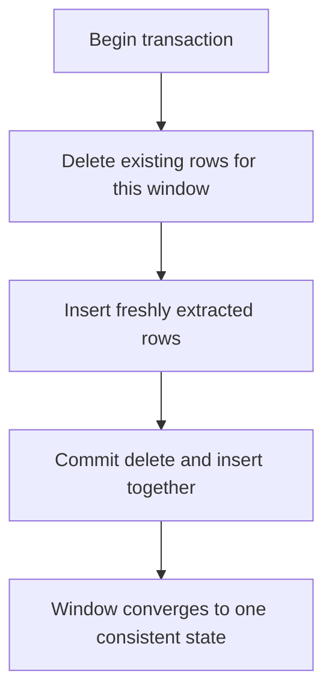
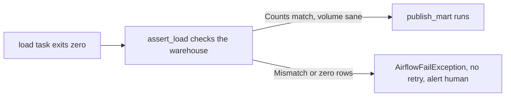

# Lecture 3 — Idempotency, the Task That Lied, and Dagster Assets

> **Time:** ~1 hour of reading + a Dagster read-through.
> **Prerequisites:** Lectures 1–2 (the data-interval model, sensors, retries, SLAs, backfill); Week 3's watermark-and-upsert loader.
> **Citations:** [Airflow data intervals & backfill](https://airflow.apache.org/docs/apache-airflow/stable/authoring-and-scheduling/dag-run.html), [Airflow core concepts (tasks)](https://airflow.apache.org/docs/apache-airflow/stable/core-concepts/dags.html), [Dagster software-defined assets](https://docs.dagster.io/concepts/assets/software-defined-assets), [Dagster partitions & backfills](https://docs.dagster.io/concepts/partitions-schedules-sensors/partitions), [Dagster schedules](https://docs.dagster.io/concepts/automation/schedules), [Dagster sensors](https://docs.dagster.io/concepts/partitions-schedules-sensors/sensors).

If you only remember one thing from this lecture, remember this:

> **An exit code is a statement about the process, not about the data.** A task can exit zero having loaded the wrong rows, half the rows, or yesterday's rows — and turn green on the dashboard while quietly poisoning the warehouse. The only defense is a *separate* task that asserts the data is right and fails loudly when it is not. And the property that makes retries, catchup, and backfill safe — idempotency — is the same property that makes "the task that lied" recoverable: you can just run the window again.

This is the lecture that ties the week back to Week 3 and forward to the rest of the course. Idempotency is not an Airflow feature; it is a property *you* build into the load. The orchestrator only multiplies it — into safety if you have it, into a corruption incident if you do not.

---

## 1. Idempotency for catchup and backfill

An operation is **idempotent** if running it twice produces the same end state as running it once. Your Week 3 loader was idempotent for the *latest* window via the watermark-and-upsert pattern. Orchestration generalizes the requirement: under catchup and backfill, *any* past window may be run again — by a retry (Lecture 2 §2.2), by re-running a failed day, by a second backfill of corrected data. So **every** window's load must be idempotent, not just the latest.

### 1.1 The pattern: own your window, replace it whole

The cleanest idempotent load for a windowed batch pipeline is **delete-then-insert for exactly this run's window**:

```python
def load_window(hook, window_start: str, window_end: str, rows: list[dict]) -> int:
    """Idempotent load of [window_start, window_end) into fact_sales.

    Running this for the same window N times leaves the same final state.
    """
    with hook.get_conn() as conn, conn.cursor() as cur:
        cur.execute("BEGIN;")
        # 1. Delete THIS window's existing rows (a no-op on the first run).
        cur.execute(
            "DELETE FROM fact_sales WHERE sales_date >= %s AND sales_date < %s",
            (window_start, window_end),
        )
        # 2. Insert this window's freshly-extracted rows.
        cur.executemany(
            "INSERT INTO fact_sales (sales_date, store_key, product_key, amount) "
            "VALUES (%(sales_date)s, %(store_key)s, %(product_key)s, %(amount)s)",
            rows,
        )
        # 3. Commit delete + insert together: an interrupted run leaves the
        #    window in its prior consistent state, never half-replaced.
        conn.commit()
        return len(rows)
```

Three properties make this safe:

1. **It is keyed off the run's window**, derived from `data_interval_start` / `data_interval_end` (Lecture 1 §3.2) — never `now()`. Run the `06-01` interval and it touches *only* `06-01`, whether that run happens on `06-02` or during a backfill on `06-19`.
2. **It replaces, it does not append.** The `DELETE` makes the second run scrub the first run's rows before re-inserting, so two runs equal one run. An `INSERT`-only load would double the window on the second run — the backfill double-count from Lecture 2 §4.2.
3. **The delete and the insert commit in one transaction.** A crash between them does not leave the window half-empty; it rolls back to the pre-run state, which a retry then cleanly replaces.


*Run this once or five times for the same window — the end state is identical.*

### 1.2 Delete-then-insert vs merge/upsert

Delete-then-insert replaces the *whole window*. The Week 3 alternative — `MERGE` / `INSERT ... ON CONFLICT DO UPDATE` keyed on a business key — replaces *individual rows*. Both are idempotent; choose by shape:

| | Delete-then-insert (this window) | Merge / upsert (per row) |
|---|---|---|
| Granularity | The entire interval's partition | Individual rows by business key |
| Best when | The source re-issues the *whole* window each time (full daily extract) | The source emits *changes* and you must preserve untouched rows |
| Late records | Naturally absorbed — the window is rebuilt from the latest source | Absorbed via the upsert on the late row's key |
| Risk | If the new extract is *missing* rows that existed, they vanish (intended for full re-extract) | A wrong key collapses or duplicates rows |

For a daily full extract — the mini-project's shape — delete-then-insert per window is the simplest correct choice. For change-data-capture sources (Week 3's late-record exercise), the upsert is right. The Phase I gate accepts either as long as a re-run does not change the counts.

### 1.3 Why this makes catchup safe

Now re-read Lecture 1 §4.1 with idempotency in hand. Catchup schedules a run for every interval from `start_date` to now. Each run keys off its own `data_interval_start`, deletes-then-inserts its own window. Run them in any order, retry any of them, run the whole range twice — the warehouse converges to the same state. *That* is why "your DAG must be idempotent for catchup to be safe" (the week's lecture spine). Catchup without idempotency is a loaded gun pointed at your facts.

---

## 2. The task that succeeded but lied

Here is the failure that separates engineers who have run pipelines in anger from those who have not.

### 2.1 Exit code is not data correctness

Your `load` task does this:

```python
@task
def load(data_interval_start=None) -> dict:
    window = data_interval_start.to_date_string()
    rows = read_source(window)            # <-- source file was TRUNCATED today: 4,127 of 10,000 rows
    n = load_window(hook, window, ..., rows)
    return {"window": window, "loaded": n}   # returns 4127, task exits 0, box turns GREEN
```

The function returned. No exception. Airflow marks the task **success**. The grid view is a wall of green. And the warehouse now has 4,127 of the day's 10,000 sales — a 59% revenue undercount that *nothing in the orchestrator will ever flag*, because the orchestrator only knows the process exited zero. Variations of the same lie:

- **Partial load:** the source was truncated / the network dropped mid-read; you loaded what you got.
- **Wrong window:** a date-math bug loaded `now()`'s data into the `06-01` partition; the count looks plausible, the data is from the wrong day.
- **Silent type coercion:** a column arrived as text, your insert coerced bad values to `0` or `NULL`, every row "loaded" but the amounts are garbage.
- **Empty success:** the source file existed (sensor passed) but was empty; you loaded zero rows and reported success.

In every case the exit code says "fine" and the data says otherwise. The orchestrator cannot catch this for you, because *correctness is domain knowledge it does not have*. You must encode that knowledge as an explicit check.

### 2.2 The assertion task

The fix is a **separate downstream task that asserts the data and fails loudly** when the assertion is violated ([core concepts](https://airflow.apache.org/docs/apache-airflow/stable/core-concepts/dags.html)). It runs after `load`, queries the just-loaded window, and raises if the data is not plausible:

```python
from airflow.exceptions import AirflowFailException

@task
def assert_load(loaded: dict, data_interval_start=None):
    window = data_interval_start.to_date_string()
    hook = PostgresHook(postgres_conn_id="warehouse")

    # 1. Row-count check: the warehouse window must match the source window.
    (warehouse_n,) = hook.get_first(
        "SELECT count(*) FROM fact_sales WHERE sales_date = %s", parameters=(window,))
    source_n = loaded["loaded"]
    if warehouse_n != source_n:
        raise AirflowFailException(
            f"row-count mismatch for {window}: warehouse={warehouse_n} source={source_n}")

    # 2. Volume / freshness sanity: refuse a suspiciously small load.
    if warehouse_n == 0:
        raise AirflowFailException(f"zero rows loaded for {window} — empty or truncated source")
    (avg_recent,) = hook.get_first(
        "SELECT avg(daily) FROM ("
        "  SELECT count(*) AS daily FROM fact_sales "
        "  WHERE sales_date >= %s::date - 7 AND sales_date < %s::date "
        "  GROUP BY sales_date) t", parameters=(window, window))
    if avg_recent and warehouse_n < 0.5 * avg_recent:
        raise AirflowFailException(
            f"volume anomaly for {window}: {warehouse_n} rows < 50% of 7-day avg {avg_recent:.0f}")

    # 3. (Optional) Checksum/reconciliation against the source total.
    return {"window": window, "asserted_rows": warehouse_n}
```

Wire it downstream so it gates everything after the load:

```python
loaded = load()
assert_load(loaded) >> publish_mart()   # publish only runs if the assertion passed
```


*A green exit code is not proof of correct data — the assertion task is the real gate.*

`AirflowFailException` fails the task *without* retrying (unlike a generic exception, which would retry — and re-asserting a still-bad load just burns retries). Now the truncated-source day turns the assertion task **red**, fires your `on_failure_callback`, halts `publish_mart`, and a human investigates *before* the executive sees a 59% revenue drop. The lie is converted into a loud, visible failure. This row-count/volume/checksum gate is the seed of the Week 10 data-quality layer; you are building the muscle now.

> The combination is the whole lesson: **idempotency** means that once you *detect* the bad load, recovery is trivial — fix the source, re-run that one window, and delete-then-insert overwrites the bad rows with good ones. Non-idempotent recovery from a partial load is a manual, error-prone surgery. Idempotency is what makes the assertion gate *actionable*.

---

## 3. Dagster: the same pipeline as software-defined assets

Airflow models **tasks**: imperative steps wired into a graph. Dagster ([Dagster docs](https://docs.dagster.io/)) models **assets**: the *things your pipeline produces* — a table, a partition, a file. You declare each asset with `@asset`, and Dagster infers the dependency graph from which assets reference which. The mental shift is from "run these steps in this order" to "these data products exist; here is how each is computed; keep them fresh."

### 3.1 The loader as assets

```python
import dagster as dg
import pandas as pd

@dg.asset
def raw_sales(context: dg.AssetExecutionContext) -> pd.DataFrame:
    """The extracted source for one day — Dagster's partition key IS the date."""
    window = context.partition_key            # 'YYYY-MM-DD' from the daily partition
    df = read_source(window)
    context.add_output_metadata({"window": window, "rows": len(df)})  # rich, visible metadata
    return df

@dg.asset
def fact_sales(context: dg.AssetExecutionContext, raw_sales: pd.DataFrame) -> None:
    """Idempotent load into the warehouse — depends on raw_sales by ARGUMENT NAME."""
    window = context.partition_key
    with warehouse_conn() as conn, conn.cursor() as cur:
        cur.execute("DELETE FROM fact_sales WHERE sales_date = %s", (window,))
        # ... bulk insert raw_sales for this window ...
        conn.commit()

@dg.asset_check(asset=fact_sales)             # the assertion gate, as a first-class check
def fact_sales_rowcount_ok(context) -> dg.AssetCheckResult:
    window = context.partition_key
    (n,) = warehouse_count(window)
    return dg.AssetCheckResult(passed=n > 0, metadata={"rows": n})
```

Read what changed. There is no `>>`. `fact_sales` depends on `raw_sales` *because it takes a parameter named `raw_sales`* — the dependency is inferred from the function signature. The unit of work is named for the *table it produces*, not the step it performs. And the assertion gate from §2.2 is a first-class `@asset_check` attached to the asset, not a separate task you must remember to wire downstream.

### 3.2 Partitions and partitioned backfills

Dagster makes the time-interval model (Lecture 1 §3) first-class via a **partitions definition** ([Dagster partitions](https://docs.dagster.io/concepts/partitions-schedules-sensors/partitions)):

```python
daily = dg.DailyPartitionsDefinition(start_date="2026-05-01")

@dg.asset(partitions_def=daily)
def raw_sales(context: dg.AssetExecutionContext) -> pd.DataFrame:
    window = context.partition_key            # exactly one day, e.g. '2026-06-18'
    ...
```

Now each partition *is* a window. A **backfill** in Dagster is "materialize partitions `2026-05-20` through `2026-06-18` of these assets" — selectable in the UI or CLI, run with bounded concurrency, and idempotent-by-construction *if* each asset's compute replaces its own partition (the same delete-then-insert discipline). The asset graph shows, per partition, which are materialized, stale, or missing — so "is June fully loaded?" is a glance, not a SQL query. This is the cleaner expression of Lecture 2 §4: the partition is the unit, backfilling a range is first-class, and the UI tells you the materialization state of every window.

### 3.3 Schedules and sensors in Dagster

Dagster has the same two triggers, named the same way. A **schedule** ([Dagster schedules](https://docs.dagster.io/concepts/automation/schedules)) materializes partitions on a cron cadence; a **sensor** ([Dagster sensors](https://docs.dagster.io/concepts/partitions-schedules-sensors/sensors)) triggers a run when an external condition becomes true (a file lands, an upstream asset updates):

```python
daily_schedule = dg.build_schedule_from_partitioned_job(
    dg.define_asset_job("daily_sales", selection=[raw_sales, fact_sales]))

@dg.sensor(job=dg.define_asset_job("on_file", selection=[raw_sales, fact_sales]))
def file_arrival_sensor(context):
    if file_exists_for_today():
        yield dg.RunRequest(partition_key=today_str())
```

Same concepts as Airflow's sensor + schedule, expressed against assets rather than tasks.

---

## 4. Pick one for a given team

Neither tool is universally better. Here is a decision framework you can defend.

| If the team… | Lean | Why |
|--------------|------|-----|
| Already runs Airflow in production, has DAGs and on-call muscle | **Airflow** | The migration cost rarely beats the marginal gain; Airflow's ecosystem (providers, operators) is the largest in the space |
| Thinks in *data products* — "the `fact_sales` table," "the customer mart" — and wants lineage, freshness, and asset-level observability built in | **Dagster** | The asset model *is* the lineage; `@asset_check` and materialization metadata are first-class, not bolted on |
| Is small / greenfield and wants strong local development, typed I/O, and testability out of the box | **Dagster** | Assets are plain typed Python functions; local runs and unit tests are first-class; the developer experience is its strongest pitch |
| Needs the broadest set of pre-built integrations (hundreds of provider packages, cloud operators, transfer operators) | **Airflow** | The provider ecosystem is unmatched; if your job is "glue 40 systems together," the operator already exists |
| Has heavy *non-data* orchestration (arbitrary task DAGs, ML training steps, infra jobs) that are not naturally "assets" | **Airflow** | The task model is more general; not everything is a data asset |
| Is hiring and wants the larger talent pool | **Airflow** | A decade as the default means more engineers know it; weigh against the experience improvement Dagster offers |

The honest summary: **Airflow is the mature, ubiquitous, task-oriented default** with the deepest ecosystem and the largest hiring pool, at the cost of an older developer experience and SLAs/observability that feel bolted on. **Dagster is the modern, asset-oriented challenger** whose data-product model gives you lineage, checks, and partition state for free, at the cost of a smaller ecosystem and talent pool. For a greenfield data team that thinks in tables and values testability and lineage, Dagster is a strong default. For a team already invested in Airflow, or one whose orchestration is broader than data, Airflow is the pragmatic choice. In this course you *build* on Airflow (the most likely tool you will be paid to operate) and *read* Dagster (so the asset model is in your vocabulary), which is exactly the position a working data engineer wants to hold.

---

## Summary

- **Idempotency is a property you build into the load, not an orchestrator feature.** Delete-then-insert (or merge/upsert) for exactly this run's window — keyed off `data_interval_start`, never `now()` — makes running a window once or five times converge to the same state ([data intervals & backfill](https://airflow.apache.org/docs/apache-airflow/stable/authoring-and-scheduling/dag-run.html)).
- Idempotency is the precondition for safe catchup, retries, and backfill — without it, each of those becomes a double-count.
- **"The task that lied":** exit code reports the *process*, never the *data*. A task can exit zero having loaded partial, wrong-window, or garbage data and turn green. The defense is a separate downstream **assertion task** (row-count, volume, checksum) that fails loudly — `AirflowFailException` to fail without burning retries ([core concepts](https://airflow.apache.org/docs/apache-airflow/stable/core-concepts/dags.html)).
- Idempotency makes the assertion gate *actionable*: once you detect a bad load, fix the source and re-run that one window — the delete-then-insert overwrites the bad rows.
- **Dagster models assets, not tasks:** `@asset` functions whose dependencies are inferred from arguments; `DailyPartitionsDefinition` makes the window first-class; partitioned backfills and `@asset_check` are built in ([software-defined assets](https://docs.dagster.io/concepts/assets/software-defined-assets), [partitions](https://docs.dagster.io/concepts/partitions-schedules-sensors/partitions), [schedules](https://docs.dagster.io/concepts/automation/schedules), [sensors](https://docs.dagster.io/concepts/partitions-schedules-sensors/sensors)).
- **Pick by team:** Airflow for maturity, ecosystem, hiring pool, and non-data orchestration; Dagster for asset/lineage thinking, developer experience, and greenfield data teams. Build on Airflow, keep Dagster in your vocabulary.

*Cited pages: Airflow data intervals & backfill, Airflow core concepts (tasks), Dagster software-defined assets, partitions & backfills, schedules, and sensors (all linked inline above); Apache Airflow 2.9 and Dagster 1.7 documentation.*
