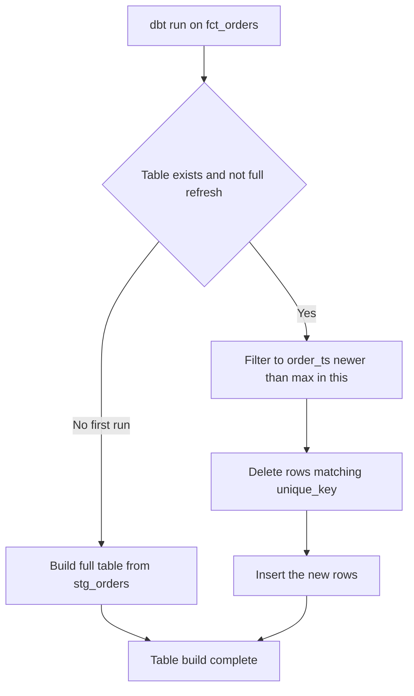
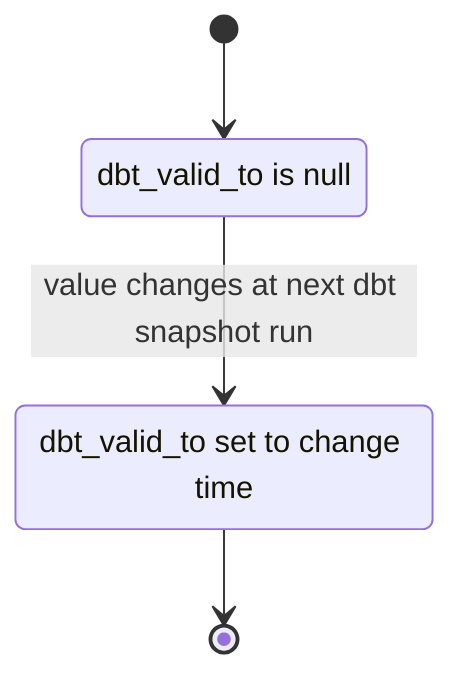

# Lecture 2 — Materializations, tests, and snapshots

> **Time:** ~3 hours of reading + a `dbt build` / `dbt snapshot` loop against DuckDB.
> **Prerequisites:** Lecture 1 (project anatomy, sources, refs, layering). Week 1 (Type-2 SCD by hand), Week 3 (idempotency, upserts, late data).
> **Citations:** materializations <https://docs.getdbt.com/docs/build/materializations>; incremental models <https://docs.getdbt.com/docs/build/incremental-models>; data tests <https://docs.getdbt.com/docs/build/data-tests>; snapshots <https://docs.getdbt.com/docs/build/snapshots>; models <https://docs.getdbt.com/docs/build/models>.

If you only remember one thing from this lecture, remember this:

> **A dbt model is a `SELECT`. How that `SELECT` becomes a warehouse object — a view recomputed on read, a table rebuilt each run, a CTE inlined into its consumers, or an incremental table that only processes new rows — is a separate decision called the materialization, set in a `config` block, not in the query. Tests are assertions attached to that model that return offending rows; a failing test exits non-zero and gates the pipeline. Snapshots are dbt's built-in Type-2 SCD, automating exactly the effective-dated history table you hand-built in Week 1.**

This lecture is the operational half of dbt: the four ways a model can be deployed, the two kinds of tests that protect it, and the snapshot mechanism that turns Week 1's SCD into one command.

---

## 1. Materializations — the same SQL, four deployments

A **materialization** is the strategy dbt uses to persist a model's result. You change it without touching the `SELECT`. dbt ships four built-ins (<https://docs.getdbt.com/docs/build/materializations>): `view`, `table`, `ephemeral`, and `incremental`. You set the materialization in three places, most specific wins: a per-model `{{ config(materialized='...') }}` block, a per-folder default in `dbt_project.yml`, or the project-wide default (`view`).

### 1.1 View (the default) — no storage, recompute on read

```sql
{{ config(materialized='view') }}
select ...
```

A view compiles to `create or replace view ... as (<your select>)`. **No data is stored.** Every time someone queries the view, the warehouse re-runs the underlying SQL. `dbt run` on a view is nearly instant because it only (re)defines the view, it does not compute anything.

*When right:* staging models, and anything cheap to compute whose freshness should always reflect the latest source. The default for `models/staging/` in Lecture 1's `dbt_project.yml`.

*When wrong:* a model with heavy joins or aggregations that analysts query repeatedly — every query pays the full compute cost.

### 1.2 Table — full rebuild each run

```sql
{{ config(materialized='table') }}
select ...
```

A table compiles to `create or replace table ... as (<your select>)`. dbt **drops and rebuilds the whole table** every `dbt run`. Queries against it are fast (it is materialized data, no recompute), but each build recomputes everything from scratch.

*When right:* marts (`dim_*`, `fct_*`) that are queried constantly and small enough to rebuild quickly. The default for `models/marts/`. On laptop-scale DuckDB data, a full mart rebuild is sub-second, so `table` is almost always correct here.

*When wrong:* a fact table with hundreds of millions of rows where a full rebuild takes hours — that is the case for `incremental` (§1.4).

### 1.3 Ephemeral — inlined as a CTE, never materialized

```sql
{{ config(materialized='ephemeral') }}
select ...
```

An ephemeral model produces **no database object at all**. Instead, dbt injects its compiled SQL as a common table expression into every model that `ref`s it. If `int_orders_enriched` is ephemeral and `fct_orders` refs it, the compiled `fct_orders` contains `with int_orders_enriched as (<the int model's SQL>) select ...`.

*When right:* intermediate "glue" models that exist for code organization and reuse but that nobody queries directly, and that are not reused so widely that inlining bloats every consumer. The default for `models/intermediate/` in Lecture 1.

*When wrong:* a model `ref`'d by many downstream models *and* expensive to compute — inlining recomputes it once per consumer. Materialize it as a table instead. Also note: you cannot test an ephemeral model directly (it has no object to query) and you cannot `dbt run --select` it in isolation, because it has no standalone existence.

### 1.4 Incremental — process only new/changed rows

This is the dbt expression of Week 3's idempotent-incremental discipline, and Challenge 01 builds it end to end. An incremental model is materialized as a table, but after the first run dbt processes **only the new rows** and merges them in, instead of rebuilding everything.

```sql
{{ config(
    materialized='incremental',
    unique_key='order_id',
    incremental_strategy='delete+insert'
) }}

select
    order_id,
    customer_id,
    order_ts,
    gross_cents
from {{ ref('stg_orders') }}


    -- on incremental runs only, process rows newer than what we already have
    where order_ts > (select max(order_ts) from {{ this }})

```

Three pieces make this work:

- **`is_incremental()`** is a macro that returns `true` only when the table already exists *and* this is not a `--full-refresh` run. The `where` clause inside the `` is the high-water-mark filter — identical in spirit to the watermark you wrote in Week 3. `{{ this }}` resolves to the model's own table, so `max(order_ts) from {{ this }}` is "the latest timestamp I have already loaded."
- **`unique_key`** tells dbt how to deduplicate. On an incremental run, dbt does not blindly append — with `unique_key='order_id'` and `delete+insert`, it deletes existing rows whose `order_id` matches the new batch and inserts the new versions. That is an **upsert**, exactly Week 3's merge, and it is what makes a re-run idempotent: re-running the same batch deletes-then-reinserts the same rows, so no double-count.
- **`incremental_strategy`** picks the mechanism. `dbt-duckdb` supports `append` (fastest, but duplicates on re-run — only safe if your `where` guarantees no overlap), `delete+insert` (delete matching `unique_key`s then insert — robust, the safe default), and `merge` (a single `MERGE` statement where the warehouse supports it).


*is_incremental decides whether to build fresh or delete-and-insert only the new rows.*

On the **first** run, `is_incremental()` is false, the `where` clause is omitted, and dbt builds the full table. On **subsequent** runs it is true, only new rows flow, and they are merged on `unique_key`. To rebuild from scratch (after a logic change), `dbt run --select fct_orders --full-refresh` (<https://docs.getdbt.com/docs/build/incremental-models>).

*When right:* large append-mostly fact tables where a full rebuild is too slow. *When wrong:* small tables (just use `table` — simpler and always correct), or tables where most rows change every run (incremental saves nothing).

### 1.5 Choosing — a one-line rule per layer

| Layer | Default materialization | Why |
|-------|------------------------|-----|
| Staging `stg_*` | `view` | Cheap, always-fresh, no storage |
| Intermediate `int_*` | `ephemeral` | Organizational glue, inlined into marts |
| Dimension `dim_*` | `table` | Queried constantly, cheap to rebuild |
| Fact `fct_*` (small) | `table` | Simplest correct choice on laptop data |
| Fact `fct_*` (large) | `incremental` | Full rebuild too slow; process new rows only |

### 1.6 Three incremental edge cases that bite everyone once

Incremental is the materialization that goes wrong in subtle ways, because it carries state between runs. Three failure modes you will hit, and the fix for each:

- **A logic change does not take effect.** You edit the `SELECT` of an incremental model, run it, and the old rows still have the old values. Of course they do — incremental only *touches new rows*; existing rows are never recomputed. After any logic change to an incremental model you must `dbt run --select <model> --full-refresh` once to rebuild from scratch, or the table is a mix of old logic and new. This is the single most common incremental surprise.
- **`append` silently double-counts.** `incremental_strategy='append'` never deduplicates — it blindly inserts the rows your `where` clause selects. If your high-water mark is `order_ts >= max(order_ts)` (note `>=`, not `>`), the boundary rows reappear every run. Use `delete+insert` (or `merge`) with a `unique_key` so re-processing is an upsert, not a duplication. The `unique` test on the grain key is what catches this for you.
- **The schema drifts and the run errors.** Add a column to an incremental model's upstream and the next run fails with a column-mismatch error, because dbt is inserting N+1 columns into an N-column table. Set `on_schema_change='append_new_columns'` (or `'sync_all_columns'`) so dbt evolves the target schema instead of erroring (<https://docs.getdbt.com/docs/build/incremental-models>). Challenge 01's stretch goal walks this.

The mental model: an incremental table is a *stateful accumulator*. Everything that feels surprising about it follows from "existing rows are not recomputed unless you full-refresh."

---

## 2. Tests — assertions that return offending rows

A dbt test is a query that asks "is anything wrong?" by **returning the rows that violate an assertion**. Zero rows returned means the test passed; one or more rows means it failed (<https://docs.getdbt.com/docs/build/data-tests>). A failing test makes `dbt test` (and `dbt build`) exit non-zero, which is precisely what lets an orchestrator treat a data-quality failure as a pipeline failure. There are two kinds.

### 2.1 Generic tests — the four built-ins, attached in YAML

Generic tests are parameterized and attached to columns (or models) in a `schema.yml`. dbt ships four (<https://docs.getdbt.com/docs/build/data-tests>):

- **`unique`** — no duplicate values in the column. The grain enforcer: `unique` on `order_id` *is* the dbt assertion that `fct_orders` has one row per order.
- **`not_null`** — no nulls. Foreign keys and natural keys should be `not_null`.
- **`accepted_values`** — every value is in a given set. `segment` must be one of `enterprise`, `smb`, `consumer`, `unknown`.
- **`relationships`** — referential integrity: every value in this column exists in another model's column. This is your foreign-key check: every `fct_orders.customer_sk` must exist in `dim_customer.customer_sk`.

```yaml
# models/marts/_marts.yml
version: 2

models:
  - name: fct_orders
    description: "Order fact. Grain: one row per order_id."
    columns:
      - name: order_id
        description: "Natural key. The grain of the fact table."
        tests:
          - unique
          - not_null
      - name: customer_sk
        description: "Surrogate FK to dim_customer."
        tests:
          - not_null
          - relationships:
              to: ref('dim_customer')
              field: customer_sk
      - name: gross_cents
        tests:
          - not_null

  - name: dim_customer
    columns:
      - name: customer_sk
        tests:
          - unique
          - not_null
      - name: segment
        tests:
          - accepted_values:
              values: ['enterprise', 'smb', 'consumer', 'unknown']
```

Each generic test compiles to a `SELECT` that returns violating rows. `unique` on `order_id`, for example, compiles to roughly `select order_id from fct_orders group by order_id having count(*) > 1`. If that returns rows, the test fails.

### 2.2 Singular tests — a `.sql` file that returns bad rows

When the built-ins do not express your rule, write a **singular test**: a plain `.sql` file in `tests/` whose query returns the offending rows. No parameters, no YAML — just the query.

```sql
-- tests/assert_one_current_row_per_customer.sql
-- The customer SCD must have exactly ONE current row per natural key.
-- This query returns any customer_id with more than one current row.
-- Zero rows = pass.
select
    customer_id,
    count(*) as current_rows
from {{ ref('dim_customer_history') }}
where dbt_valid_to is null         -- "current" rows have an open end-date
group by customer_id
having count(*) > 1
```

This is the dbt version of the audit query you would have written by hand in Week 1 to check your SCD. Now it runs on every build.

### 2.3 Severity, and how a failing test gates a pipeline

By default a failing test has severity `error` and exits non-zero. You can downgrade to `warn` (logged, build continues) when an assertion is advisory:

```yaml
      - name: email
        tests:
          - not_null:
              config:
                severity: warn          # log it, do not fail the build
```

The non-zero exit is the whole point. When you wire `dbt build` into the Week 4 Airflow DAG, an `error`-severity test failure returns a non-zero exit code, the Airflow task fails, the DAG stops, and the bad data never reaches the dashboard. That is a *gate*, not a log line. Week 10 builds the full quality layer on this foundation.

### 2.4 `dbt build` — run and test interleaved by DAG order

`dbt run` builds models. `dbt test` runs tests. **`dbt build` does both, interleaved in dependency order**: it builds a model, immediately runs that model's tests, and only proceeds to downstream models if those tests pass. The safety property is that a broken staging model never silently feeds a mart — its test fails first, and dbt **skips** everything downstream:

```text
14:10:01  1 of 14 START sql view model main.stg_customers ........ [RUN]
14:10:01  1 of 14 OK created sql view model main.stg_customers ... [OK in 0.04s]
14:10:01  2 of 14 START test not_null_stg_customers_customer_id .. [RUN]
14:10:01  2 of 14 PASS not_null_stg_customers_customer_id ........ [PASS in 0.02s]
...
14:10:02  9 of 14 START test unique_fct_orders_order_id .......... [RUN]
14:10:02  9 of 14 FAIL 3 unique_fct_orders_order_id .............. [FAIL 3 in 0.03s]
14:10:02 10 of 14 SKIP relationships_fct_orders_customer_sk ...... [SKIP]
14:10:02  Done. PASS=8 WARN=0 ERROR=1 SKIP=1 TOTAL=10
```

Note `FAIL 3` — three duplicate `order_id`s — and the downstream test `SKIP`ped. `dbt build` exits non-zero. Use `dbt build` as your single pipeline command; use `dbt run` / `dbt test` separately only while developing.

To inspect *which* rows failed, dbt writes the failing query to `target/`; or store failures as a table with `--store-failures` and `select * from <failures table>`.

---

## 3. Snapshots — dbt's Type-2 SCD

In Week 1 you hand-built a Type-2 slowly-changing dimension: when a customer's `segment` changed, you closed the old row (`effective_to = now()`), opened a new row (`effective_from = now()`, current-flag true), and kept full history so you could answer "what was this customer's segment on 2026-03-01?" That logic — detect change, close, open, key — is error-prone to maintain by hand. `dbt snapshot` does it for you (<https://docs.getdbt.com/docs/build/snapshots>).

A snapshot lives in `snapshots/` and is a `select` wrapped in a `` block. Each time you run `dbt snapshot`, dbt compares the current source rows to the latest snapshot rows and writes Type-2 history.

### 3.1 The columns dbt manages

dbt adds four metadata columns to the snapshot table, mapping one-to-one onto your Week 1 hand-built columns:

| dbt column | Week 1 equivalent | Meaning |
|------------|-------------------|---------|
| `dbt_valid_from` | `effective_from` | When this version became current |
| `dbt_valid_to` | `effective_to` | When it was superseded (`null` = still current) |
| `dbt_scd_id` | your surrogate key | A hash uniquely identifying this version-row |
| `dbt_updated_at` | — | Timestamp of the snapshot run that recorded this |

"Current" rows are those with `dbt_valid_to is null`. The audit query is identical to Week 1: `where dbt_valid_from <= '2026-03-01' and (dbt_valid_to > '2026-03-01' or dbt_valid_to is null)`.


*Every snapshot run either keeps a row current or closes it and opens a new version.*

### 3.2 The `timestamp` strategy — trust an `updated_at` column

If the source has a reliable "last modified" column, use the `timestamp` strategy. dbt records a new version whenever that timestamp advances:

```sql
-- snapshots/customers_snapshot.sql


{{
    config(
        target_schema='snapshots',
        unique_key='customer_id',
        strategy='timestamp',
        updated_at='updated_at'
    )
}}

select * from {{ source('raw', 'customers') }}


```

`unique_key` is the natural key (which customer). `updated_at` names the column dbt watches. When `updated_at` for a customer is newer than the version dbt has, it closes the old row and opens a new one. This is the cheapest strategy and the correct one when the source's `updated_at` is trustworthy.

### 3.3 The `check` strategy — diff specific columns

If there is no reliable `updated_at`, use the `check` strategy: dbt compares a named list of columns and records a new version when *any* of them changes.

```sql
-- snapshots/customers_snapshot_check.sql


{{
    config(
        target_schema='snapshots',
        unique_key='customer_id',
        strategy='check',
        check_cols=['segment', 'country_code', 'email']
    )
}}

select * from {{ source('raw', 'customers') }}


```

Here dbt has no timestamp to trust; it hashes `segment`, `country_code`, and `email` and opens a new version whenever that hash changes. Use `check_cols='all'` to track every column (heavier; sensitive to noise columns). The trade-off vs `timestamp`: `check` needs no clean source timestamp but cannot distinguish a real change from a re-statement, and it is more expensive (it diffs columns every run).

### 3.4 Running and consuming a snapshot

```bash
dbt snapshot          # capture the current state into Type-2 history
```

Run it on a schedule (your Airflow DAG) so history accumulates. Crucially, snapshots run **before** the models that depend on them, and downstream models `ref` the snapshot like any other model:

```sql
-- models/marts/dim_customer.sql, now SCD-aware
select
    {{ dbt_utils.generate_surrogate_key(['customer_id', 'dbt_valid_from']) }} as customer_sk,
    customer_id,
    segment,
    country_code,
    dbt_valid_from,
    dbt_valid_to,
    (dbt_valid_to is null) as is_current
from {{ ref('customers_snapshot') }}
```

Note the surrogate key hashes `customer_id` *and* `dbt_valid_from` — because a Type-2 dimension has multiple rows per natural key, one per version, and each needs a distinct surrogate. This is exactly the surrogate-key-per-version design from Week 1, now keyed off dbt's managed validity columns.

A warning that bites everyone once: **snapshots are stateful and run-time-dependent.** dbt captures whatever the source looks like *at the moment you run `dbt snapshot`*. If you do not run it between two source changes, you lose the intermediate version forever — there is no way to reconstruct history you never captured. Schedule snapshots at least as often as the source meaningfully changes.

---

## 4. Summary

- A **materialization** is how a model's `SELECT` becomes a warehouse object, set in `config`, decoupled from the query. Four built-ins:
  - **view** — no storage, recompute on read; staging default.
  - **table** — full rebuild each run; mart default; almost always right on laptop data.
  - **ephemeral** — inlined as a CTE, no object; intermediate glue.
  - **incremental** — process only new rows via `is_incremental()` + `unique_key`; the dbt form of Week 3's idempotent incremental load. `delete+insert` upserts on `unique_key` so a re-run does not double-count.
- **Tests return offending rows; zero rows = pass.** Generic tests (`unique`, `not_null`, `accepted_values`, `relationships`) attach in `schema.yml`; singular tests are `.sql` files in `tests/`. `unique` on the grain key enforces grain; `relationships` enforces foreign keys.
- A failing `error`-severity test **exits non-zero**, which is how `dbt build` in an orchestrator *halts* a pipeline instead of landing bad data. Downgrade advisory checks to `warn`.
- **`dbt build`** interleaves run and test in DAG order and **skips** everything downstream of a failed test — a broken staging model never feeds a mart.
- **Snapshots are dbt's Type-2 SCD.** dbt manages `dbt_valid_from` / `dbt_valid_to` / `dbt_scd_id`, mapping onto your Week 1 effective-dated columns. `timestamp` strategy trusts an `updated_at`; `check` strategy diffs named columns. Snapshots are stateful — capture lost history is gone.

*Cited pages: materializations <https://docs.getdbt.com/docs/build/materializations>; incremental models <https://docs.getdbt.com/docs/build/incremental-models>; data tests <https://docs.getdbt.com/docs/build/data-tests>; snapshots <https://docs.getdbt.com/docs/build/snapshots>; models <https://docs.getdbt.com/docs/build/models>.*
