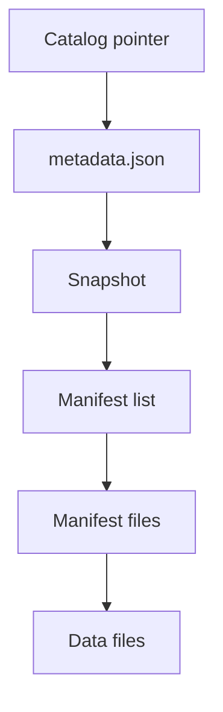
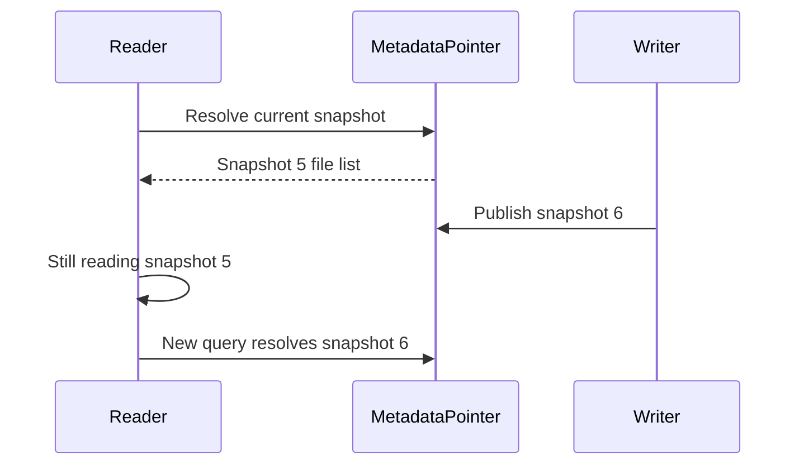

# Lecture 03 — Iceberg & Delta: ACID, Time Travel & Schema Evolution

> **Time:** ~2 hours · **Prerequisites:** Lectures 01–02 (Parquet, partitioning,
> object storage), Week 1/2 transactions & isolation · **Citations:** Iceberg docs
> <https://iceberg.apache.org/docs/latest/>, Iceberg spec
> <https://iceberg.apache.org/spec/>, Iceberg evolution
> <https://iceberg.apache.org/docs/latest/evolution/>, PyIceberg
> <https://py.iceberg.apache.org/>, Delta protocol
> <https://github.com/delta-io/delta/blob/master/PROTOCOL.md>, delta-rs
> <https://delta-io.github.io/delta-rs/>, DuckDB iceberg extension
> <https://duckdb.org/docs/extensions/iceberg>, DuckDB delta extension
> <https://duckdb.org/docs/extensions/delta>

You now have partitioned, well-sized, statistics-bearing Parquet on object storage.
It is fast to scan. It is also **not a table** in any sense a database engineer
would accept: it has no atomic commits, no isolation between a writer and a reader,
no way to ask "what did this look like yesterday," and no safe way to add a column.
This lecture is about the metadata layer that turns a bag of Parquet files into a
real table. The spine of the week lands here: **the table format is the contract,
the engine is interchangeable.** Once the contract (files + metadata) is written,
DuckDB, Spark, Trino, and Flink all read the same table without a migration.

## 1. What plain Parquet on object storage cannot do

Picture the lakehouse directory from Lecture 02 and ask the questions a database
answers without thinking:

- **Which files are "the table" right now?** A directory listing tells you which
  files *exist*, not which ones are *current*. After a failed write you may have
  half-written files in the directory. After a compaction you may have both the old
  small files and the new big file. A `SELECT *` over `**/*.parquet` would read all
  of them and double-count or read garbage.
- **Atomic multi-file commit?** A logical change ("replace March's data") touches
  many files. Object storage gives you no transaction across them. A reader that
  lists mid-write sees a torn state — some new files, some old.
- **Isolation?** Two writers appending concurrently can clobber or interleave with
  no coordination. A long-running reader can see files appear underneath it.
- **Time travel?** Gone. Once you overwrite, the previous state is gone unless you
  manually kept copies.
- **Schema evolution?** Adding a column means new files have it and old files do
  not. Renaming means readers break. Dropping leaves stale data. By *what* do you
  even match columns — name? position? Both are fragile.

Every one of these is a property your Postgres gave you for free in Week 1, and
every one of them is *absent* from a pile of files. A **table format** adds a thin
metadata layer that restores them — without giving up the cheap, scalable, engine-
agnostic Parquet-on-object-storage substrate.

## 2. The core idea: a metadata layer over immutable data files

Both Iceberg and Delta share one architecture, and if you remember nothing else,
remember this:

> **Data files are immutable. A change is a new commit that records a new set of
> files. A pointer (or log) names the current commit. Reading an old commit is time
> travel. Reading is always against one consistent snapshot.**

Because data files never change in place, the only mutable thing is a tiny bit of
metadata that says "the table as of version N is exactly these files." Writing is:
(1) write new immutable data files, (2) atomically publish a new metadata version
that includes them. Reading is: (1) resolve the current (or a requested) metadata
version, (2) get its list of files, (3) scan them. Atomicity reduces to a single
atomic operation on one small metadata object. Isolation is free: a reader pins a
version and is unaffected by later commits. Time travel is free: just resolve an
older version. The two formats differ in *how* they structure that metadata.

## 3. Apache Iceberg — manifest tree + catalog

Iceberg (<https://iceberg.apache.org/spec/>) layers its metadata like this:

```
catalog (points to current metadata file for the table)
   │
   ▼
metadata.json   (table schema(s), partition spec(s), snapshot list, current-snapshot-id)
   │   each SNAPSHOT references ...
   ▼
manifest list   (one Avro file per snapshot; lists the manifests in that snapshot,
   │             with partition-range summaries for manifest-level pruning)
   ▼
manifest files  (Avro; each lists data files with per-file stats: row count,
   │             column min/max/null counts, partition values, file path)
   ▼
data files      (the immutable Parquet you wrote in Lectures 01–02)
```

Walk a read top-down. The **catalog** is the one piece that must be transactional —
it holds the pointer "table X → current metadata.json." A commit atomically swaps
that pointer to a new `metadata.json`. The new `metadata.json` lists all
**snapshots** (each is a version of the table) and which is current. A snapshot
points to a **manifest list**, which points to **manifest files**, which point to
**data files** — and at every level Iceberg stores statistics (partition ranges in
the manifest list, per-file column min/max in the manifests). So pruning happens
*before* you open a single Parquet footer: Iceberg reads its manifests, sees which
data files could possibly match your filter, and hands the engine only those file
paths. This is metadata-level pruning stacked on top of the row-group pruning from
Lecture 01.


*Iceberg resolves a table through five metadata layers before touching a data file.*

The **catalog** is the part that needs care. Options you will meet: a **REST
catalog**, a **Hive metastore**, a JDBC/SQL catalog, AWS Glue, or — simplest for a
laptop — a **SQL catalog backed by SQLite** plus an `s3fs` filesystem for the data.
PyIceberg supports exactly this local setup (<https://py.iceberg.apache.org/>),
which is what you use in Exercise 03.

```python
# PyIceberg: a local SQL catalog + MinIO for data. (Exercise 03 uses this.)
from pyiceberg.catalog.sql import SqlCatalog

catalog = SqlCatalog(
    "local",
    **{
        "uri": "sqlite:///./iceberg_catalog.db",     # the transactional pointer store
        "warehouse": "s3://crunch-lake/warehouse",    # where data + metadata land
        "s3.endpoint": "http://localhost:9000",       # MinIO
        "s3.access-key-id": "minioadmin",
        "s3.secret-access-key": "minioadmin",
        "s3.path-style-access": "true",
    },
)
catalog.create_namespace_if_not_exists("crunch")
table = catalog.create_table("crunch.trips", schema=arrow_table.schema)
table.append(arrow_table)        # one atomic commit -> one new snapshot
```

## 4. Delta Lake — the `_delta_log` transaction log

Delta Lake (<https://github.com/delta-io/delta/blob/master/PROTOCOL.md>) reaches
the same guarantees with a different structure: an **ordered transaction log** in a
`_delta_log/` subdirectory next to the data.

```
s3://crunch-lake/trips_delta/
├── _delta_log/
│   ├── 00000000000000000000.json     <- commit 0: AddFile actions, metaData, protocol
│   ├── 00000000000000000001.json     <- commit 1: AddFile / RemoveFile actions
│   ├── 00000000000000000002.json     <- commit 2
│   ├── ...
│   └── 00000000000000000010.checkpoint.parquet   <- periodic compacted state
├── part-00000-....parquet
├── part-00001-....parquet
└── ...
```

Each commit is a numbered JSON file containing **actions**: `add` (this file is now
part of the table), `remove` (this file is no longer part of the table),
`metaData` (schema/partitioning), `protocol` (reader/writer feature version).
The current state of the table is the *replay* of all commits 0..N: start empty,
apply each add/remove in order, and the surviving set of `add`ed-but-not-`remove`d
files is the table. To avoid replaying thousands of tiny JSON files, Delta writes a
**checkpoint** (a Parquet snapshot of the full state) every ~10 commits; a reader
loads the latest checkpoint and replays only the JSON commits after it.

The atomic operation is "write commit N as `...N.json`" — and because two writers
both trying to write commit N would collide, Delta uses the storage layer's
*put-if-absent* / mutual-exclusion semantics (or a coordinating service) to ensure
exactly one wins; the loser retries against N+1. That is **optimistic concurrency
control**.

```python
# delta-rs (deltalake) in Python: write and read a Delta table on MinIO.
from deltalake import write_deltalake, DeltaTable

storage_options = {
    "AWS_ENDPOINT_URL": "http://localhost:9000",
    "AWS_ACCESS_KEY_ID": "minioadmin",
    "AWS_SECRET_ACCESS_KEY": "minioadmin",
    "AWS_ALLOW_HTTP": "true",
    "AWS_S3_ALLOW_UNSAFE_RENAME": "true",   # single-writer laptop setup
}
write_deltalake("s3://crunch-lake/trips_delta", arrow_table,
                storage_options=storage_options)

dt = DeltaTable("s3://crunch-lake/trips_delta", storage_options=storage_options)
print(dt.version())          # current version
print(dt.files())            # the current set of add-ed data files
```

delta-rs reference: <https://delta-io.github.io/delta-rs/>.

### Iceberg vs Delta — the honest contrast

| Aspect | Apache Iceberg | Delta Lake |
| --- | --- | --- |
| Metadata structure | Snapshot → manifest list → manifests → data files (Avro tree) | Ordered JSON commit log + periodic Parquet checkpoints |
| Source of truth for "current" | Catalog pointer → `metadata.json` | Latest commit number in `_delta_log/` |
| Atomic commit | Swap catalog pointer (catalog provides atomicity) | Write next-numbered log file (put-if-absent) |
| Partitioning | Hidden partitioning via transforms in metadata | Hive-style partition columns (column values in data + path) |
| Concurrency | Optimistic, catalog-mediated | Optimistic, log-mediated |
| Catalog requirement | Needs a catalog (REST/Hive/JDBC/Glue/SQLite) | No external catalog; the log *is* the catalog |
| Ecosystem origin | Apache, vendor-neutral; broad engine support | Originated at Databricks; open protocol, strong Spark support |

Neither is "better" in the abstract. Iceberg's manifest tree and hidden
partitioning shine for large tables with evolving layout and multiple engines; the
catalog is the price. Delta's self-contained log is simpler to stand up (no
catalog) and deeply integrated with Spark. The course point stands: the *contract*
(immutable data + a metadata layer giving ACID/snapshots/evolution) is shared, and
you can read the same Parquet through either by choosing the metadata layer.

## 5. ACID and snapshot isolation, concretely

Map the four ACID properties onto the mechanism:

- **Atomicity.** A commit publishes a whole set of file changes via one atomic
  metadata operation (pointer swap / next log file). Either the new snapshot exists
  in full or it does not; there is no torn state.
- **Consistency.** A reader always resolves to *one* snapshot and reads exactly the
  files that snapshot names — never a mix of in-progress files.
- **Isolation.** **Snapshot isolation**: when your query starts, it pins the current
  snapshot id. Writers committing newer snapshots do not change what your query
  reads. Two readers at different times can see different consistent snapshots.
- **Durability.** The data files and metadata live on durable object storage; once
  the commit is published it survives.

This is why a `SELECT` over a lakehouse table is safe even while a job is writing
to it — the reader is pinned to a snapshot, the writer publishes a new one, and they
never interfere. Contrast the plain-Parquet directory, where a reader can stumble
into half-written files.


*Snapshot isolation: a running reader keeps its pinned snapshot even as a writer commits a newer one.*

## 6. Time travel — read an old snapshot

Because old snapshots are not deleted on commit (until you expire them), you can
read the table *as of* a past version or timestamp. The data files that snapshot
referenced still exist; you just resolve the older metadata.

```python
# Iceberg time travel with PyIceberg: read a prior snapshot by id.
tbl = catalog.load_table("crunch.trips")
for snap in tbl.metadata.snapshots:
    print(snap.snapshot_id, snap.timestamp_ms, snap.summary)

# Read as of a specific snapshot id (the state before your last append):
old_scan = tbl.scan(snapshot_id=<earlier_id>).to_arrow()
```

```sql
-- DuckDB iceberg extension can read a snapshot too.
INSTALL iceberg; LOAD iceberg;
SELECT count(*) FROM iceberg_scan('s3://crunch-lake/warehouse/crunch.db/trips',
                                  snapshot_from_id => <earlier_id>);
-- Snapshot history:
SELECT * FROM iceberg_snapshots('s3://crunch-lake/warehouse/crunch.db/trips');
```

DuckDB iceberg extension: <https://duckdb.org/docs/extensions/iceberg>.

```python
# Delta time travel with delta-rs: load a prior version.
dt = DeltaTable("s3://crunch-lake/trips_delta", version=0,
                storage_options=storage_options)
print(dt.to_pyarrow_table().num_rows)   # the table as it was at commit 0
dt.history()                             # full commit history with timestamps
```

Time travel is what lets you reproduce yesterday's report, debug "when did this
number change," or roll back a bad load by re-pointing the table at a prior
snapshot. It is not free forever — old snapshots and the data files only they
reference accumulate, which is why both formats have an **expire/vacuum** operation
to garbage-collect snapshots older than a retention window. Run expiry too eagerly
and you lose time-travel range; never run it and storage grows unbounded.

## 7. Schema evolution — add, rename, drop by column id

The reason schema evolution is *safe* in a table format and *dangerous* in plain
Parquet is one design decision: **columns are tracked by a stable integer id, not
by name or position** (Iceberg spec; evolution docs
<https://iceberg.apache.org/docs/latest/evolution/>).

- **Add column.** Assign a new id. Old data files simply lack that id; reads of old
  files return `NULL` for the new column. **No old data is rewritten** — it is a
  pure metadata change, instant even on a petabyte table.
- **Rename column.** The id stays the same; only the human-readable name in the
  schema changes. Every old file is read through the id→name mapping, so nothing
  breaks and nothing is rewritten.
- **Drop column.** Remove the id from the current schema. Old files still physically
  contain the bytes but the column is no longer projected. No rewrite.
- **Reorder, promote type (e.g. `int`→`long`).** Also metadata-level, within the
  rules the spec allows.

Compare to plain Parquet, where "schema" is matched by name/position per file and
adding a column means some files have it and some do not, with no coordinating
layer to reconcile them. The id mapping is the whole trick.

```python
# Iceberg add-column with PyIceberg (Exercise 03 does exactly this).
with tbl.update_schema() as update:
    update.add_column("surcharge", pyarrow_to_iceberg_type)   # new id assigned
# Reads of pre-existing rows now return NULL for `surcharge`; no data rewritten.
```

```python
# Delta schema evolution on append (mergeSchema-style).
write_deltalake("s3://crunch-lake/trips_delta", new_arrow_table_with_extra_col,
                mode="append", schema_mode="merge",
                storage_options=storage_options)
```

This is the property that makes a lakehouse table survive years of changing
requirements: requirements always add and rename columns, and a format that turns
those into metadata edits instead of multi-hour data rewrites is the difference
between a table you can evolve and a table you have to migrate.

## 8. Hidden partitioning revisited — partition by transform

With the manifest model in hand, Iceberg's hidden partitioning (Lecture 02)
becomes concrete. The partition **spec** — e.g. `day(pickup_ts)` — is stored in
`metadata.json`. When Iceberg writes a file, it records that file's partition value
(the day) in the manifest. When you query `WHERE pickup_ts >= '2024-03-01'`,
Iceberg applies the same `day()` transform to your predicate, compares it to each
file's recorded partition value in the manifests, and prunes — *without you ever
writing `WHERE day = ...`*. And because the spec is metadata, you can change it
(say to `hour(pickup_ts)`) for new data; old files keep their old spec and reads
span both. Delta uses Hive-style partition columns instead, so there you do choose
explicit partition columns as in Lecture 02.

## Summary

- Plain Parquet on object storage has **no atomic commit, no isolation, no time
  travel, no safe schema change** — a directory listing tells you which files exist,
  not which are current.
- A **table format** adds a metadata layer over **immutable data files**: a change
  is a new commit naming a new file set; a pointer/log names the current commit;
  reads pin one **snapshot**.
- **Iceberg**: catalog → `metadata.json` → snapshot → manifest list → manifests →
  data files, with statistics at each level for metadata-level pruning; needs a
  **catalog** (SQLite locally).
- **Delta**: an ordered `_delta_log` of JSON `add`/`remove` actions plus periodic
  Parquet **checkpoints**; the log is the catalog; commits use put-if-absent
  optimistic concurrency.
- **ACID** maps directly: atomic pointer/log op, consistent single-snapshot reads,
  **snapshot isolation** (readers pin a snapshot), durable object storage.
- **Time travel** reads an older snapshot by id/version/timestamp; **expire/vacuum**
  trades time-travel range for storage.
- **Schema evolution** is safe because columns are tracked by **stable id**:
  add/rename/drop/reorder are metadata edits, **no data rewrite**.
- **Iceberg hidden partitioning** stores a partition *transform* in metadata so
  queries filter on raw columns and the scheme can evolve; Delta uses explicit
  Hive-style partition columns.
- The contract is the format; the engine is interchangeable — DuckDB now, Spark in
  Week 7, all reading the same table.

Cited pages: Iceberg docs <https://iceberg.apache.org/docs/latest/>; Iceberg spec
<https://iceberg.apache.org/spec/>; Iceberg evolution
<https://iceberg.apache.org/docs/latest/evolution/>; PyIceberg
<https://py.iceberg.apache.org/>; Delta protocol
<https://github.com/delta-io/delta/blob/master/PROTOCOL.md>; delta-rs
<https://delta-io.github.io/delta-rs/>; DuckDB iceberg
<https://duckdb.org/docs/extensions/iceberg>; DuckDB delta
<https://duckdb.org/docs/extensions/delta>.
