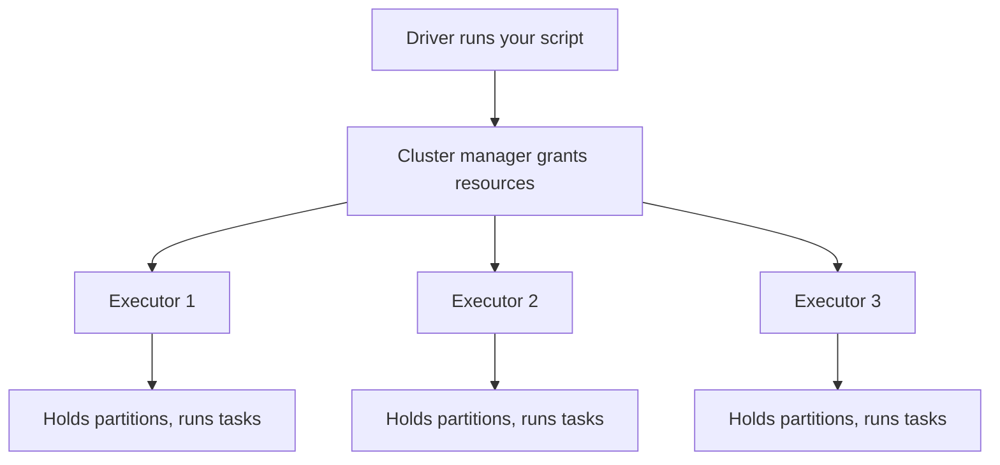
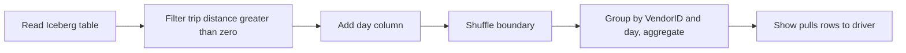

# Lecture 1 — The Spark Execution Model: Driver, Executors, Stages, Tasks

> **Duration:** ~2 hours of reading + running the SparkSession setup and the DAG-inspection code blocks.
> **Prerequisites:** Week 6 lakehouse running (MinIO + Iceberg in Docker); Python 3.11+; the pandas DataFrame mental model.
> **Citations:** Apache Spark cluster-mode overview <https://spark.apache.org/docs/latest/cluster-overview.html>; RDD Programming Guide <https://spark.apache.org/docs/latest/rdd-programming-guide.html>; SQL/DataFrame guide <https://spark.apache.org/docs/latest/sql-programming-guide.html>; PySpark API <https://spark.apache.org/docs/latest/api/python/index.html>.
> **Outcome:** You can name every component of a running Spark application, trace one action from your Python line to the tasks that execute it, distinguish narrow from wide transformations, and create a `SparkSession` in Docker wired to the Iceberg lakehouse.

If you only remember one thing from this lecture, remember this:

> **Your Spark program runs in one process — the driver — that never touches your data. It builds a plan. When you call an action, the driver compiles that plan into stages, splits each stage into tasks (one task per partition), and ships those tasks to executor processes that hold the data. The driver coordinates; the executors compute; the partitions are the unit of parallelism. Stage boundaries fall exactly where a wide transformation forces a shuffle. Everything else this week is detail on top of that sentence.**

Week 6's output — the NYC taxi data as an Iceberg table on MinIO — is this lecture's input. This lecture's output is a `SparkSession` that can read that table and the vocabulary to describe what happens when it does.

---

## 1. Why distributed compute at all

A pandas DataFrame, a DuckDB query, a Postgres `GROUP BY` — all run in **one process on one machine**. That is fine until one of two things breaks:

1. **The data does not fit.** A DataFrame that needs 80 GB of RAM will not load on a 32 GB laptop. You can stream it in chunks, but then you give up the convenience of "the whole thing is in memory."
2. **The computation does not finish in time.** Even if the data fits, a single-threaded scan of 500 GB, or a self-join that is quadratic in row count, can take hours. One machine has a finite number of cores.

There are two responses. **Scale up**: buy a bigger machine — more RAM, more cores. This works further than people think; a modern cloud instance can have 24 TB of RAM. **Scale out**: split the data across many machines and compute on all of them at once. Spark is the canonical scale-out engine (Zaharia et al. 2016, *CACM* 59:56, <https://dl.acm.org/doi/10.1145/2934664>).

Scaling out is not free. The moment work spans machines you pay a **coordination tax**: data must be partitioned, tasks scheduled, intermediate results moved across the network, failures detected and retried, and results gathered back. Spark's entire architecture is machinery for paying that tax efficiently. The corollary — which Lecture 3 makes concrete — is that **if you do not need to scale out, you should not pay the tax.** DuckDB on one big machine will beat Spark on anything that fits. Spark earns its keep only when the data or the compute genuinely exceeds one machine.

This lecture is about *how* Spark scales out: the components, the scheduling, and the cost model.

---

## 2. The components of a running Spark application

A Spark application has three kinds of component (cluster-mode overview, <https://spark.apache.org/docs/latest/cluster-overview.html>):

```
            ┌──────────────────────────────────────────────┐
            │                  DRIVER                        │
            │  - runs your main() / your PySpark script      │
            │  - holds the SparkSession / SparkContext       │
            │  - builds the DAG, schedules stages & tasks    │
            │  - collects results back from executors        │
            └───────────────┬────────────────────────────────┘
                            │ asks for resources
                            ▼
            ┌──────────────────────────────────────────────┐
            │            CLUSTER MANAGER                     │
            │  local[*] | Standalone | YARN | Kubernetes     │
            │  - grants executor processes + cores + memory  │
            └───────────────┬────────────────────────────────┘
                            │ launches
              ┌─────────────┼──────────────┐
              ▼             ▼              ▼
        ┌──────────┐  ┌──────────┐   ┌──────────┐
        │ EXECUTOR │  │ EXECUTOR │   │ EXECUTOR │
        │ holds    │  │ holds    │   │ holds    │
        │ partitions│ │ partitions│  │ partitions│
        │ runs tasks│ │ runs tasks│  │ runs tasks│
        └──────────┘  └──────────┘   └──────────┘
```

**The driver** is the process that runs your program. In PySpark, when you run `python my_job.py`, that process *is* the driver. It holds the `SparkSession` (and, underneath it, the legacy `SparkContext`). The driver is where your DataFrame transformations are recorded, where the **DAG scheduler** lives, and where the final small result of a `.collect()` or `.show()` lands. The driver is a coordinator, not a worker: it must not be where you accidentally pull a billion rows back with `.collect()`, or it runs out of memory.

**The cluster manager** allocates resources. In this week's labs you use two:

- **`local[*]`** — Spark runs everything in *one JVM* on your laptop, using one thread per core. The "cluster" is a fiction; driver and executor are the same process. This is the default and the right mode for development. The `*` means "all available cores"; `local[4]` means four.
- **Standalone mode** — a real driver process plus one or more separate **worker** containers, each running an executor. The stretch goal and Challenge 1's compose file use this so you can see multiple executors in the UI. Spark also supports YARN, Kubernetes, and Mesos in production; the DataFrame code is identical across all of them — only the master URL changes.

**Executors** are JVM processes that do the actual work. Each executor is granted a number of **cores** (how many tasks it can run at once) and an amount of **memory** (for caching partitions and for shuffle/aggregation buffers). An executor holds **partitions** of your data and runs **tasks** against them. In `local[*]` mode there is one executor (the driver JVM itself) with as many task slots as you have cores.


*The driver asks the cluster manager for resources; the cluster manager launches executors that hold data and run tasks.*

---

## 3. Jobs, stages, tasks — the unit hierarchy

These four words have precise meanings. Getting them straight is the difference between reading the Spark UI fluently and guessing.

- **Application** — your whole program, one `SparkSession`, from start to `spark.stop()`.
- **Job** — the work triggered by **one action**. Every `.show()`, `.count()`, `.collect()`, `.write.save()` launches exactly one job (sometimes more, for things like inferring schema). No action, no job — that is lazy evaluation (Section 5).
- **Stage** — a job is split into stages at **shuffle boundaries**. All the narrow transformations that can run without moving data across the network are fused into one stage. A wide transformation ends the current stage and starts a new one. A job with one shuffle has two stages; a job with three shuffles has four stages.
- **Task** — a stage is split into tasks, **one task per partition**. A task is the smallest unit of work: it runs the stage's fused computation on a single partition, on a single core, on a single executor. If a stage operates on 200 partitions, it has 200 tasks; with 8 cores, they run 8 at a time in waves.

```
Application
└── Job (one action)
    ├── Stage 0  (narrow ops, before the shuffle)
    │   ├── Task 0  (partition 0)
    │   ├── Task 1  (partition 1)
    │   └── ...
    └── Stage 1  (after the shuffle)
        ├── Task 0  (partition 0)
        └── ...
```

The **parallelism** of a stage is `min(number of partitions, total executor cores)`. More partitions than cores means tasks queue up and run in waves; fewer partitions than cores means some cores sit idle. This is why partition count matters so much — it is the dial that sets how parallel your job actually is.

---

## 4. The DAG scheduler and lineage

When you chain DataFrame operations, Spark records a **lineage**: a directed acyclic graph (DAG) where each node is a dataset and each edge is a transformation that produced it. Nothing computes yet. The DAG is just a recipe.

When an action fires, the **DAG scheduler** (part of the driver) does three things:

1. Walks the lineage backward from the action to find what must be computed.
2. Cuts the lineage into **stages** at every wide dependency (shuffle).
3. Submits the stages in topological order, turning each into a `TaskSet` of one task per partition, and hands them to the **task scheduler**, which places tasks on executors (preferring executors that already hold the relevant partition — *data locality*).

Lineage is also Spark's **fault-tolerance** mechanism. Because the DAG records *how* every partition was derived, if an executor dies and loses a partition, Spark can recompute just that partition from its parents rather than restarting the job. This is the RDD model (Zaharia et al. 2016; RDD Programming Guide, <https://spark.apache.org/docs/latest/rdd-programming-guide.html>). DataFrames sit on top of RDDs and inherit it.

---

## 5. Lazy evaluation: transformations vs actions

This is the most important behavioral fact about Spark, and the one that trips up everyone coming from pandas.

A **transformation** returns a new DataFrame and **computes nothing**. It only extends the lineage. `select`, `filter`, `withColumn`, `join`, `groupBy`, `orderBy`, `repartition` — all transformations, all lazy.

An **action** forces the recorded lineage to execute and returns a result to the driver (or writes to storage). `show`, `count`, `collect`, `take`, `first`, `write.save`, `foreach` — all actions, all eager.

```python
from pyspark.sql import functions as F

# These three lines compute NOTHING. They build a lineage.
trips = spark.read.parquet("s3a://lakehouse/yellow_tripdata/")
busy = trips.filter(F.col("passenger_count") > 1)
by_vendor = busy.groupBy("VendorID").agg(F.count("*").alias("n"))

# THIS line triggers a job: read -> filter -> shuffle -> aggregate -> collect.
by_vendor.show()
```

Why lazy? Because seeing the *whole* pipeline before running it lets the **Catalyst** optimizer do work no row-at-a-time engine can: push the `filter` down into the Parquet read (so fewer rows are ever materialized), prune columns you never reference, combine adjacent projections, and choose a join strategy from the estimated sizes. A pandas pipeline executes each line immediately and cannot optimize across lines. Spark waits, sees everything, then runs the optimized plan.

A practical consequence: **the line that is slow is the action, not the transformation that "looks" expensive.** When you profile, the `groupBy` line takes no time; the `.show()` three lines later takes all of it, because that is where the recorded `groupBy` actually runs.

---

## 6. Narrow vs wide transformations

Every transformation has a **dependency** type, and this is the crux of the whole week.

**Narrow dependency:** each output partition depends on **at most one** input partition. The computation stays local to an executor; no data crosses the network. Narrow transformations pipeline together — Spark fuses a whole chain of them into a single stage and a single pass over the data (whole-stage code generation, the `*(n)` markers you will see in plans).

- Examples: `select`, `filter`, `withColumn`, `map`, `union`, `drop`, `cast`.

**Wide dependency:** each output partition depends on **many** input partitions, because rows are regrouped by some key. Achieving that regrouping requires a **shuffle**: every executor writes its rows out, partitioned by the key, and every executor reads back the rows belonging to its output partitions — a full all-to-all data movement across the network.

- Examples: `groupBy` + agg, `join` (unless broadcast), `distinct`, `repartition`, `orderBy` (global sort).

```
NARROW (filter):                      WIDE (groupBy):

P0 ──> P0'                            P0 ─┐
P1 ──> P1'                            P1 ─┼─ shuffle ─> P0' (key A,B)
P2 ──> P2'                            P2 ─┘            ─> P1' (key C,D)
                                                       ─> P2' (key E,F)
(one in, one out, local)             (many in, many out, network)
```

A **stage boundary always falls at a wide transformation.** You can read a pipeline and predict the stage count by counting the wide ops: each one adds a stage. Lecture 2 takes the shuffle apart mechanically; for now, the rule is: **narrow is cheap and local; wide forces a shuffle and a stage boundary.** Reference: <https://spark.apache.org/docs/latest/rdd-programming-guide.html#transformations>.

---

## 7. Partitions and parallelism

A **partition** is a contiguous chunk of the dataset that lives on one executor and is processed by one task. Partitions are the atoms of Spark parallelism.

**How many partitions do you start with?** On read, it depends on the source. Reading Parquet, Spark creates partitions based on file and block layout — roughly one partition per file (or per ~128 MB block for large files, governed by `spark.sql.files.maxPartitionBytes`). Twelve monthly taxi Parquet files often read as ~12+ partitions. You can check any time:

```python
trips = spark.read.parquet("s3a://lakehouse/yellow_tripdata/")
print(trips.rdd.getNumPartitions())   # e.g. 12
```

**How does partition count change?** A **shuffle** repartitions the data into `spark.sql.shuffle.partitions` partitions — **default 200** (SQL performance tuning, <https://spark.apache.org/docs/latest/sql-performance-tuning.html#other-configuration-options>). So after any `groupBy` or sort-merge join, you typically have 200 partitions regardless of how many you started with. This default is wrong for small jobs (200 near-empty partitions, 200 tasks of overhead with almost no data) and often wrong for large ones (each partition too big to fit in an executor's memory). Tuning it is Lecture 2's job.

**Reshaping partitions explicitly:**

- `df.repartition(n)` — a **full shuffle** into `n` partitions, evenly distributed. Use to *increase* parallelism or to balance skew. Expensive.
- `df.repartition(n, "col")` — shuffle into `n` partitions hashed by `col` (co-locates rows sharing a key).
- `df.coalesce(n)` — merges partitions down to `n` with **no shuffle** (only combines adjacent partitions on the same executor). Use to *decrease* partition count cheaply, e.g. before writing few output files. Cannot increase parallelism.

```python
trips.repartition(8).rdd.getNumPartitions()   # 8, via full shuffle
trips.coalesce(1).rdd.getNumPartitions()      # 1, no shuffle (one output file)
```

The rule of thumb: aim for partitions of **~128 MB to a few hundred MB** each, and for a total partition count that is a small multiple of your executor-core count so tasks fill the cores without too many waves. For the year of taxi data on a laptop, 64–128 shuffle partitions is far better than the 200 default.

---

## 8. Creating a SparkSession in Docker, wired to the lakehouse

The **`SparkSession`** is the entry point to everything (SQL/DataFrame guide, <https://spark.apache.org/docs/latest/sql-programming-guide.html#starting-point-sparksession>). In a notebook or script you build one with `SparkSession.builder`. To talk to the Week 6 Iceberg-on-MinIO lakehouse, you wire in three things: the Iceberg Spark runtime extension, an Iceberg catalog backed by your warehouse path, and the S3A connector pointed at MinIO.

```python
from pyspark.sql import SparkSession

spark = (
    SparkSession.builder
    .appName("crunch-data-week07")
    .master("local[*]")                       # all laptop cores; one JVM
    # --- Iceberg SQL extensions + a catalog named 'lake' ---
    .config("spark.sql.extensions",
            "org.apache.iceberg.spark.extensions.IcebergSparkSessionExtensions")
    .config("spark.sql.catalog.lake", "org.apache.iceberg.spark.SparkCatalog")
    .config("spark.sql.catalog.lake.type", "hadoop")
    .config("spark.sql.catalog.lake.warehouse", "s3a://lakehouse/warehouse")
    # --- S3A connector pointed at MinIO (the Week 6 object store) ---
    .config("spark.hadoop.fs.s3a.endpoint", "http://minio:9000")
    .config("spark.hadoop.fs.s3a.access.key", "minioadmin")
    .config("spark.hadoop.fs.s3a.secret.key", "minioadmin")
    .config("spark.hadoop.fs.s3a.path.style.access", "true")
    .config("spark.hadoop.fs.s3a.impl", "org.apache.hadoop.fs.s3a.S3AFileSystem")
    # --- sane defaults for laptop-scale work ---
    .config("spark.sql.shuffle.partitions", "64")
    .config("spark.sql.adaptive.enabled", "true")
    .getOrCreate()
)
spark.sparkContext.setLogLevel("WARN")
```

The Iceberg and S3A jars must be on the classpath. The clean way to get them is `--packages` when launching, which pulls them from Maven (Iceberg Spark getting-started, <https://iceberg.apache.org/docs/latest/spark-getting-started/>):

```bash
spark-submit \
  --packages org.apache.iceberg:iceberg-spark-runtime-3.5_2.12:1.6.1,org.apache.hadoop:hadoop-aws:3.3.4 \
  my_job.py
```

In Challenge 1's `docker-compose.yml` these packages are baked into the Spark image so the container starts ready. Once the session is up, the lakehouse is one line away:

```python
trips = spark.table("lake.nyc.yellow_tripdata")     # the Iceberg table from Week 6
trips.printSchema()
print("partitions:", trips.rdd.getNumPartitions())
trips.select("VendorID", "tpep_pickup_datetime", "trip_distance",
             "total_amount").show(5, truncate=False)
```

`spark.table("lake.nyc.yellow_tripdata")` reads through the Iceberg catalog, which resolves the current snapshot, prunes to the files you need, and hands back a lazy DataFrame. You did the hard storage work in Week 6; Spark just consumes it.

---

## 9. Tracing one action end to end

Put the whole model together by tracing a single action. Consider:

```python
trips = spark.table("lake.nyc.yellow_tripdata")
result = (
    trips
    .filter(F.col("trip_distance") > 0)            # narrow
    .withColumn("day", F.to_date("tpep_pickup_datetime"))  # narrow
    .groupBy("VendorID", "day")                    # WIDE -> shuffle
    .agg(F.count("*").alias("trips"),
         F.sum("total_amount").alias("revenue"))
)
result.show()                                       # ACTION -> one job
```

What happens when `.show()` runs:

1. The driver's DAG scheduler walks the lineage: `table -> filter -> withColumn -> groupBy/agg -> show`.
2. It finds **one** wide transformation (`groupBy`), so the job has **two stages**:
   - **Stage 0:** read the Iceberg files (with the `filter` pushed down into the Parquet scan and only the needed columns read), apply `withColumn`, then do the *map-side partial aggregation* and write shuffle files partitioned by `(VendorID, day)`. One task per input partition (~12 tasks).
   - **Stage 1:** read the shuffle files, do the *reduce-side final aggregation* per `(VendorID, day)`, produce the result. One task per shuffle partition (64, because we set `spark.sql.shuffle.partitions=64`).
3. The driver dispatches Stage 0's tasks to executor cores; as they finish, Stage 1's tasks read the shuffle output and finish.
4. `show()` pulls the first 20 rows of the result back to the driver and prints them.


*Stage 0 covers the narrow steps before the shuffle boundary; Stage 1 covers the aggregate after it.*

You can see exactly this decomposition in the **Spark UI** (Lecture 3) and in the **explain plan** (Lecture 2). For now, run `result.explain(mode="formatted")` and find the line that says `Exchange hashpartitioning(VendorID, day, 64)` — that single line *is* the shuffle, the stage boundary, the network cost, and the thing the rest of the week teaches you to control.

---

## 10. Summary

- Distributed compute exists for data or computation that exceeds one machine; it costs a **coordination tax** that DuckDB on one big machine does not pay (Lecture 3 quantifies this).
- A Spark application has a **driver** (coordinates, runs your code, holds the `SparkSession`), a **cluster manager** (grants resources: `local[*]` or standalone in this week's labs), and **executors** (JVM processes that hold partitions and run tasks).
- The unit hierarchy: **application → job (one action) → stage (split at shuffle boundaries) → task (one per partition).** Parallelism is `min(partitions, cores)`.
- The **DAG scheduler** turns recorded lineage into stages and tasks; lineage also gives fault tolerance by recomputation.
- **Lazy evaluation:** transformations build lineage and compute nothing; only **actions** trigger a job. The slow line is always the action.
- **Narrow** transformations (`filter`, `select`, `withColumn`) stay local and fuse into one stage; **wide** transformations (`groupBy`, `join`, `distinct`, `repartition`) force a **shuffle** and a stage boundary.
- **Partitions** are the unit of parallelism. Read partitioning follows file layout; shuffle repartitioning follows `spark.sql.shuffle.partitions` (default 200 — usually wrong). `repartition` shuffles; `coalesce` merges without shuffling.
- A **`SparkSession`** wired with the Iceberg extensions, a `hadoop` catalog over a `s3a://` warehouse, and the S3A connector to MinIO reads the Week 6 lakehouse in one `spark.table(...)` call.

Next: **Lecture 2 — the DataFrame API in depth, the shuffle taken apart, and the join-strategy decision** that decides whether a join shuffles at all.
