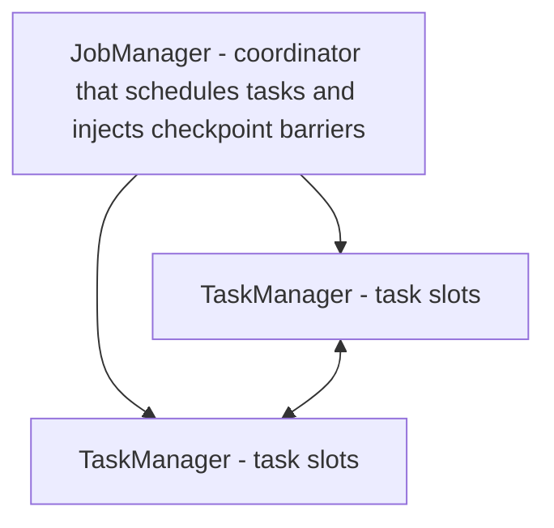
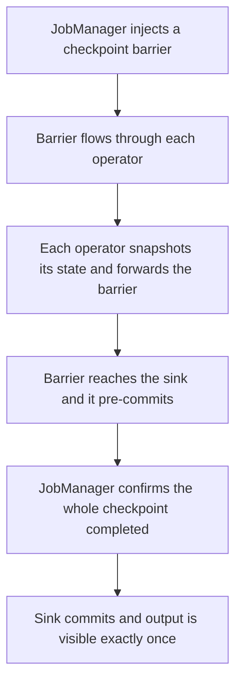

# Lecture 3 — Apache Flink and When to Use Which

> **Duration:** ~2.5 hours of reading + a 45-minute PyFlink run.
> **Prerequisites:** Lectures 1–2 (watermarks, windows, output modes, exactly-once in Spark), Week 8 (the `clickstream` Kafka topic).
> **Citations:** Apache Flink docs (<https://nightlies.apache.org/flink/flink-docs-stable/>); Flink concepts / architecture (<https://nightlies.apache.org/flink/flink-docs-stable/docs/concepts/flink-architecture/>); Flink event time & watermarks (<https://nightlies.apache.org/flink/flink-docs-stable/docs/concepts/time/>); Flink fault tolerance / checkpointing (<https://nightlies.apache.org/flink/flink-docs-stable/docs/learn-flink/fault_tolerance/>); PyFlink Table API (<https://nightlies.apache.org/flink/flink-docs-stable/docs/dev/python/table/intro_to_table_api/>); Flink Kafka SQL connector (<https://nightlies.apache.org/flink/flink-docs-stable/docs/connectors/table/kafka/>); Flink windowing TVFs (<https://nightlies.apache.org/flink/flink-docs-stable/docs/dev/table/sql/queries/window-tvf/>).
> **Outcome:** You can describe Flink's JobManager/TaskManager architecture and true record-at-a-time model, contrast it with Spark micro-batch, write the same windowed count in PyFlink with a `WATERMARK FOR` DDL and a `TUMBLE` window over Kafka, explain Flink's exactly-once via barrier snapshots + two-phase commit, and give a defensible Spark-vs-Flink answer for a workload.

Lectures 1–2 built the windowed count in Spark. This lecture builds the *same* count in **Apache Flink**, the dedicated streaming engine, and gives you the vocabulary to choose between them on the merits rather than the marketing.

> **The one sentence:**
> **Spark Structured Streaming is a micro-batch engine wearing a streaming API; Flink is a true record-at-a-time streaming engine. Same guarantees (event-time windows, watermarks, exactly-once), different mechanisms (checkpointed offsets + idempotent sink vs asynchronous barrier snapshots + two-phase-commit sinks), different sweet spots (Spark's mature batch ecosystem and operational familiarity vs Flink's lower latency and richer streaming/state model).**

---

## 1. Flink architecture: JobManager, TaskManagers, dataflow graph

A Flink cluster (the "concepts/architecture" doc) has two process roles:

- **JobManager** — the coordinator. It receives the job graph, schedules tasks onto slots, coordinates checkpoints (it injects the barriers; see §5), and handles recovery. There is one leader JobManager (plus standbys for HA).
- **TaskManagers** — the workers. Each provides a fixed number of **task slots**; each slot runs a chain of operator subtasks. TaskManagers exchange records with each other directly over the network as data flows through the pipeline. This is where the work happens.


*One JobManager coordinates many TaskManagers, which exchange records directly with each other.*

A Flink program is a **dataflow graph** of operators (source → map → keyBy → window → sink). Unlike Spark — which compiles a query into a *sequence of batch jobs* re-planned every micro-batch — Flink deploys the dataflow graph **once** as a long-running set of operator instances, and records stream through it continuously. There is no batch boundary. A record enters the source operator, flows to the next operator the instant it is ready, and exits at the sink, all without waiting to be batched with its neighbors. This standing-pipeline model is the root of every difference that follows.

```
Flink (standing dataflow, record-at-a-time):
   Kafka ─▶ [source] ─▶ [keyBy page] ─▶ [tumbling window agg] ─▶ [sink]
            one operator graph, deployed once, records flow through continuously

Spark Structured Streaming (re-planned micro-batches):
   every trigger:  read offset slice ─▶ plan a batch job ─▶ run it ─▶ commit ─▶ repeat
            a new small batch job per trigger, state carried in the state store
```

---

## 2. Event time and watermarks in Flink

The good news: **everything from Lecture 1 transfers.** Flink invented much of the modern event-time/watermark vocabulary (its lineage runs straight to the Dataflow Model paper), so the concepts are identical — event time vs processing time, the watermark as a lower bound on event time, late data, windows. Flink even uses the *same word*, "watermark," for the *same thing*: a special marker that flows through the dataflow asserting "no event with timestamp earlier than this will arrive."

The differences are surface:

- In Flink you declare event time and the watermark **in the table DDL** with a `WATERMARK FOR` clause (Table API) or via a `WatermarkStrategy` (DataStream API), rather than calling `withWatermark` on a DataFrame. The strategy `forBoundedOutOfOrderness(Duration.ofMinutes(10))` is Spark's `withWatermark("event_ts", "10 minutes")` exactly.
- Flink watermarks are **first-class records that flow through the graph** — each operator tracks the watermark on each input and forwards the minimum, so the watermark propagates continuously rather than being recomputed at batch boundaries. This is why Flink can fire a window the instant its watermark passes, with no batch-interval floor.
- Flink's late-data handling is richer: it offers `allowedLateness` (keep a window's state a while after the watermark passes, updating it for late arrivals) and **side outputs** for events too late even for that — so genuinely-late events can be captured rather than silently dropped. Spark only drops (and counts) them.

The "concepts/time" doc is the reference. The mental model from Lecture 1 needs no revision; only the API does.

---

## 3. The same windowed count in PyFlink (Table API)

Here is the Lecture-1/2 aggregate — count of `clickstream` events per page per 5-minute tumbling window — in PyFlink's Table API, reading the same Week-8 Kafka topic. The Kafka connector DDL (the "connectors/table/kafka" doc) declares the source; the `WATERMARK FOR` clause sets event time and the 10-minute watermark; a windowing **table-valued function** (`TUMBLE`, from the "window-tvf" doc) does the windowing.

```python
from pyflink.table import EnvironmentSettings, TableEnvironment

# Streaming TableEnvironment (true streaming, not batch)
t_env = TableEnvironment.create(EnvironmentSettings.in_streaming_mode())
# the Kafka SQL connector jar is on the classpath via the lab's Flink image / pipeline.jars

# 1) Declare the Kafka source as a table. WATERMARK FOR sets event time + the 10-minute bound.
t_env.execute_sql("""
CREATE TABLE clickstream (
    user_id       STRING,
    session_id    STRING,
    page          STRING,
    event_type    STRING,
    event_ts      TIMESTAMP(3),
    processing_ts TIMESTAMP(3),
    WATERMARK FOR event_ts AS event_ts - INTERVAL '10' MINUTE   -- = Spark withWatermark("event_ts","10 minutes")
) WITH (
    'connector'                 = 'kafka',
    'topic'                     = 'clickstream',
    'properties.bootstrap.servers' = 'kafka:9092',
    'properties.group.id'       = 'flink-week09',
    'scan.startup.mode'         = 'latest-offset',
    'format'                    = 'avro-confluent',                       -- matches Week-8 Confluent Avro
    'avro-confluent.url'        = 'http://schema-registry:8081'
)
""")

# 2) Sink table: a print sink for the comparison run (swap for an Iceberg/Delta sink to land it).
t_env.execute_sql("""
CREATE TABLE page_counts (
    window_start TIMESTAMP(3),
    window_end   TIMESTAMP(3),
    page         STRING,
    event_count  BIGINT
) WITH ('connector' = 'print')
""")

# 3) The same windowed count, as a TUMBLE windowing TVF over event time.
t_env.execute_sql("""
INSERT INTO page_counts
SELECT window_start, window_end, page, COUNT(*) AS event_count
FROM TABLE(
    TUMBLE(TABLE clickstream, DESCRIPTOR(event_ts), INTERVAL '5' MINUTE)   -- = window(event_ts,"5 minutes")
)
GROUP BY window_start, window_end, page
""")
```

That is the entire job. Line for line it mirrors the Spark version: `WATERMARK FOR ... INTERVAL '10' MINUTE` is `withWatermark("event_ts","10 minutes")`; `TUMBLE(..., INTERVAL '5' MINUTE)` is `window(col("event_ts"),"5 minutes")`; `GROUP BY window_start, window_end, page` is `groupBy(window(...), "page")`. Flink emits each window's result the instant its watermark passes the window end — no output mode to choose, because true streaming has no micro-batch to gate emission; the windowing TVF defines when a row is final.

### 3.1 The DataStream API alternative

For lower-level control (custom state, event-time timers, side outputs for late data) PyFlink also exposes the **DataStream API**: `StreamExecutionEnvironment.get_execution_environment()`, a `KafkaSource` built with `KafkaSource.builder()`, a `WatermarkStrategy.for_bounded_out_of_orderness(Duration.of_minutes(10))`, then `.key_by(lambda e: e.page).window(TumblingEventTimeWindows.of(Time.minutes(5)))`. The Table API above is the right altitude for this aggregate; reach for DataStream when you need per-key timers or to capture late events via a side output. The "intro_to_table_api" doc and the DataStream docs cover both.

---

## 4. Latency vs throughput: Spark micro-batch vs Flink true streaming

The architectural difference cashes out as a latency/throughput trade:

- **Latency.** Flink processes a record the moment it arrives and can fire a window the instant its watermark passes — **end-to-end latency in the single-digit-to-tens-of-milliseconds range**. Spark's micro-batch model caps latency at roughly the trigger interval: even with the default "as fast as possible" trigger, a batch has fixed planning + scheduling + commit overhead, so Spark's practical floor is **hundreds of milliseconds to a few seconds**. For a 5-minute window feeding a 15-minute dashboard, this difference is invisible; for a fraud-blocking pipeline that must answer before a transaction completes, it is decisive.
- **Throughput.** Both scale horizontally to very high throughput. Spark's micro-batch amortizes per-record overhead across a batch, which can give excellent *throughput* even though *latency* is higher — batching is efficient. Flink sustains high throughput too, with backpressure propagating naturally through the standing pipeline. At the lab's ~1,000 events/second neither is stressed; the difference you will *measure* is latency, not throughput.
- **What you will see in the lab.** Run both on the same topic and compare the wall-clock gap between an event's `event_ts` and the moment its window's count appears at the sink. Flink's will be markedly lower for the same watermark. The mini-project's PERF.md asks for exactly this number, plus throughput and recovery time after a kill.

---

## 5. Flink's exactly-once: barrier snapshots + two-phase commit

Spark's exactly-once was *checkpointed offsets + idempotent sink* (Lecture 2). Flink reaches the **same guarantee by a different mechanism**, and knowing both is the point of the comparison.

**Asynchronous barrier snapshotting** (a variant of the **Chandy–Lamport** distributed-snapshot algorithm; the "learn-flink/fault_tolerance" doc): the JobManager periodically injects a **checkpoint barrier** into the source stream. The barrier flows downstream through the dataflow graph alongside the records. When an operator receives the barrier on all its inputs, it snapshots its own state (the partial window aggregates) to durable storage (the lab uses MinIO/S3) and forwards the barrier. When the barrier reaches all sinks, the JobManager has a globally consistent snapshot — every operator's state as of the same logical point in the stream — **without stopping the pipeline**. That is the "asynchronous" part: records keep flowing while the snapshot is taken. On failure, Flink restores every operator from the last completed snapshot and rewinds the Kafka source to the offsets recorded in it — exactly-once *state* recovery.

For exactly-once *output*, Flink uses **two-phase-commit (2PC) sinks** (`TwoPhaseCommitSinkFunction`): a sink **pre-commits** its writes as part of the checkpoint (phase one, e.g. write to a staging area or open a transaction), and only **commits** them (phase two, make them visible) once the JobManager confirms the *whole* checkpoint completed. If the job fails between pre-commit and commit, recovery either completes or aborts the pending transaction, so each record's output appears exactly once. Kafka sinks (transactional producer), file sinks, and Iceberg/Delta sinks all implement this pattern.


*Asynchronous barrier snapshotting plus two-phase commit, without stopping the pipeline.*

| | Spark Structured Streaming | Apache Flink |
|---|---|---|
| State recovery | state-store snapshots in the checkpoint | asynchronous barrier snapshots (Chandy–Lamport) |
| Source replay | offsets in checkpoint WAL | offsets stored in the snapshot |
| Output exactly-once | idempotent sink (`MERGE`) or txn dedup | two-phase-commit sink |
| When the snapshot happens | at micro-batch boundaries | continuously, via barriers, without stopping |

Same end guarantee — each record's effect on the output appears exactly once — reached by genuinely different machinery. If you can explain both columns, you understand exactly-once, not just how to spell it.

---

## 6. When to pick which

A defensible decision, not a religious one:

**Reach for Spark Structured Streaming when:**

- Your team already runs Spark for batch (Week 7) — one engine, one cluster, one skill set, and `foreachBatch` lets you reuse all your batch code. This is the dominant reason in practice.
- Latency requirements are seconds-to-minutes (most analytics, the lab's dashboard).
- The workload is fundamentally aggregate-then-land-in-the-lakehouse, where the micro-batch maps cleanly onto a `MERGE` and the streaming-lakehouse pattern.
- You want `Trigger.AvailableNow` to run the *same* job as a scheduled batch — a flexibility Flink does not offer as cleanly.

**Reach for Flink when:**

- Low latency is a **product requirement**: sub-second alerting, fraud blocking, real-time feature serving.
- The workload is event-driven and stateful in ways that strain Spark: complex event processing (CEP), per-key timers, large keyed state with fine-grained TTL, sophisticated late-data handling via side outputs.
- You are building a long-lived standing pipeline whose value *is* its continuous low-latency operation, and the operational investment in a second runtime is justified by that value.

**The operational-complexity tax.** Flink is a *second* distributed system to deploy, monitor, tune (state backends, checkpoint intervals, network buffers), and recover. If you have no Flink expertise and your latency needs are met by Spark, adopting Flink is buying capability you will pay to operate and may not consume — the same "latency you don't need is cost you do pay" lesson from Lecture 2, applied to engine choice. The honest default for a Spark-shop analytics team is **Spark**, and the honest reason to adopt Flink is **a latency or state requirement Spark genuinely cannot meet**, backed by a measured number — which is exactly what the mini-project's comparison write-up makes you produce.

---

## 7. Summary

- **Flink architecture:** JobManager (coordinator, injects checkpoint barriers) + TaskManagers (workers with task slots) running a **standing dataflow graph** deployed once — records flow through continuously, no batch boundary, in contrast to Spark's re-planned micro-batches.
- **Event time & watermarks transfer unchanged** from Lecture 1; only the API differs — `WATERMARK FOR event_ts AS event_ts - INTERVAL '10' MINUTE` is `withWatermark("event_ts","10 minutes")`. Flink watermarks are first-class records flowing through the graph; Flink adds `allowedLateness` and side outputs for late data.
- **The same windowed count in PyFlink:** a Kafka-connector source table with a `WATERMARK FOR`, a `TUMBLE(TABLE ..., DESCRIPTOR(event_ts), INTERVAL '5' MINUTE)` windowing TVF, `GROUP BY window_start, window_end, page`. Line-for-line mirror of the Spark job.
- **Latency vs throughput:** Flink fires windows the instant the watermark passes (ms-scale latency); Spark's micro-batch floors latency at ~the trigger interval (hundreds of ms to seconds) but amortizes overhead for high throughput. At lab scale the measurable difference is latency.
- **Flink exactly-once:** asynchronous barrier snapshots (Chandy–Lamport) for consistent state recovery + two-phase-commit sinks for exactly-once output — same guarantee as Spark's checkpoint + idempotent sink, different mechanism.
- **Choose Spark** when you already run Spark, latency is seconds-to-minutes, and you want `AvailableNow`/`foreachBatch` reuse. **Choose Flink** when low latency is a product requirement or the stateful/CEP workload strains Spark — and only when the operational tax of a second runtime is justified by a measured need.

This closes the lecture arc. Take the quiz, work the exercises and challenges, then build the mini-project: the full streaming-lakehouse aggregate in Spark, the same aggregate in Flink, and a comparison write-up backed by numbers.
