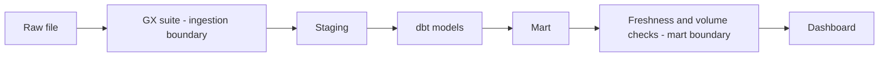
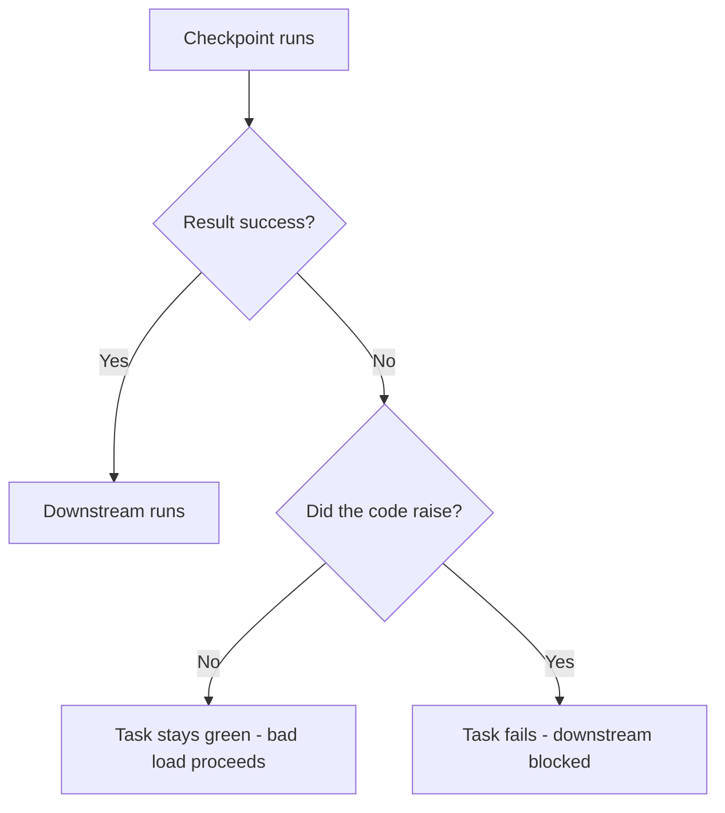

# Lecture 1 — The Data-Quality Taxonomy and the Halting Gate

> **Duration:** ~2 hours of reading + thinking.
> **Outcome:** You can name the six data-quality dimensions, classify any data incident into one of them, name the right check for each, and explain — with the failure cost behind it — why a quality gate must be able to *halt* a pipeline rather than merely log, and when a check should `warn` versus `error`.

If you remember one sentence from this entire week, remember this one:

> **A check you only log is not a gate. If the malformed load still lands when the check fails, you built a smoke detector with no battery — the noise it makes is irrelevant because nothing stops the fire.**

For nine weeks you built systems that *move* data and trusted that the data was good. This week you stop trusting it. The discipline of not trusting your inputs has a structure — a taxonomy of how data goes wrong and a right check for each way — and it has a hard requirement: the checks must have the authority to stop the pipeline. We build the taxonomy first, then the authority.

---

## 1. Why this week exists: the bad load that ran green

Picture the failure this week is named for. An upstream orders API, the source of your nightly `fct_orders` load, has an incident at 01:00. It does not error; it returns `200 OK` with a *truncated* page — 16,000 rows instead of the usual 40,000. Your ingestion job reads the file, finds it well-formed JSON, loads it. Staging runs. The dbt mart builds. The daily-revenue rollup refreshes. The executive dashboard updates. At 09:00 the VP of Sales opens the dashboard, sees revenue down 60% overnight, and calls an emergency meeting. Three hours and one very tense bridge call later, someone notices the row count. The data was never wrong in the sense of *corrupt* — every row that loaded was a real order. There were just **not enough of them**, and no part of the system had an opinion about how many rows a normal night produces.

Now contrast the two ways this could have gone:

- **No gate (what happened):** the load succeeded, the bad number was published, a human discovered it downstream after it had already done damage. Time-to-detection: 8 hours. Discovered by: an executive. Cost: a board's worth of trust.
- **With a volume gate:** the ingestion task ran a check — "this load should contain between 30,000 and 50,000 rows" — saw 16,000, **failed the task**, stopped the downstream from running, and paged the on-call data engineer at 01:05 with "orders load volume 16,000 outside expected [30k, 50k]." Time-to-detection: 5 minutes. Discovered by: the person who can fix it. Cost: a night's sleep.

The difference is not the check — both scenarios *could* compute the row count. The difference is **authority**: in the second, the check could halt the load. That authority is the entire subject of §5. First, the taxonomy that tells you *which* checks to write.

---

## 2. The six dimensions of data quality

Data quality is not one thing you either have or lack. It is six measurable properties, and a dataset can be perfect on five and broken on the sixth. Naming the dimension of an incident is the first move in any data-quality conversation, because **the dimension determines the check.** The canonical six (the framing in *Fundamentals of Data Engineering*, ch. 9, "Serving Data for Analytics," and the standard across the discipline):

| # | Dimension | The question it answers | Classic failure |
|---|-----------|-------------------------|-----------------|
| 1 | **Completeness** | Is all the data that should be here, here? | A non-null column has nulls; a daily partition is missing; an upstream truncated a page. |
| 2 | **Validity** | Is each value well-formed and in range? | `total_cents = -1`; a status of `"PLCAED"`; an email with no `@`; a date in the year 2103. |
| 3 | **Uniqueness** | Are there unintended duplicates? | Two rows with the same `order_id`; a fact loaded twice because a retry wasn't idempotent. |
| 4 | **Freshness** | Is the data recent enough? | The source's max `loaded_at` is 6 hours old against a 2-hour SLA; last night's load never ran. |
| 5 | **Volume** | Is the *amount* of data right? | 16,000 rows where 40,000 was normal; or 4,000,000 where a duplicate load doubled it. |
| 6 | **Distribution** | Is the *shape* of the data right? | Mean order value jumps 5×; a column's null-rate goes from 1% to 40%; a category's cardinality collapses. |

Internalize the difference between the last three, because they are the subtle ones and they are where the expensive bugs hide:

- **Freshness** is about *time*: the data may be perfectly valid and complete, but it's from yesterday.
- **Volume** is about *count*: every row may be valid and fresh, but there are the wrong number of them.
- **Distribution** is about *shape*: the right number of valid, fresh rows, but their statistical character has shifted in a way that signals an upstream change.

The first three (completeness, validity, uniqueness) are **per-row, intrinsic** — you can check them by looking at the data alone. The last three (freshness, volume, distribution) are **per-load, contextual** — you can only check them by comparing this load to *expectations or history*. That split maps directly onto the two boundaries you gate this week: per-row checks at the **ingestion boundary** (does each raw row obey the rules?) and per-load checks at the **mart boundary** (is the published result fresh, the right size, the right shape?).

---

## 3. The right check for each dimension

A taxonomy is only useful if it routes you to the fix. Here is the dimension → check mapping you should be able to produce from memory by Friday. The check column names the concrete tool — a Great Expectations expectation, a dbt test, a source-freshness rule, a SQL query — that you'll wire in Lectures 2 and 3.

### 3.1 Completeness → null checks, row presence, partition presence

The failure: data that should be present is absent. Three sub-cases:

- **Nulls in a required field.** Check: GX `expect_column_values_to_not_be_null(column="order_id")`; dbt `not_null`. For a column that's *allowed* some nulls but not too many, a **threshold**: GX `expect_column_values_to_not_be_null(column="customer_id", mostly=0.99)` — fail only if more than 1% are null.
- **Missing rows / truncated load.** This is really a *volume* check (§3.5) — completeness at the row level is a row-count expectation.
- **Missing partition.** "Did yesterday's date partition arrive at all?" Check: a query that asserts `count(*) WHERE created_date = current_date - 1 > 0`, or `dbt source freshness` (a stale source *is* a missing-partition signal).

The `mostly` parameter deserves emphasis: real data is rarely 100% clean, and a check that fails on a single stray null is a check you will disable within a week. `mostly=0.99` says "I expect this column populated, but I tolerate 1% noise" — which is the difference between a gate people keep and a gate people rip out.

### 3.2 Validity → type, range, format, value-set checks

The failure: a value that is present but malformed. Sub-cases and checks:

- **Out of range.** `total_cents` should be `>= 0`; an order quantity `1..1000`. Check: GX `expect_column_values_to_be_between(column="total_cents", min_value=0, max_value=10_000_000)`; dbt `dbt_utils.accepted_range` or `dbt_expectations.expect_column_values_to_be_between`.
- **Not in the allowed set.** `status` must be one of `{PLACED, SHIPPED, DELIVERED, CANCELLED}`. Check: GX `expect_column_values_to_be_in_set(column="status", value_set=[...])`; dbt `accepted_values`.
- **Wrong format.** An email must match a pattern; a `currency_code` must be three uppercase letters. Check: GX `expect_column_values_to_match_regex(column="currency_code", regex="^[A-Z]{3}$")`.
- **Wrong type / schema.** A `quantity` column arrives as a string. Check: a *schema* expectation — `expect_column_to_exist`, `expect_column_values_to_be_of_type` — run before the value checks, because a type mismatch makes range checks meaningless.

Validity is where you encode the *business rules* the upstream team may not have. "Status `PLCAED` is a typo for `PLACED`" is a validity rule that only you, the consumer, will catch — which is exactly why the contract (Lecture 3) matters.

### 3.3 Uniqueness → key and compound-key checks

The failure: rows that should be distinct are duplicated, usually because a retry or a non-idempotent load ran twice (recall the idempotency work in Week 3 — a uniqueness check is how you *prove* idempotency held).

- **Single-column key.** `order_id` is unique. Check: GX `expect_column_values_to_be_unique(column="order_id")`; dbt `unique`.
- **Compound key.** A row is unique on `(order_id, line_number)`, not on either alone. Check: GX `expect_compound_columns_to_be_unique(column_list=["order_id", "line_number"])`; dbt `dbt_utils.unique_combination_of_columns`.
- **Referential integrity** is a *uniqueness-adjacent* completeness check: every `customer_id` in `fct_orders` must exist in `dim_customer`. Check: dbt `relationships(to=ref('dim_customer'), field='customer_id')`; in GX, a join-and-assert singular check or a foreign-key expectation. (Pure GX is weaker at cross-table referential integrity than dbt — note that honestly and use the right tool.)

### 3.4 Freshness → load-timestamp vs SLA

The failure: the data is fine but old. The check compares the maximum load timestamp to *now* against an SLA:

```sql
-- freshness check: fail if the newest row is older than the SLA
SELECT max(loaded_at) AS newest,
       now() - max(loaded_at) AS lag
FROM raw.orders;
-- gate: lag > interval '2 hours'  ->  error
--       lag > interval '1 hour'   ->  warn
```

The first-class tool is **`dbt source freshness`**, configured with `loaded_at_field`, `warn_after`, and `error_after` (Lecture 3 §2). The key design choice is the SLA itself: freshness is the one dimension that is *meaningless without a contract*, because "old" is only definable relative to a promise the producer made. Two hours stale is a disaster for a fraud feed and irrelevant for a monthly finance rollup.

### 3.5 Volume → row-count vs baseline

The failure: the wrong *amount* of data — the truncated-load incident from §1, or its mirror, a doubled load. The check compares this load's row count to an expected range:

- **Static bounds** (when you know the rough scale): GX `expect_table_row_count_to_be_between(min_value=30000, max_value=50000)`.
- **Dynamic / rolling baseline** (better): compare today's count to the trailing average and flag a delta beyond a band — e.g. "fail if today is below 50% or above 200% of the trailing-7-day mean." This is a SQL singular test, covered in Lecture 3 §3, and `dbt_expectations.expect_row_values_to_have_recent_data` and the row-count expectations help. The rolling baseline is strictly better than static bounds because your normal volume drifts (Black Friday is not a normal Tuesday) and a static `[30k, 50k]` will both miss real anomalies and fire false alarms across the year.

### 3.6 Distribution → statistical drift checks

The failure: the right count of valid, fresh rows whose *statistics* have shifted — a signal that something upstream changed even when no individual row is "wrong." Three workhorse drift metrics:

- **Mean / median drift.** `avg(total_cents)` jumps 5× overnight (a currency-unit change upstream — cents became dollars). Check: a SQL comparison of today's mean to the trailing baseline; GX `expect_column_mean_to_be_between`.
- **Null-rate drift.** A column's null-rate goes from 1% to 40% (an upstream stopped populating it). Check: compute `null_rate` per load, compare to history.
- **Cardinality drift.** A `category` column that normally has ~50 distinct values suddenly has 3 (an upstream join broke and collapsed the dimension). Check: GX `expect_column_unique_value_count_to_be_between`; a SQL `count(distinct ...)` vs baseline.

Distribution checks are the most powerful and the most prone to false alarms — they catch the bugs nothing else does (the currency-unit change is invisible to completeness, validity, uniqueness, freshness, and volume) but they fire on legitimate change too. They are therefore the dimension most often run as `warn`, not `error` (§5).

### 3.7 The whole map on one page

Here is the dimension → failure → check → default-severity table to pin above your desk. By Friday you should be able to reproduce it from memory and, given any incident, point to the row:

| Dimension | The failure | The check (GX / dbt) | Typical severity |
|-----------|-------------|----------------------|------------------|
| Completeness | null in a required field | `ExpectColumnValuesToNotBeNull` / `not_null` | error |
| Completeness | too many nulls (tolerable column) | `ExpectColumnValuesToNotBeNull(mostly=0.99)` | error/warn |
| Completeness | missing partition / load never ran | row-presence query / `dbt source freshness` | error |
| Validity | out of range | `ExpectColumnValuesToBeBetween` / `dbt_utils.accepted_range` | error |
| Validity | not in allowed set | `ExpectColumnValuesToBeInSet` / `accepted_values` | error |
| Validity | wrong format | `ExpectColumnValuesToMatchRegex` | error |
| Validity | wrong type / missing column | `ExpectColumnToExist` / `ExpectColumnValuesToBeOfType` | error |
| Uniqueness | duplicate key | `ExpectColumnValuesToBeUnique` / `unique` | error |
| Uniqueness | duplicate compound key | `ExpectCompoundColumnsToBeUnique` / `dbt_utils.unique_combination_of_columns` | error |
| Uniqueness | orphan FK (referential integrity) | dbt `relationships` / SQL anti-join | error/warn |
| Freshness | stale vs SLA | `dbt source freshness` (`warn_after`/`error_after`) | error |
| Volume | wrong row count | `ExpectTableRowCountToBeBetween` / rolling-baseline singular test | error |
| Distribution | mean/median drift | `ExpectColumnMeanToBeBetween` / baseline compare | warn |
| Distribution | null-rate drift | per-load null-rate vs history | warn |
| Distribution | cardinality drift | `ExpectColumnUniqueValueCountToBeBetween` / `count(distinct)` vs baseline | warn |

Two patterns fall out of the table that are worth stating explicitly. First, **the intrinsic dimensions (completeness, validity, uniqueness) default to `error`** — they are unambiguous, so a failure is corruption and corruption must halt. Second, **the distribution dimension defaults to `warn`** — drift is ambiguous (it might be a real promotion, not a bug), so you alert a human rather than stop the trains. Freshness and volume sit in between: unambiguous enough to gate hard, contextual enough to deserve a graduated band (§5.3). Memorize the *shape* of that severity gradient — intrinsic → error, contextual → it depends, distribution → warn — and you will assign severity correctly without thinking.

### 3.8 A worked classification

Reading the table is not the skill; *classifying live incidents* is. Walk through three real ones the way you will in the on-call channel:

- **"Revenue is exactly double yesterday's."** Resist "it's a revenue problem" — that's not a dimension. Double revenue with the same *shape* of orders is a **volume** failure (twice the rows), almost certainly a non-idempotent load that ran twice (recall Week 3). Check: row count vs baseline — it will be ~2×. Severity: error. The fix is upstream (idempotency), but the gate that *catches* it is a volume check.
- **"The fraud dashboard hasn't updated since 2 a.m."** Nothing is wrong with the *data* — it's a **freshness** failure. `max(loaded_at)` is hours old. The subtle part (§3.4): you can't tell from the data alone whether the producer published late or your DAG silently died; the freshness gate catches both, which is its superpower. Severity: error (a fraud feed has a tight SLA).
- **"Average order value tripled overnight."** Tempting to call it volume, but the row *count* is normal — it's a **distribution** failure (mean drift). Likely a units change upstream (cents → dollars) or a single huge outlier order. Check: mean vs baseline. Severity: warn first — a legitimate B2B bulk order could triple the mean, so you want a human to look before you halt the pipeline over it.

The move in every case is the same: strip the business framing ("revenue," "fraud," "AOV"), find the dimension underneath, and the right check and severity follow from §3.7. That translation — from a panicked Slack message to a dimension and a check — is the reflex Week 10 builds.

---

## 4. The two boundaries

You do not check everything everywhere. The two-boundary pattern is the architectural backbone of the week, and it maps onto the per-row / per-load split from §2:

```
                  INGESTION BOUNDARY                         MART BOUNDARY
                  (per-row, intrinsic)                       (per-load, contextual)
   raw file  ──▶  [ GX suite ]  ──▶  staging  ──▶  dbt  ──▶  mart  ──▶  [ freshness + volume ]  ──▶  dashboard
                  schema                                                 is it recent enough?
                  nulls / thresholds                                     is it the right size?
                  ranges                                                 (and distribution checks)
                  value sets
                  uniqueness
                  referential integrity
```

- **Ingestion boundary — Great Expectations, per-row.** This is where raw data first enters your trust zone. Check completeness, validity, uniqueness, and referential integrity *here*, before a single bad row reaches staging. If you let a bad row in, every downstream model inherits the problem and the blast radius grows. Gate hard here: a schema violation or a flood of nulls should **fail**.
- **Mart boundary — freshness + volume (+ distribution), per-load.** This is where the *published result* leaves your trust zone for a consumer. The raw rows may each be valid, but the *aggregate* can still be wrong: stale (freshness), short (volume), or shifted (distribution). Gate the published artifact here.

Why both and not one? Because the failure modes are different. The ingestion gate catches "this row is malformed"; the mart gate catches "this *result* is untrustworthy even though every row is fine." The truncated-load incident from §1 passes the ingestion gate cleanly (every one of the 16,000 rows is valid) and is caught *only* by the volume check at the mart boundary. You need both.


*Per-row checks gate the ingestion boundary; per-load checks gate the mart boundary before data reaches the dashboard.*

---

## 5. The halting gate: why a check must be able to stop the pipeline

Now the hard requirement. A data-quality check has exactly two things it can do when it fails:

1. **Log** — write the failure somewhere and let the pipeline continue.
2. **Halt** — fail the task, which (by the orchestrator's dependency rules) stops the downstream and triggers an alert.

A **gate** is a check that *halts*. A check that only logs is a **monitor**. Both have a place, but **only a gate prevents the bad load from landing**, and the entire premise of the week — catch the bad load before the executive does — requires a gate. The monitor-only approach fails the §1 scenario completely: it would have logged "volume 16,000, expected ~40,000" into a file, the load would have proceeded, the dashboard would have updated, and the VP would still have called the meeting. The log was written. Nobody read it in time. **A log nobody reads in time is not a control.**

### 5.1 How a halt actually works

In an orchestrator (Airflow, which you built in Week 4), a task halts by **raising an exception**. That is the mechanism — there is no special "halt" API; you raise, the task goes to `failed`, and Airflow's dependency engine refuses to run anything downstream of a failed task:

```python
# the ingestion gate as an Airflow PythonOperator callable
def validate_orders_ingestion(**context):
    checkpoint_result = run_gx_checkpoint("orders_ingestion")
    if not checkpoint_result.success:
        # THIS is the gate. The raise fails the task, which stops the DAG.
        raise AirflowException(
            f"orders_ingestion checkpoint FAILED: "
            f"{summarize_failures(checkpoint_result)}"
        )
    # if we reach here, every expectation passed; downstream may run
```

The shape that matters: the validation *result* must be inspected and the failure must be turned into a `raise`. The `GreatExpectationsOperator` (from the `airflow-provider-great-expectations` package) does this for you — it raises on a failed checkpoint by default (`fail_task_on_validation_failure=True`). A `PythonOperator` that runs GX but *forgets to check `result.success` and raise* is the classic broken gate: it runs the validation, prints a pretty report, returns `None`, the task goes green, and the bad load proceeds. **Running the check is not gating; acting on the result is gating.**


*A check only becomes a gate when a failing result is turned into a raised exception.*

### 5.2 Fail vs warn: the two severities

Not every failure should halt the pipeline. There are two severities, and choosing correctly is a real engineering decision:

| Severity | Effect | Use when |
|----------|--------|----------|
| **error / fail** | Halts the pipeline; downstream does not run; alert fires. | A bad load here would *corrupt downstream truth*: schema violation, key duplication, volume off by 60%, a non-null key with nulls. |
| **warn** | Logs/alerts but lets the pipeline continue. | A failure that's *suspicious but not necessarily wrong*: distribution drift, a freshness `warn_after` window, a soft volume band. You want a human to look, but you don't want to stop the trains over a maybe. |

dbt encodes this directly as `severity: warn` / `severity: error`, with `warn_if` and `error_if` thresholds (Lecture 2 §6). GX gives you the boolean `result.success` and you decide in code whether a given suite's failure raises (fail) or merely alerts (warn). The principle:

- **Intrinsic, unambiguous failures → fail.** A duplicate primary key is *never* acceptable. A null `order_id` is *never* acceptable. Halt.
- **Contextual, ambiguous signals → warn (often), fail (when the band is wide enough to be unambiguous).** A 10% volume dip might be a slow day; a 60% dip is an incident. So you can have *both*: `warn` at ±20%, `error` at ±50%. Distribution drift is almost always `warn` first — you tighten it to `error` only once you've watched it long enough to trust the band.

### 5.3 The false-halt cost and how to tune the band

A gate that halts has a failure mode of its own: the **false halt**, where a *legitimate* load is rejected and the pipeline stops for no reason. False halts are not free — they page people at 3 a.m. for nothing, and a gate that cries wolf gets disabled, which is worse than no gate. So you tune the band between two costs:

- **Cost of a missed bad load** (gate too loose): the §1 incident — bad data published, discovered downstream, trust lost.
- **Cost of a false halt** (gate too tight): a 3 a.m. page for a real Black Friday spike; a pipeline stopped because `mostly=1.0` choked on one legitimate null.

The craft is setting thresholds wide enough to never false-halt on normal variation and tight enough to always catch real incidents — and using `mostly`, rolling baselines, and the `warn`/`error` split to create a *graduated* response instead of a single brittle line. A gate people trust is a gate people keep; a gate that false-halts is a gate people delete the week after you build it.

---

## 6. The data-quality report as an artifact

A gate produces a *decision* (pass/fail). It should also produce a *record* — a human-readable data-quality report, emitted on every run, that says what was checked, what passed, what failed, and by how much. This is the artifact you build in the mini-project. Two reasons it matters:

- **Forensics.** When something slips a gate (the gate you didn't write yet), the report from the runs around the incident is your evidence. "The null-rate on `customer_id` was 1% Monday, 1% Tuesday, 39% Wednesday — Wednesday's load is the one to investigate."
- **Trust.** A report that ships with every run — GX's **Data Docs** is exactly this, an auto-generated HTML site of every validation — turns "is the data good?" from a question into a link. Consumers stop asking and start checking.

The report is *not* a substitute for the gate. The gate prevents the bad load; the report explains every load, good or bad. You need both, for the same reason a flight has both a brake and a black box.

---

## 7. Where this goes

- **Lecture 2** makes the ingestion gate real: Great Expectations Core 1.x end to end — Data Context, Datasource, Batch Definition, Expectation Suite, Validation Definition, Checkpoint, Actions, Data Docs — and then revisits dbt tests in depth (generic, singular, `dbt_utils`, `dbt_expectations`, severity, `store_failures`) as the gates inside the transformation layer.
- **Lecture 3** makes the mart gate and the contract real: the data contract YAML, `dbt source freshness` for freshness, rolling-baseline volume detection, distribution drift, and the run-metadata observability that turns gates into early warning.
- **The mini-project** wires both boundaries into your Airflow DAG so a corrupted file fails the pipeline and alerts, and emits the DQ report.

The taxonomy is the part you carry forever. Tools change — GX had a major API break between 0.x and 1.x, dbt adds packages, new vendors appear — but "this is a completeness failure and the right check is a not-null gate" is true regardless of the tool. Learn the six dimensions cold; everything else is which button to press.

---

## References

- **Joe Reis & Matt Housley, *Fundamentals of Data Engineering*** (O'Reilly, 2022), ch. 9 "Serving Data for Analytics" and the data-quality discussion throughout — the framing of quality dimensions and the place of validation in the lifecycle. ISBN 978-1-098-10830-4. <https://www.oreilly.com/library/view/fundamentals-of-data/9781098108298/>
- **Great Expectations — documentation** (the validation framework, Data Context, suites, checkpoints, Data Docs): <https://docs.greatexpectations.io/docs/>
- **dbt — Add data tests to your DAG** (generic and singular tests, severity, `store_failures`): <https://docs.getdbt.com/docs/build/data-tests>
- **Barr Moses, Lior Gavish & Molly Vorwerck, *Data Quality Fundamentals*** (O'Reilly, 2022) — the data-downtime framing and the dimensions of quality at scale: <https://www.oreilly.com/library/view/data-quality-fundamentals/9781098112035/>
