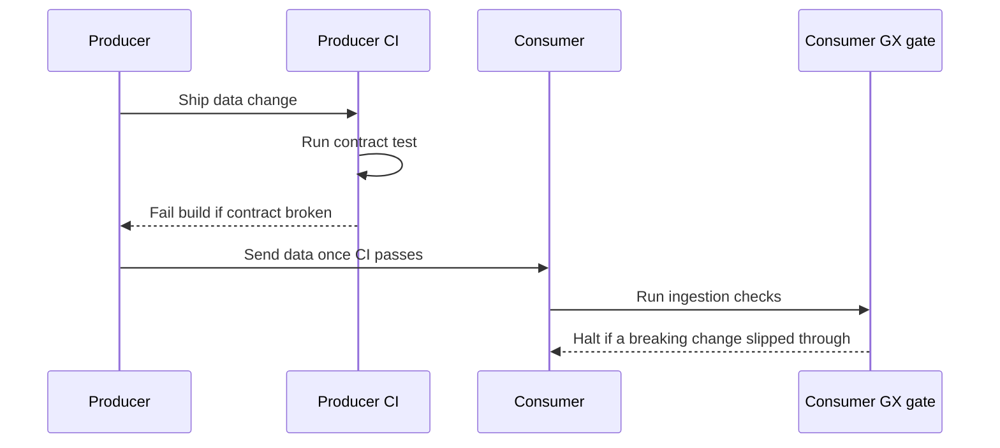
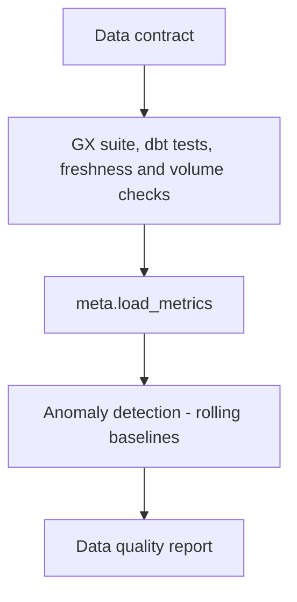

# Lecture 3 — Data Contracts, Freshness/Volume/Distribution Anomalies, and Observability

> **Duration:** ~1.5 hours of reading + hands-on.
> **Outcome:** You can write a data contract two teams hold each other to, enforce its clauses as automated checks, detect freshness anomalies with `dbt source freshness`, detect volume anomalies against a rolling baseline, detect distribution drift, and emit the run metadata that turns gates into early warning.

Lectures 1 and 2 gave you the gates: the taxonomy, the halting requirement, GX at ingestion, dbt tests in transformation. This lecture supplies the two things that make the gates *correct and self-aware*: the **contract** that defines what the checks should assert (because freshness and volume are meaningless without a promise), and the **observability** that lets you detect anomalies and find them after the fact.

> **The sentence to keep:** a freshness or volume gate without a contract is a guess. "Two hours stale is bad" and "40,000 rows is normal" are not facts about your data — they are *promises the producer made*, and the contract is where those promises are written down so a check can enforce them and a producer can be held to them.

---

## 1. What a data contract actually contains

When two teams disagree about data — "you broke us," "you never told us that field could be null" — the argument is unwinnable because there was never a written agreement. A **data contract** is that agreement: a machine-readable spec, owned by the *producing* team, that the *consuming* team depends on, and that CI can enforce on *both* sides. It is the artifact that turns "the upstream team broke us again" into "the producer's CI failed the contract test before they shipped."

A real contract has these clauses. Here it is as YAML — the shape you author in Challenge 2, aligned with the open Data Contract Specification (<https://datacontract.com/>):

```yaml
# contracts/orders.yaml — owned by the orders-platform (producer) team
dataContractSpecification: "1.1.0"
id: orders-raw-v1
info:
  title: Raw Orders Feed
  version: 1.2.0                       # contracts are versioned; breaking changes bump major
  owner: orders-platform              # who is accountable (ownership clause)
  contact:
    name: Orders Platform Team
    url: https://wiki.internal/teams/orders-platform

# --- SCHEMA + SEMANTICS + GRAIN ---
models:
  orders:
    type: table
    description: "One row per order line. Grain: (order_id, line_number)."
    fields:
      order_id:
        type: bigint
        required: true                 # completeness clause
        unique: false                  # unique only WITH line_number (grain below)
        description: "Stable order identifier from the checkout service."
      line_number:
        type: integer
        required: true
      customer_id:
        type: bigint
        required: true
        pii: false                     # PII flag (governance clause)
      status:
        type: string
        required: true
        enum: [PLACED, SHIPPED, DELIVERED, CANCELLED]   # validity clause
      total_cents:
        type: long
        required: true
        minimum: 0                     # validity clause
      currency_code:
        type: string
        pattern: "^[A-Z]{3}$"          # validity clause
      customer_email:
        type: string
        pii: true                      # PII flag: this column needs masking downstream
    primaryKey: [order_id, line_number]   # grain, as an enforceable compound key

# --- SLAs: freshness + volume (the promises) ---
servicelevels:
  freshness:
    description: "The feed lands within 2h of the order's creation."
    threshold: 2h                      # error SLA (Lecture 1 §3.4)
    warningThreshold: 1h               # warn SLA
    timestampField: loaded_at
  volume:
    description: "A normal nightly load is 30k–50k rows."
    minRows: 30000
    maxRows: 50000

# --- CHANGE POLICY: what the producer may and may not do without notice ---
changePolicy:
  additive: allowed                    # adding a nullable column: fine, no notice needed
  breaking:                            # dropping/renaming/narrowing a field, changing grain
    notice: 14d                        # 14 days' notice + a major version bump, in writing
    requiresConsumerSignoff: true
```

The clauses, named:

- **Schema** — field names and types. The structural contract.
- **Semantics + grain** — what each field *means* and what one row *is* (`(order_id, line_number)`). The most-violated clause, because two teams can agree on the schema and still disagree on whether a row is an order or an order *line*.
- **SLAs** — freshness (`threshold` / `warningThreshold`) and volume (`minRows` / `maxRows`). The promises the gates enforce.
- **Ownership** — who is accountable, with a contact. An unowned contract is unenforceable.
- **Change policy** — what the producer may change freely (additive) and what requires notice + a major version bump + consumer sign-off (breaking). This is the clause that prevents the 3 a.m. "they dropped a column" incident.
- **PII flags** — which fields carry personal data, so the consumer knows what must be masked/restricted (a governance hand-off to Week 11).

### 1.1 Enforcing the contract

A contract nobody checks is a wiki page. Enforcement runs on **both** sides:

- **Producer side (the important one):** the producer's CI runs a contract test against the data they're *about* to ship. If they dropped `currency_code` or changed the grain, *their* build fails before the change reaches you. Tools: the `datacontract` CLI (`datacontract test contracts/orders.yaml`), or generated dbt/GX checks from the contract.
- **Consumer side (defense in depth):** you run the same schema + SLA checks at *your* ingestion boundary (the GX suite from Lecture 2) so that if a breaking change slips through, *your* gate halts before it corrupts your marts.


*The contract is enforced twice - once by the producer before shipping, once by the consumer before trusting.*

The contract is the single source of truth that *generates* both sides' checks. A field marked `required: true` becomes a `not_null` gate; an `enum` becomes `accepted_values` / `ExpectColumnValuesToBeInSet`; `minimum: 0` becomes a range check; the volume SLA becomes `ExpectTableRowCountToBeBetween`. The contract is the taxonomy of Lecture 1, written down and signed.

---

## 2. Freshness anomaly detection

Freshness is "is the data recent enough?" — and "enough" is the SLA from the contract. The detection compares the newest load timestamp to *now*.

### 2.1 The first-class tool: `dbt source freshness`

dbt builds freshness checking into **sources** (the raw tables your project reads). You declare a `loaded_at_field` and the SLA, and `dbt source freshness` checks it:

```yaml
# models/sources.yml
sources:
  - name: raw
    database: analytics
    schema: raw
    # default freshness for all tables in this source
    loaded_at_field: loaded_at            # the column holding the per-row load time
    freshness:
      warn_after: {count: 1, period: hour}    # warn if newest row > 1h old (the contract's warning SLA)
      error_after: {count: 2, period: hour}   # error if newest row > 2h old (the contract's SLA)
    tables:
      - name: orders
        # per-table override: orders has a tighter SLA than the source default
        freshness:
          warn_after: {count: 30, period: minute}
          error_after: {count: 90, period: minute}
      - name: products
        freshness: null                   # products is a slow dimension; freshness check off
```

Run it:

```bash
dbt source freshness
# 14:32:10  1 of 2 START freshness of raw.orders ........... [RUN]
# 14:32:10  1 of 2 PASS freshness of raw.orders ............ [PASS in 0.21s]
# 14:32:11  2 of 2 WARN freshness of raw.products .......... [WARN in 0.18s]
```

`dbt source freshness` constructs `select max(loaded_at) from raw.orders`, compares the gap to `warn_after` / `error_after`, and exits non-zero on an `error` — which is exactly what halts a pipeline when run as an Airflow task. This is the freshness gate at the **source boundary**, the third boundary alongside GX (ingestion) and dbt tests (transformation). Full docs: <https://docs.getdbt.com/docs/build/sources#snapshotting-source-data-freshness>.

### 2.2 The raw SQL underneath (for non-dbt sources)

When the source isn't a dbt source, the same check is one query:

```sql
-- freshness gate for a raw table not managed by dbt
SELECT
  max(loaded_at)                          AS newest,
  now() - max(loaded_at)                  AS lag,
  (now() - max(loaded_at)) > interval '2 hours'  AS is_stale
FROM raw.orders;
-- a CI task selects is_stale and exits non-zero when true -> halt
```

Freshness's subtlety: a source can be *stale* not because the data is old but because **the load never ran**. `max(loaded_at)` being 26 hours old is identical whether the producer published late or your DAG silently failed. The freshness gate catches both, which is why it's the cheapest high-value check you can add — it catches "the pipeline didn't run" for free.

---

## 3. Volume anomaly detection against a rolling baseline

Static bounds (`min_value=30000`) are a fine first cut but they drift out of calibration: a band that fits a normal Tuesday false-halts on Black Friday and misses a slow decay. The better detector compares today's count to a **rolling baseline** computed from history. You need run history — which is exactly the observability metadata of §5.

```sql
-- volume anomaly: today's load vs the trailing-7-day baseline
WITH daily AS (
  SELECT load_date, row_count
  FROM meta.load_metrics
  WHERE table_name = 'raw.orders'
),
baseline AS (
  SELECT
    load_date,
    row_count,
    avg(row_count)    OVER w AS rolling_mean,
    stddev(row_count) OVER w AS rolling_std
  FROM daily
  WINDOW w AS (ORDER BY load_date ROWS BETWEEN 7 PRECEDING AND 1 PRECEDING)
)
SELECT
  load_date,
  row_count,
  rolling_mean,
  -- z-score: how many std-devs is today from the trailing mean?
  (row_count - rolling_mean) / nullif(rolling_std, 0) AS z_score,
  CASE
    WHEN row_count < 0.5 * rolling_mean OR row_count > 2.0 * rolling_mean THEN 'ERROR'
    WHEN abs((row_count - rolling_mean) / nullif(rolling_std, 0)) > 3   THEN 'WARN'
    ELSE 'OK'
  END AS verdict
FROM baseline
WHERE load_date = current_date;
```

Two signals, two severities (Lecture 1 §5.2):

- **Ratio band** (`< 50%` or `> 200%` of the trailing mean) → **error**. The §1 truncated-load incident — 16,000 vs a ~40,000 mean — trips this hard and halts.
- **Z-score** (more than 3 standard deviations from the trailing mean) → **warn**. A subtler drift a human should eyeball.

The ratio band is robust and unambiguous (good for a halting gate); the z-score is sensitive (good for a warning). Run both; they catch different anomalies. `dbt_expectations.expect_table_row_count_to_be_between` covers the static-band case; the rolling baseline is a singular test reading the metrics table.

---

## 4. Distribution anomaly detection

Distribution drift (Lecture 1 §3.6) catches the bug nothing else does: the right count of valid, fresh rows whose *statistics* have shifted. The three workhorse metrics, each computed per load and compared to the trailing baseline in `meta.load_metrics`:

```sql
-- per-load distribution metrics for raw.orders, emitted alongside row_count
SELECT
  current_date                                    AS load_date,
  avg(total_cents)                                AS mean_total_cents,   -- mean drift
  count(*) FILTER (WHERE customer_id IS NULL)::float / count(*) AS null_rate_customer, -- null-rate drift
  count(DISTINCT status)                          AS cardinality_status  -- cardinality drift
FROM raw.orders
WHERE loaded_at::date = current_date;
```

Then compare each metric to its trailing baseline exactly as in §3:

- **Mean drift.** `mean_total_cents` jumps from ~3,000 to ~300,000 → an upstream changed units (cents → dollars, off by 100×). Invisible to every other dimension because each row is individually "valid."
- **Null-rate drift.** `null_rate_customer` goes 1% → 39% → an upstream stopped populating the join. The `mostly=0.99` GX check (Lecture 2 §3) catches this at the row level; the drift metric catches the *trend* before it crosses the threshold.
- **Cardinality drift.** `cardinality_status` collapses from 4 to 1 → every order arrived `PLACED` because the status-update feed broke.

Distribution checks are almost always `warn`, not `error` (Lecture 1 §5.2): a mean can legitimately move 5× on a promotion, and you do not want to halt the whole pipeline on a maybe. They are early-warning signals — the human looks, decides, and tightens the band to `error` only once they trust it. GX ships `ExpectColumnMeanToBeBetween` and `ExpectColumnUniqueValueCountToBeBetween` for these.

---

## 5. Pipeline observability: the metadata every run should emit

Every section above that compares "today" to "a baseline" assumed a `meta.load_metrics` table existed. **Building that table is observability**, and it is the substrate the anomaly detectors run on. A pipeline that runs but emits no metrics is a black box: the first question in any incident — "how many rows did last night's load write, and how does that compare?" — is unanswerable without re-running the job.

What every run should record:

```sql
CREATE TABLE IF NOT EXISTS meta.load_metrics (
  run_id          text        PRIMARY KEY,   -- the orchestrator's run id
  pipeline        text        NOT NULL,       -- 'orders_nightly'
  table_name      text        NOT NULL,       -- 'raw.orders'
  load_date       date        NOT NULL,
  started_at      timestamptz NOT NULL,
  ended_at        timestamptz,
  status          text        NOT NULL,       -- 'success' | 'failed' | 'gated'
  rows_read       bigint,                     -- volume in
  rows_written    bigint,                     -- volume out
  latency_seconds numeric GENERATED ALWAYS AS  -- stage latency
                    (extract(epoch FROM ended_at - started_at)) STORED,
  newest_loaded_at timestamptz,               -- freshness of the result
  -- distribution metrics for drift detection (§4)
  mean_total_cents numeric,
  null_rate_customer numeric,
  cardinality_status integer
);
```

Each pipeline run writes one row per table it touches. Now every observability and anomaly question is a query, not an investigation:

- **Volume** (§3): `row_count` over `load_date`, with a window function for the rolling baseline.
- **Freshness** (§2): `newest_loaded_at` vs the SLA.
- **Latency**: `latency_seconds` over time — a load that's getting slower is a leading indicator of an upstream problem.
- **Distribution** (§4): the three drift columns vs their baselines.
- **Run health**: `status` — and a `failed` or `gated` run is the alert.

This is the *DIY* version. Named tools that do this for you, honestly compared:

| Tool | What it is | When to reach for it |
|---|---|---|
| **`dbt source freshness`** | Built-in freshness checks on dbt sources. | You already use dbt; freshness is the gate you need. Free, native. |
| **Elementary** | Open-source dbt package + UI: collects run results, test results, and anomaly detection (volume, freshness, schema, distribution) into a report, built on dbt's artifacts. | You want observability *on top of dbt* without a new platform. Open source. <https://docs.elementary-data.com/> |
| **Soda** | Open-core: SodaCL, a YAML check language (`row_count`, `missing`, `duplicate`, freshness, anomaly), runs against many sources, gates in CI/orchestration. | You want a declarative checks-as-config layer across warehouses, not just dbt. <https://docs.soda.io/> |
| **Monte Carlo** | Commercial "data observability" platform: automated, ML-based anomaly detection across freshness/volume/schema/distribution, lineage, incident management. | A large org that will pay for hands-off monitoring at scale. Named here for comparison; not used in this course. |

For Week 10 you build the metadata table yourself (so you understand what every tool is doing) and use `dbt source freshness` for the freshness gate; Elementary and Soda are the open-source next steps, and Monte Carlo is what the DIY table grows up into at enterprise scale.

---

## 6. Tying it together: contract → checks → observability → report

The full loop the mini-project builds:

```
   data contract (the promises)
        │  generates
        ▼
   GX suite (ingestion) + dbt tests (transform) + dbt source freshness + volume/dist checks (mart)
        │  run on every load, gate (halt) or warn
        ▼
   meta.load_metrics (observability)  ──▶  anomaly detection (rolling baselines)
        │  on every run
        ▼
   data-quality report (Data Docs + a run summary)  ──▶  the artifact a human reads
```

The contract defines what to check; the gates enforce it and halt on failure; the metadata records every run; the anomaly detectors read the metadata to catch the drift the static gates miss; the report makes all of it legible. Remove any one and the system regresses to "a pipeline that runs and hopes."


*The contract defines the checks, the checks feed the metrics table, and the metrics power anomaly detection and the report.*

---

## 7. Where this goes

You now have all three boundaries (ingestion / transformation / source), the contract that defines them, the anomaly detection that catches drift, and the observability that records every run. The **mini-project** wires the GX checkpoint and the freshness + volume checks into your Airflow DAG so a corrupted file halts the pipeline and alerts, and emits the DQ report. **Week 11** takes the contract's ownership and PII clauses forward into governance, lineage, and cost — the discipline that sits on top of the quality layer you built this week.

---

## References

- **Joe Reis & Matt Housley, *Fundamentals of Data Engineering*** (O'Reilly, 2022) — the data-quality, SLA, and observability framing across the data lifecycle. ISBN 978-1-098-10830-4. <https://www.oreilly.com/library/view/fundamentals-of-data/9781098108298/>
- **dbt — Snapshotting source data freshness** (`loaded_at_field`, `warn_after`, `error_after`, `dbt source freshness`): <https://docs.getdbt.com/docs/build/sources#snapshotting-source-data-freshness>
- **Data Contract Specification** (the open YAML spec for contracts): <https://datacontract.com/>
- **Elementary — data observability for dbt** (run/test results + anomaly detection): <https://docs.elementary-data.com/>
- **Soda — documentation** (SodaCL checks, anomaly detection, gating): <https://docs.soda.io/>
