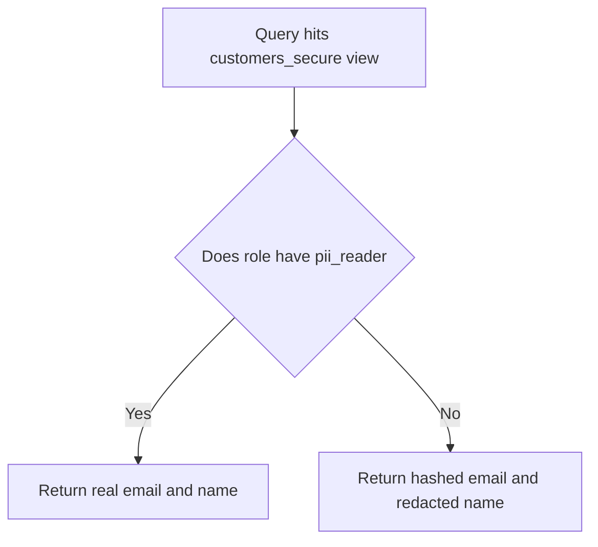
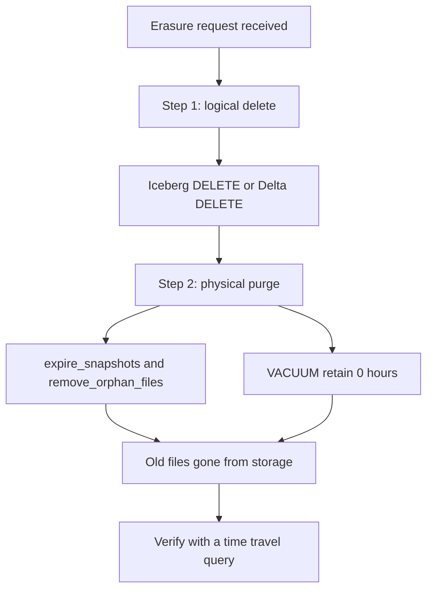

# Lecture 11.3 — PII, Masking, Access Control, and GDPR Deletion

> "How do you delete a user's data from a table you built to be append-only forever?"

Three weeks ago you celebrated that the lakehouse is immutable — Parquet files never change, time travel keeps every old snapshot, an audit can always reconstruct the past. This week a user invokes their right to be forgotten, and that same immutability is now a legal liability. This lecture covers the governance obligations that ride on top of every data platform: knowing which columns hold personal data, showing the right value to the right person, restricting who sees which rows and columns, and — the hard one — erasing a person from storage that was designed never to forget.

---

## 1. PII classification — you cannot govern what you have not labeled

**PII** (Personally Identifiable Information) is any data that identifies a person: name, email, phone, address, government ID, IP address, precise location, and — depending on jurisdiction — anything that, combined, singles someone out. Special categories (health, biometrics, ethnicity) carry stricter rules. Before you can mask, restrict, or delete PII, you have to *know which columns hold it*. That labeling is **classification**, and it lives as metadata next to the data.

### 1.1 Tagging columns in dbt

dbt models carry `meta` blocks; use them to classify columns at the place the column is defined, so the tag travels with the model and shows up in `dbt docs` and the catalog:

```yaml
# models/staging/stg_customers.yml
models:
  - name: stg_customers
    columns:
      - name: customer_id
        description: "Surrogate key. Not PII."
      - name: email
        meta:    { classification: pii, pii_type: email, masking: hash }
        tests:   [not_null, unique]
      - name: full_name
        meta:    { classification: pii, pii_type: name, masking: redact }
      - name: ip_address
        meta:    { classification: pii, pii_type: ip, masking: truncate }
      - name: country
        meta:    { classification: non_pii }
```

Because these tags live in `manifest.json` (lecture 2), a CI check can parse the manifest and *fail the build* if any column matching a PII name pattern (`%email%`, `%ssn%`, `%phone%`) is not tagged — turning classification from a one-time chore into an enforced policy.

### 1.2 Catalog tags

DataHub and OpenMetadata add a *tag taxonomy* and *glossary terms* (e.g. a `PII.Email` tag, a `Sensitive` term) you apply to columns through the UI or ingest from dbt `meta`. The catalog can then run column-level scanners that auto-suggest PII tags from column names and value patterns, and policy engines can act on the tags (mask, restrict, alert). The tag is the hook everything else hangs off.

---

## 2. Masking strategies

Masking shows the right people the real value and everyone else a transformed one. The strategy you pick depends on whether downstream still needs to *join* or *group* on the column.

| Strategy | What it does | Reversible? | Keeps joins/grouping? | Use when |
| --- | --- | --- | --- | --- |
| **Redaction** | Replace with a constant (`***`) or NULL | No | No | The consumer never needs the value at all |
| **Partial / truncation** | Show last 4 digits, or first IP octet | No | No | Support needs to recognize but not read fully |
| **Hashing (non-deterministic salt)** | `sha256(value || random_salt)` | No | No | One-way, no correlation needed |
| **Hashing (deterministic)** | `sha256(value || fixed_secret)` | No | **Yes** — same input → same hash | Analysts must `GROUP BY` or join on the identity without seeing it |
| **Tokenization** | Replace with a token; a separate secured vault maps token↔value | Yes (via the vault) | Yes (consistent token) | The real value must be recoverable by authorized systems |
| **Column-level encryption** | Encrypt the column; decrypt only with the key | Yes (with key) | Only if deterministic | Strong protection at rest; underpins crypto-shredding (§5.4) |

The crucial distinction is **deterministic vs non-deterministic**. A non-deterministic hash (random salt per row) is maximally private but destroys the ability to count distinct users or join. A deterministic hash (fixed secret) lets an analyst compute "how many distinct emails ordered twice" without ever seeing an email — the same email always hashes the same way. Most analytics PII masking wants *deterministic* so the analytics still work; the trade is that deterministic hashing is vulnerable to dictionary attacks on low-cardinality columns, which is why you salt with a secret, not a public constant.

### 2.1 Dynamic masking via views

The cleanest open-source pattern is a **view that masks based on the querying role**. The base table holds the real data, locked down; everyone queries the view, which decides per-role what to reveal:

```sql
-- Base table is locked: only the etl_owner role may touch it directly.
REVOKE ALL ON customers FROM PUBLIC;
GRANT SELECT ON customers TO etl_owner;

-- A masking function: deterministic hash with a server-side secret.
CREATE OR REPLACE FUNCTION mask_email(addr text) RETURNS text
LANGUAGE sql IMMUTABLE AS $$
  SELECT encode(digest(addr || current_setting('app.pii_secret'), 'sha256'), 'hex')
$$;

-- The view everyone reads. Privileged role sees the real value; everyone else the hash.
CREATE VIEW customers_secure AS
SELECT
  customer_id,
  country,
  CASE WHEN pg_has_role(current_user, 'pii_reader', 'MEMBER')
       THEN email ELSE mask_email(email) END                          AS email,
  CASE WHEN pg_has_role(current_user, 'pii_reader', 'MEMBER')
       THEN full_name ELSE '***' END                                  AS full_name
FROM customers;

GRANT SELECT ON customers_secure TO analyst, support;
```

A `pii_reader` sees real emails; an `analyst` sees a deterministic hash they can still `GROUP BY`; nobody touches the base table. In the lakehouse, the equivalent is a masking view in the query engine (Trino/Spark) or a catalog-enforced column mask; the *pattern* — base locked, masked projection granted — is identical.


*The base table stays locked; the view decides what each role sees.*

---

## 3. Access control — row- and column-level security

Masking transforms values; access control decides which **rows** and which **columns** a principal can see at all.

### 3.1 Postgres row-level security (the teaching example)

Row-level security (RLS) attaches a predicate to a table so each role sees only the rows the policy permits — enforced by the engine, not by every query remembering to add a `WHERE`. The teaching scenario: a regional analyst must see only their own region's orders.

```sql
-- 1. Turn RLS on for the table.
ALTER TABLE orders ENABLE ROW LEVEL SECURITY;
ALTER TABLE orders FORCE ROW LEVEL SECURITY;   -- applies even to the table owner

-- 2. A policy: a row is visible only if its region matches the session's region setting.
CREATE POLICY orders_region_isolation ON orders
  FOR SELECT
  USING ( region = current_setting('app.current_region', true) );

-- 3. A separate policy that lets a global auditor see everything.
CREATE POLICY orders_auditor_all ON orders
  FOR SELECT
  TO auditor
  USING ( true );
```

The application sets the session variable per request (`SET app.current_region = 'EU';`), and every query against `orders` — no matter how it is written — returns only EU rows for that session. `FORCE ROW LEVEL SECURITY` ensures even the owner is subject to it. Policies can also gate `INSERT`/`UPDATE`/`DELETE` with `WITH CHECK` clauses (e.g. a regional user may only insert rows in their region). RLS is the model every serious multi-tenant system uses; the lakehouse analogue is row filters enforced by the catalog (Unity Catalog, Lake Formation) or the engine (Trino access control), but Postgres is where you learn the mechanic.

### 3.2 Column-level security via views

Postgres can grant on specific columns (`GRANT SELECT (customer_id, country) ON orders TO support`), but the more portable and explicit pattern is a **view that projects only the permitted columns**:

```sql
-- Support sees order facts and a partial card, never the full PAN or PII.
CREATE VIEW orders_support AS
SELECT order_id, order_date, status, amount,
       '****-****-****-' || right(card_number, 4) AS card_last4
FROM orders;
REVOKE ALL ON orders FROM support;          -- no base-table access
GRANT SELECT ON orders_support TO support;  -- only the safe projection
```

Combine RLS (rows) with a projecting view (columns) and you have full row- and column-level security: the support team in EU sees EU orders, with truncated cards, and nothing else.

---

## 4. GDPR-style hard-delete in an immutable lakehouse

This is the hard problem and the one most engineers get wrong in interviews. **GDPR Article 17** — the right to erasure / "right to be forgotten" — obliges you, on a valid request, to erase a person's personal data without undue delay. In a transactional database that is `DELETE FROM customers WHERE id = 42`. In a lakehouse it is not, for two reasons:

1. **Parquet files are immutable.** You cannot edit a row inside a Parquet file; you can only rewrite the file or record that the row is gone.
2. **Time travel keeps the past on purpose.** Even after a logical delete, the *old snapshot* still references the *old file* that still contains the person's data. A `SELECT ... FOR VERSION AS OF` query — or anyone who reads the old files directly — resurrects them. A logical delete that leaves the old snapshot intact is **not** compliant erasure.

So a compliant hard-delete is always **two steps**: (1) a logical row-level delete, then (2) physically purge the old data files and the snapshots that point at them.


*Logical delete alone is not erasure; physical purge is the second, required step.*

### 4.1 Iceberg — row-level delete + snapshot expiration

**Step 1 — the logical delete.** Iceberg supports SQL `DELETE`:

```sql
DELETE FROM local.db.customers WHERE customer_id = 42;
```

How Iceberg records this depends on the delete *mode*:

- **Copy-on-write (COW)** — Iceberg rewrites every data file that contained a matching row, minus that row, into new files. Reads stay fast (no merge at query time) but the write is expensive. Set per operation: `ALTER TABLE ... SET TBLPROPERTIES ('write.delete.mode'='copy-on-write')`.
- **Merge-on-read (MOR)** — Iceberg writes a small **delete file** alongside the data and applies it at read time. Writes are cheap; reads pay a merge. Two kinds of delete file:
  - **Position deletes** — "in file F, rows at positions 10, 57, 233 are deleted." Compact and fast; used when Iceberg knows exactly which rows matched.
  - **Equality deletes** — "any row where `customer_id = 42` is deleted." Used by streaming upserts where positions are unknown; more expensive to apply because every read must evaluate the predicate.

Either way, after step 1 the *current* table no longer shows customer 42 — **but the old data files still exist and the old snapshots still point at them.** You are not done.

**Step 2 — physically purge.** Expire the snapshots that reference the old files, which makes Iceberg's maintenance delete the now-unreferenced data files from object storage:

```sql
-- Expire every snapshot older than now (retain none), then remove orphaned files.
CALL local.system.expire_snapshots(
  table        => 'db.customers',
  older_than   => TIMESTAMP '2026-06-19 00:00:00',
  retain_last  => 1
);
CALL local.system.remove_orphan_files(table => 'db.customers');
```

After `expire_snapshots`, no time-travel query can reach a snapshot that contains customer 42, and the underlying Parquet files have been deleted from MinIO. *Now* the erasure is complete. **The verification that closes the lab is a time-travel query proving the old version is gone** (it errors or returns nothing for the expired snapshot).

### 4.2 Delta — DELETE + VACUUM + deletion vectors

Delta mirrors the pattern:

```sql
-- Step 1: logical delete. With deletion vectors enabled, Delta marks the rows
-- as removed in a per-file deletion vector instead of rewriting the file (cheap, MOR-style).
DELETE FROM db.customers WHERE customer_id = 42;

-- Step 2: physically remove the old files. VACUUM deletes files no longer
-- referenced by the current version AND older than the retention threshold.
VACUUM db.customers RETAIN 0 HOURS;   -- teaching value; see the warning below
```

**Deletion vectors** are Delta's efficiency feature: rather than rewrite a whole data file to drop a few rows (`DELETE`, `UPDATE`, `MERGE`), Delta writes a compact bitmap (the deletion vector) marking which rows in that file are gone, and applies it at read time — merge-on-read for Delta. Eventually `OPTIMIZE` rewrites the file to physically drop the marked rows.

**The retention warning.** `VACUUM` will not, by default, delete files newer than the retention period (`delta.deletedFileRetentionDuration`, default **7 days**) because time-travel and in-flight readers may still need them. `RETAIN 0 HOURS` overrides that for an immediate compliant purge and Delta forces you to disable a safety check (`spark.databricks.delta.retentionDurationCheck.enabled=false`) to do it — a deliberate friction so you do not accidentally break time travel. For GDPR you accept losing time travel on that table in exchange for compliant erasure.

### 4.3 The non-negotiable point

In a lakehouse, **`DELETE` alone is never compliant erasure.** The data lives on until you expire snapshots (Iceberg) or `VACUUM` (Delta) to physically remove the old files. Any deletion runbook that stops at the logical delete leaves the person's data sitting in object storage, reachable by time travel, and out of compliance. Write the two-step, and verify step two with a time-travel query that can no longer find the data.

### 4.4 Crypto-shredding — the pragmatic alternative

Rewriting petabytes to delete one user every time a request arrives is sometimes infeasible. **Crypto-shredding** sidesteps it: encrypt each user's personal data with a **per-user key**, store the keys in a separate key store, and to "delete" a user, **destroy their key**. The ciphertext remains in the immutable files but is now permanently unreadable — cryptographically equivalent to erasure, and recognized as a valid Article 17 approach when implemented properly. The trade: you must encrypt per-user from day one (you cannot retrofit it onto data already written in plaintext), and key management becomes the critical, audited system. It pairs naturally with column-level encryption (§2): the masking key *is* the per-user key.

---

## 5. What to carry into the lab and the capstone

- **Classify first.** Tag PII columns in dbt `meta` and the catalog; enforce the tagging in CI. You cannot mask, restrict, or delete what you have not labeled.
- **Mask by need.** Choose redaction / partial / hashing / tokenization / encryption by whether downstream must still join or group; prefer **deterministic, secret-salted hashing** for analytics PII. Enforce it with a base-locked table and a masking view.
- **Control access in two dimensions.** Postgres **RLS (`CREATE POLICY`)** for rows, a **projecting view** for columns; the lakehouse analogue is catalog/engine-enforced row filters and column masks.
- **Compliant deletion is two steps.** Logical delete (Iceberg row-level delete — COW vs MOR, position vs equality; Delta `DELETE` + deletion vectors) **then** physical purge (`expire_snapshots` + `remove_orphan_files`; `VACUUM`). Verify with a time-travel query that the old data is gone. **`DELETE` alone is not erasure.**
- **Crypto-shredding** is the alternative when rewriting is infeasible: per-user keys, delete the key.

---

## References

- GDPR Article 17 — Right to erasure ("right to be forgotten"). <https://gdpr-info.eu/art-17-gdpr/>
- Apache Iceberg documentation — row-level deletes (copy-on-write / merge-on-read, position vs equality deletes), `DELETE`, and maintenance (`expire_snapshots`, `remove_orphan_files`). <https://iceberg.apache.org/docs/latest/>
- Apache Iceberg — Spark writes and procedures. <https://iceberg.apache.org/docs/latest/spark-writes/> · <https://iceberg.apache.org/docs/latest/spark-procedures/>
- Delta Lake documentation — `DELETE`, `VACUUM`, retention, and deletion vectors. <https://docs.delta.io/latest/index.html> · <https://docs.delta.io/latest/delta-utility.html>
- PostgreSQL documentation — Row Security Policies (`CREATE POLICY`, RLS). <https://www.postgresql.org/docs/current/ddl-rowsecurity.html>
- PostgreSQL documentation — `pgcrypto` (`digest`, `encode`) for hashing and column encryption. <https://www.postgresql.org/docs/current/pgcrypto.html>
- Joe Reis & Matt Housley, *Fundamentals of Data Engineering*, O'Reilly, 2022. ISBN 978-1-098-10830-4 — Ch. 10 on security, privacy, and data management obligations. <https://www.oreilly.com/library/view/fundamentals-of-data/9781098108298/>
