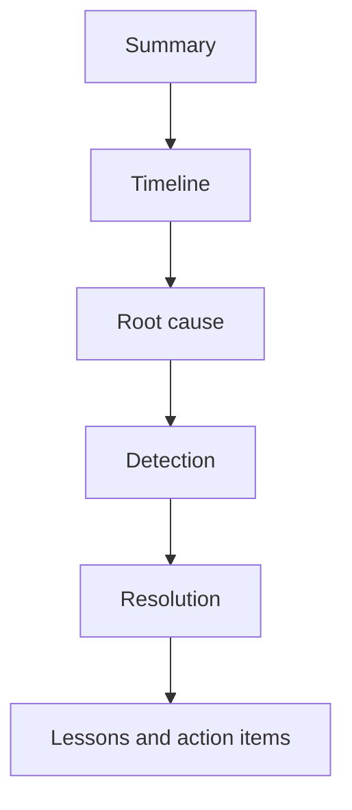
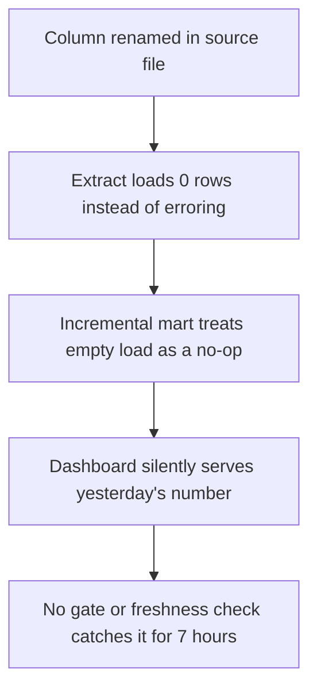

# Lecture 2 — Postmortem Writing and the Chaos Drills

> *A postmortem is the document you write about a failure, and it is the truest test of engineering maturity there is, because it requires the two things engineers are worst at: admitting a system you built broke, and resisting the urge to blame a person for it. A bad postmortem says "the analyst ran the backfill twice and double-counted revenue; we told the team to be more careful." A good one says "the DAG was not idempotent, so a re-run double-counted; here is the action item to make the upsert idempotent by construction, with an owner and a deadline." The difference is not politeness — it is whether the organization learns. This lecture is about writing the second kind, about the three chaos drills you run on your own pipeline to generate the failure worth writing about, and about why the SYLLABUS weights the postmortem as its own capstone deliverable: because owning a platform means owning its failures, in writing, honestly.*

## 1. Why a postmortem is a deliverable

The SYLLABUS requires a 3–5-page postmortem of one chaos drill as a capstone deliverable, and the chaos-drill outcome feeds the grading. This is deliberate. A pipeline that has never failed in front of you is one you do not yet understand, and an engineer who has never written a postmortem has not yet learned the most valuable lesson failures teach: that the failure is almost never where you first look, and almost never one person's fault.

The postmortem is also the single most transferable artifact you produce. A hiring manager who reads a well-written postmortem learns more about how you think than any amount of "I built a lakehouse" — they see whether you reason about root cause or symptom, whether you blame systems or people, and whether your lessons are actionable or platitudes. Alongside the data-quality report, it is the most credible item in your portfolio, and the source material for the behavioral "tell me about an incident" interview round (Lecture 3).

## 2. The three properties: blameless, factual, actionable

### Blameless

The root cause of an incident is *never* "human error." It is always a system property that *allowed* the human action to cause harm. This is not a moral stance; it is an engineering one. "The analyst ran the backfill twice" is a symptom; the root cause is "the backfill was not idempotent — there was no high-water mark and the load did an `INSERT` instead of a `MERGE`, so a second run double-counted." The fix targets the system, because the system is what you can change — you cannot ship "be more careful" to every analyst who will ever trigger a backfill, but you can ship an idempotent `MERGE` keyed on a natural key.

Blameless does not mean consequence-free or vague. It means the *analysis* targets the system. When you write "the malformed file landed in the mart," the blameless framing is not "I should have tested better" — it is "there was no quality gate at the ingestion boundary, so a schema-corrupt file passed straight through; the action item is a Great Expectations checkpoint that halts the load (Week 10)."

### Factual

A postmortem is a record, not a narrative. The timeline is timestamped and neutral: "02:00 — daily file landed. 02:03 — DAG triggered. 02:04 — extract task loaded 0 rows (file had a renamed column). 02:05 — dbt mart built on an empty incremental, silently producing yesterday's number. 09:12 — analyst reported the dashboard was flat." No adjectives, no "frantically," no "luckily." The reader reconstructs what happened from the facts and forms their own judgment. Speculation is labeled as speculation ("we believe, but did not confirm, that …").

### Actionable

Every lesson becomes an action item, and every action item has an owner and a "done when." "We should have better monitoring" is not an action item; "Add a dbt source-freshness check that errors when the mart's `max(loaded_at)` is older than 6 hours — owner: you — done when: the check fails in a repeat of this drill" is. A postmortem whose lessons are not action items is a diary, not an engineering document.

## 3. The postmortem structure

Use the Google SRE structure (<https://sre.google/sre-book/postmortem-culture/>); it is the industry standard and the one a reviewer will recognize:

1. **Summary** — one paragraph. What broke, the impact (which tables/metrics, how many rows, what data was lost or double-counted), and the duration (detection to resolution).
2. **Timeline** — timestamped, neutral, from "trigger" to "pipeline healthy." Include the detection moment and each diagnostic step.
3. **Root cause** — the system property, traced past the symptom. If there is a chain (most incidents have one), give the chain: the immediate trigger, what allowed it, and what allowed *that*.
4. **Detection** — how you found out, how long it took, and how long it *should* have taken. The gap between the two is itself a finding (a bad load found by an analyst at 09:12 instead of by a gate at 02:04 is a detection failure).
5. **Resolution** — exactly what you did to recover, step by step, so it is reproducible — and, for a data pipeline, *how you proved no bad data leaked downstream and nothing was double-counted.*
6. **Lessons / action items** — blameless, each with an owner and a "done when." Separate the "prevent recurrence" items from the "detect faster next time" items.

*The Google SRE postmortem structure, written in this order.*

## 4. The single-root-cause trap

Most incidents do not have one root cause; they have a chain, and a postmortem that stops at the first cause it finds misses the real lesson. Consider the malformed-batch drill: the dashboard went flat. The first cause: a column was renamed in the source file. But why did that flatten the dashboard rather than fail loudly? Because the extract loaded 0 rows instead of erroring on the missing column. And why did 0 rows produce yesterday's number rather than a visible gap? Because the mart was incremental and an empty increment is a no-op, so the dashboard silently served the prior day. And why was none of this caught for seven hours? Because there was no quality gate at ingestion and no freshness check at the mart. Four causes, four different fixes (validate the schema at extract; fail on an unexpectedly empty load; gate the ingestion boundary with Great Expectations; add a mart-freshness check). A postmortem that stops at "the column was renamed" learns one lesson; one that follows the chain learns four, and the four together are what actually prevent recurrence.

*Following the chain of why past the first cause reveals four fixes, not one.*

The technique: for each cause, ask "why did *that* happen" until you reach a cause genuinely outside your system (e.g., "the upstream team renamed the column without notice" — a real boundary that the data-contract action item addresses) or until the chain forks into the independent system weaknesses that each deserve a fix.

## 5. The three chaos drills

You run *one* of these on your own pipeline before the demo; it is the source material for the postmortem. Each exercises a different failure class and a different week's content. The SYLLABUS framing for each is "prove no data was lost or double-counted" — that proof is the heart of the postmortem.

### 5.1 Malformed batch load

**The drill:** a daily file arrives with a corrupted schema (a renamed or dropped column) or out-of-range values, mid-pipeline. Drop the bad file into the landing zone and trigger the DAG.

**What it tests:** the intersection of Week 10 (quality gates) and Week 3 (idempotency). Does the Great Expectations checkpoint at the ingestion boundary catch the schema corruption and *halt* the load, or does the bad file land silently? When you re-run after fixing the file, does the load double-count, or is it idempotent?

**The postmortem-worthy question:** prove the bad data never reached the mart — show the row counts and the quality report — and trace exactly where the gate stopped it. If it *did* leak (a gap your drill exposes), the postmortem documents the missing gate and the fix.

### 5.2 Stream partition lag spike

**The drill:** a consumer falls behind and a partition's lag explodes mid-run. Throttle or pause the Spark Structured Streaming consumer (or flood the topic) so consumer-group lag on one partition climbs sharply, then resume.

**What it tests:** the intersection of Week 8 (consumer groups, offsets, delivery semantics) and Week 9 (exactly-once). What happens as lag grows — does the job back-pressure, does a rebalance redistribute partitions, does scaling the consumer help? When it catches up, did exactly-once hold — were any events lost, and were any double-counted when the job re-read from the last committed offset?

**The postmortem-worthy question:** trace the data-loss-and-duplication boundary precisely. Exactly-once is at-least-once plus an idempotent sink (Week 9) — prove the sink's idempotency held under the lag-and-recovery, by checking the windowed aggregate against a ground-truth count of the produced events. If a duplicate slipped in, that is the finding and the fix.

### 5.3 Schema-evolution event

**The drill:** a producer adds a field (a compatible change) and later makes a breaking change (a type change or a dropped required field). Register the compatible schema, then attempt the incompatible one against the schema registry.

**What it tests:** the intersection of Week 8 (the schema registry and compatibility) and Week 6 (table-format schema evolution). Did the registry absorb the compatible change (a new optional field) and *reject* the breaking one? Did the lakehouse table format (Iceberg/Delta) evolve to add the new column without rewriting data? Did downstream dbt models and the dashboard survive the compatible change, and fail safely (rather than silently corrupting) on the breaking one?

**The postmortem-worthy question:** trace what the breaking change *would* have done if the registry had not rejected it — which dbt model would have broken, which dashboard number would have gone wrong — and document the registry + table-format defense that stopped it, plus the data-contract policy (Week 10) that should have given the consuming team notice.

## 6. The data-quality report as the drill's artifact

The capstone requires the generated data-quality report (the Great Expectations Data Docs for the final run, plus row-count and freshness evidence). Where the chaos drill produces an artifact, capture it: the report page for the run where the gate *fired*, the row-count comparison proving the bad data did not reach the mart, the lag panel screenshot, the rejected-schema error from the registry. Annotate each — what it shows, what "good" looks like, and what the drill revealed. An annotated artifact from your own pipeline, tied to a postmortem finding, is the single most credible thing in your portfolio: it cannot be faked and it proves you operated the platform under a failure, not just at the keyboard.

## 7. The postmortem as the capstone's spine

The postmortem ties the whole capstone together. It cites the architecture doc (the design the drill stressed), the quality gates (the thing that did or did not halt the bad load), the lineage map (how you traced the bad number), and the data-quality report (the proof). A reviewer reading your postmortem alongside your architecture doc can see whether your design *anticipated* the failure or was surprised by it — and "I designed for this failure, here is the drill confirming the gate works, and here is the one thing the drill taught me to improve" is the strongest possible capstone narrative. It demonstrates the through-line of the entire course: you do not just build a pipeline, you own its failures, in writing, with a plan.

## 8. Summary

A postmortem is blameless (root cause is a system property, never "human error" — "the DAG was not idempotent," not "the analyst re-ran it"), factual (a timestamped, neutral timeline), and actionable (every lesson is an action item with an owner and a "done when"). Use the Google SRE structure: summary, timeline, root cause, detection, resolution, lessons. Avoid the single-root-cause trap — follow the chain of "why did that happen" until it forks into the independent weaknesses that each deserve a fix. Run one of the three chaos drills — malformed batch load (quality gate × idempotency), stream partition lag spike (consumer groups × exactly-once), or schema-evolution event (schema registry × table-format evolution) — and for each, *prove no data was lost or double-counted*, which is the heart of the postmortem. Capture the data-quality report and the drill artifacts. The postmortem is the capstone's spine: it proves your design anticipated the failure and that you own the platform's failures, not just its successes.

Next lecture: defending the architecture under the reviewer panel, the question taxonomy, the eight-round senior data-engineering interview loop, and packaging the portfolio.

## References for this lecture

- Google SRE Book, "Postmortem Culture: Learning from Failure". <https://sre.google/sre-book/postmortem-culture/>
- Google SRE Book, "Managing Incidents". <https://sre.google/sre-book/managing-incidents/>
- Etsy / John Allspaw, "Blameless PostMortems and a Just Culture". <https://www.etsy.com/codeascraft/blameless-postmortems/>
- Principles of Chaos Engineering. <https://principlesofchaos.org/>
- SYLLABUS, "Capstone" section — the three chaos drills and the data-quality-report requirement.
- Joe Reis and Matt Housley, *Fundamentals of Data Engineering*, O'Reilly, 2022. ISBN 978-1-098-10830-4. — on idempotency, exactly-once, and the failure modes the drills exercise. <https://www.oreilly.com/library/view/fundamentals-of-data/9781098108298/>
